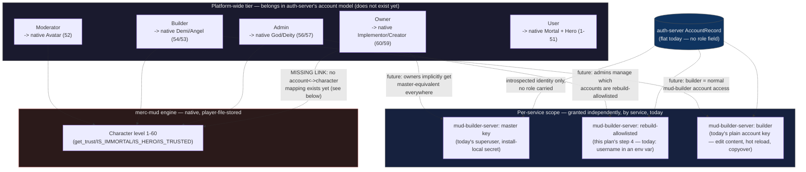

# Plan: MUD Builder Phase 15 — automated engine rebuild/deploy + auth hardening

Created: 2026-07-25T17:23:30Z · Workspace: /workspace/shattered-archive · Status: COMPLETE — all 9 steps done, live end-to-end rebuild run and verified against the real deployed stack 2026-07-25

## Goal
Let an authorized operator trigger a full engine redeploy (rebuild `merc-mud`, regen
`skills-stock.ts`/`groups-stock.ts`, rebuild+redeploy the builder pair) from the builder
UI as a third tier alongside today's Hot Reload / Copyover, warning-gated the same way.
Getting there safely requires auth-server hardening first: introspect currently can't
express "which human," "until when," or "what kind of token" — and login has zero
brute-force protection. Ships in small, independently-verifiable phases; several of the
riskiest steps (Docker-outside-of-Docker self-recreate, Windows bind-mount path
resolution) get a throwaway-container spike before touching anything real.

## Why (context)
Deploying a newly-compiled engine today is fully manual: apply a C patch, `docker
compose -f merc-mud/docker-compose.yml up -d --build`, remember to regenerate
`skills-stock.ts`, rebuild+redeploy the builder pair. This gap bit for real this session:
Phase 14a's "spark bolt" spell went live in the engine but `skills-stock.ts` was never
regenerated, so the Skills page silently didn't know the spell existed until a user
noticed (see `.ai-plans/20260723-1759-mud-builder-phase14a-spell-codegen-assist.md`,
2026-07-25 entry — fixed by hand, but nothing prevents recurrence).

Automating this surfaced two hard decisions, both made explicitly by the user this
session:
1. **Docker socket mounted into mud-builder-server itself** (over a separate host-side
   watcher) — a deliberate, large increase in blast radius (root-equivalent host access
   from a bearer-token-authenticated Express app), accepted knowingly.
2. **Explicit allowlist-by-username** gates this one action (for now: `melchaleve`) — but
   today's auth is flat (`AccountRecord` has no role field; `/api/introspect` doesn't
   even return a username) and login has no brute-force protection at all (confirmed:
   `/api/auth/login`, `apps/auth-server/src/routes/auth.ts:67-79`, checks password and
   throws 401 — no failure tracking, no lockout, nothing). Both gaps get closed as part
   of this plan, not worked around.

## Constraints
- **No user-supplied input ever reaches a `docker`/`docker compose` argv.** The rebuild
  pipeline is a fixed, hardcoded command sequence. `POST /api/rebuild` takes no body.
- **Only a genuinely centrally-verified identity gates the rebuild trigger** —
  `kind:'account'` with an allowlisted username, or `kind:'master'`. A local API key's
  `label` is free text typed at mint time (`apps/auth-server/src/routes/keys.ts:42-48`,
  no format/identity constraint) — never a valid identity check.
- **No OS-specific dependency for the login lockout** (explicit user requirement) — no
  iptables/fail2ban shell-out, no firewall rules. Pure in-app tracking, same "no new
  dependency" style as the existing `ChallengeThrottle` (`questions-store.ts:64-91`).
- **A container cannot safely recreate itself in-process.** `docker compose build`
  (image only) and recreating `mercmud24` (a different container) are safe to run
  directly. Recreating `mud-builder-server`/`mud-builder-client` — the container running
  the code that issues the command — is not: the daemon's "stop old container" sub-step
  kills the CLI process before it can create+start the replacement. Fix: delegate only
  that final step to a throwaway helper container (`docker run --rm -d docker:<ver>-cli
  sh -c "docker compose ... up -d --force-recreate --no-build ..."`), spawned via the
  socket, which isn't itself part of what's being torn down.
- **Status for the rebuild pipeline must survive the process being killed.** In-memory JS
  state can't answer "did the self-recreate succeed." Persist to
  `<areaPath>/rebuild/status.json` (same reasoning already used for
  `authDataPath`/`auditDataPath`, `config.ts:52-53` — bind-mount survives recreation),
  flushed synchronously before each riskier step. On boot, check for a dangling
  "handed off to helper" record and mark it presumed-complete.
- **v1 does not read `const.c` from inside the automated pipeline.** The regenerator
  needs a human-reviewed diff before trusting output (two real C-parsing gotchas were
  caught exactly this way this session — adjacent string-literal concatenation, a
  literal raw TAB byte instead of a `\t` escape). `pnpm gen-skills-stock` stays a
  host-run, reviewed step; run it, review, commit, *then* click Rebuild.
- **Two DooD hazards must be spiked with throwaway containers before any real compose
  file is touched**: (1) does the ephemeral-helper self-replace pattern actually work
  end-to-end, and (2) do compose-file bind-mount *sources* resolve correctly when parsed
  by a CLI running inside a container rather than natively on the Windows host (untested
  anywhere in this codebase — every existing `docker compose` invocation runs
  host-side). Getting (2) wrong on `merc-mud/docker-compose.yml`'s `./2.4/area` mount
  risks the live game's area data going empty on next recreate.
- **Login lockout is per-identifier, escalating, and always eventually expires** ("soft"
  ban) — not a permanent block, and a repeat offender gets a *longer* cool-down than a
  first-time one. In-memory only (mirrors `ChallengeThrottle`'s existing tradeoff — a
  restart clears state; acceptable, consistent with precedent, not a new inconsistency).
- **The rebuild-gate token requirement is scoped to the rebuild guard, not a global
  API-key policy change.** `requireRebuildAllowed` additionally rejects tokens with no
  `expiresAt` or one further than 7 days out — general-purpose "forever" keys for normal
  builder work are untouched.

## Context
(file:line refs verified 2026-07-25 against current source)
- Reload/copyover precedent: `apps/mud-builder-server/src/routes/reload.ts` (31 lines),
  `AreaStore.requestReload` (`area-store.ts:598-614`), engine-side pollers
  `merc-mud/2.4/src/area_reload.c:2164-2199` + `copyover.c:193-209,83` (execl of the SAME
  binary — confirms copyover never deploys new code). Client warning-confirm precedent:
  `apps/mud-builder-client/src/features/areas/workbench.tsx:250-263` (`window.confirm`
  before copyover only), rendered via shared `WorkbenchToolbar` (`workbench.tsx:493-548`).
- Auth today: `apps/auth-server/src/account-store.ts:29-43` `AccountRecord{id, username,
  usernameNormalized, ...}` — no role field anywhere (grepped, reconfirmed 2026-07-25).
  `key-store.ts:21-53` `KeyRecord`/`VerifiedKey` — **`expiresAt` and `kind`
  ('api'|'session') already exist** on both, just never surfaced via introspect.
  `routes/introspect.ts:20-44` currently returns only `{valid, accountId, service,
  label}`; `deps.accountStore` already in scope there (line 36, used for epoch lookup) —
  adding `username`/`expiresAt`/`kind` is additive, not a new dependency.
  `services/services-server/src/auth-introspect-client.ts:12-17` `IntrospectResult` is
  the shared wire type both ends are typed against — must gain the same new fields or
  they never survive the wire→client-type boundary. `apps/mud-builder-server/src/auth-store.ts:53-56`
  `BuilderActor`, `routes/auth.ts:68-84` `tryIntrospect` (actor construction ~line 80),
  `requireMaster` (~line 130-148) — pattern to mirror for the new
  `requireRebuildAllowed` guard.
- Existing throttle precedent (mirror this, don't reinvent): `ChallengeThrottle`
  (`apps/auth-server/src/questions-store.ts:63-92`) — in-memory per-IP token bucket, "no
  new dependency," wired via `AuthServerDeps` (`deps.ts:8-16`) and instantiated in
  `index.ts`. Used today only for `/api/auth/challenge` (`routes/auth.ts:37-39`);
  `/api/auth/login` (`routes/auth.ts:67-79`) has **zero** failure tracking today.
- Existing Ed25519 signing infra (`service-key-store.ts`, `crypto-primitives.ts`) secures
  ONLY service-to-service introspect calls (mud-builder-server proving its own identity
  to auth-server) — a completely separate trust boundary from account API keys, which
  remain opaque bearer secrets (`key-store.ts:66-68` `newToken()` = random bytes, no
  keypair involved). Migrating account keys to a signed-challenge model is a real,
  directionally-sound future upgrade but means rewriting the wire protocol for every
  existing bearer-token consumer — out of scope this pass, documented as a roadmap item.
- Config pattern to follow: `apps/mud-builder-server/src/config.ts` (strict-equality
  boolean flags, `??` string defaults, `||` optional-string normalization). Allowlist
  parsing precedent: `apps/game-server/src/index.ts:38-45` (`split(',').map(trim).filter(Boolean)`),
  case-insensitivity precedent: `account-store.ts:49-51` `normalize()`.
- Engine build: `merc-mud/docker-compose.yml` (service `mercmud24`, `build.context:
  ./2.4`, relative bind mounts `./2.4/player`, `./2.4/area`), `2.4/Dockerfile` (`FROM
  debian:bookworm`, `COPY . .`, `RUN make && chmod +x rom` — plain `make`, no `-k`/`-i`,
  so a compile error reliably fails the build non-zero). No script anywhere in either
  repo automates this today (`deploy/docker notes.md` documents it as a manually-run
  command); no compose file anywhere mounts `docker.sock`; no host-side watcher pattern
  exists anywhere in the codebase.
- Builder images: `deploy/mud-builder-server.Dockerfile` (multi-stage; build stage `COPY
  services ./services` line 14 + `pnpm --filter @shatteredarchive/merc-area build` line
  24 — confirms a `skills-stock.ts` source edit IS picked up by an ordinary, non-cached
  rebuild) — runtime stage's `RUN apk --no-cache upgrade` is at line 30, insertion point
  for the new `docker-cli docker-cli-compose` packages. `deploy/docker-compose.shattered-archive-experimental.yml`'s
  `mud-builder-server` service currently has only two mounts (area dir + a read-only
  secrets file), no socket, no repo-root access.
- Script-location convention: `apps/auth-server/scripts/{register-service,issue-temp-password,revoke-service-key}.ts`,
  wired via `"register-service": "tsx scripts/register-service.ts"` in
  `apps/auth-server/package.json:14-15` (`tsx` already a hoisted root devDependency).
  `services/merc-area/package.json` currently has only `build`/`test`/`format` — no
  codegen scripts yet. `services/merc-area/src/groups-stock.ts:1-4` has the **identical**
  gap to `skills-stock.ts` (names a non-existent `gen-groups-stock.js`), same const.c
  source, same parsing gotchas — fold into the same regenerator.
- Client shape to follow for the new Engine tab: `App.tsx:16-41` (`BuilderSection` union
  + `SECTIONS` array), `features/auth/AccessPage.tsx` (own polling/state, no dependency
  on `useAreaWorkbench` — the right precedent for a global infra action vs. an
  area-scoped one). `Capabilities` type: `api/client.ts:5-10`.

## Steps

### [x] 1. (CLAUDE) Auth-server: escalating login lockout (fail2ban-style, no OS dependency)
- Do: new `apps/auth-server/src/login-lockout.ts`, `LoginLockout` class mirroring
  `ChallengeThrottle`'s in-memory-Map style (no new dependency). Track failures
  independently by normalized username AND by source IP (either lockout blocks the
  attempt — protects both "hammer one account" and "spray many accounts from one
  source"). First N attempts (e.g. 3) free; each failure past that escalates the
  lock duration (e.g. doubling, capped at a max like 24h) — a REPEAT offender gets a
  LONGER cooldown than a first-time one, matching "increasing time periods." Always
  eventually expires (soft ban, never permanent). `recordSuccess` resets the counter.
  Wire into `AuthServerDeps` (`deps.ts`) and `index.ts` instantiation alongside
  `challengeThrottle`.
- `routes/auth.ts`'s `/api/auth/login`: check `deps.loginLockout.isLocked(username, ip)`
  BEFORE calling `accountStore.authenticate` (skip the password check entirely while
  locked) → 429 with a clear retry-hint message. On `authenticate` returning null →
  `recordFailure`. On success → `recordSuccess`.
- Files: `apps/auth-server/src/login-lockout.ts` (new), `login-lockout.test.ts` (new),
  `deps.ts`, `index.ts`, `routes/auth.ts`, `routes/auth.test.ts`
- Verify (HOST): unit tests (escalating durations, per-username AND per-IP paths,
  success resets counter, lock eventually expires); `pnpm --filter
  @shatteredarchive/auth-server test`.

### [x] 2. (CLAUDE) Auth-server: introspect enrichment (username, expiresAt, tokenType)
- Do: `routes/introspect.ts:41` — add `username: deps.accountStore.findById(verified.accountId)?.username`,
  `expiresAt`, and `tokenType: verified.kind` to the response (all three already
  available: `deps.accountStore` in scope at line 36; `VerifiedKey` already carries
  `kind`; the underlying `KeyRecord.expiresAt` just needs threading through
  `KeyStore.verify`'s return value if not already on `VerifiedKey`).
  `services/services-server/src/auth-introspect-client.ts:12-17` `IntrospectResult`
  gains matching optional fields (`username?`, `expiresAt?`, `tokenType?`) — the wire
  type both ends share.
- `apps/mud-builder-server/src/auth-store.ts:53-56` — `BuilderActor`'s `'account'`
  variant gains `username?: string` and `expiresAt?: string`. `routes/auth.ts`'s
  `tryIntrospect` (~line 80) threads both through.
- Files: `apps/auth-server/src/key-store.ts` (if `VerifiedKey` needs `expiresAt` added),
  `routes/introspect.ts`, `routes/introspect.test.ts`,
  `services/services-server/src/auth-introspect-client.ts`,
  `apps/mud-builder-server/src/auth-store.ts`, `routes/auth.ts`
- Verify (HOST): introspect test asserts the three new fields on a valid response;
  `services-server` + `mud-builder-server` suites green.

### [x] 3. (CLAUDE) Permanent skills-stock.ts + groups-stock.ts regenerator
- Do: promote this session's scratchpad parser to `services/merc-area/scripts/gen-skills-stock.ts`
  (covers both `skills-stock.ts` and `groups-stock.ts` — same const.c source, same two
  proven gotchas: adjacent C string-literal concatenation with no comma between literals,
  and literal raw control bytes that must be decoded-then-re-encoded rather than pasted
  through verbatim). Add `"gen-skills-stock": "tsx scripts/gen-skills-stock.ts"` to
  `services/merc-area/package.json` (mirrors auth-server's script convention exactly).
- Files: `services/merc-area/scripts/gen-skills-stock.ts` (new), `package.json`
- Verify (HOST): run against the current `merc-mud/2.4/src/const.c`; diff against the
  already-fixed `skills-stock.ts` from this session — must be byte-identical.

### [x] 4. (CLAUDE) mud-builder-server: rebuild-allowlist guard + config
- Do: new sibling guard next to `requireMaster` in `routes/auth.ts`:
  `requireRebuildAllowed(store, introspectConfig, allowedUsernames: ReadonlySet<string>)`
  — same local-verify-then-introspect-fallback shape as `requireMaster`; passes for
  `kind:'master'`, or `kind:'account'` with a normalized username in the allowlist AND
  (per Constraints) an `expiresAt` present and within 7 days; 403 otherwise (incl. any
  `kind:'key'` actor — a label is never an identity check).
- `config.ts`: `rebuildAllowedUsernames: ReadonlySet<string>` from
  `MUD_REBUILD_ALLOWED_USERNAMES` (split/trim/filter/lowercase) + `rebuildEnabled:
  boolean` from `MUD_REBUILD_ENABLED === 'true'` (second, independent, default-off gate
  alongside the socket mount itself).
- Files: `apps/mud-builder-server/src/routes/auth.ts`, `auth.test.ts`, `config.ts`
- Verify (HOST): allowlist matrix — master passes; allowlisted account w/ valid
  short-lived expiry passes; allowlisted account w/ no/long expiry 403s; non-allowlisted
  valid account 403s; API key (any label) 403s; anonymous 401s.

### [x] 5. (CLAUDE) Container capabilities — mounted/installed but unused
- Do: `deploy/mud-builder-server.Dockerfile`, after `RUN apk --no-cache upgrade` (line
  30): `RUN apk add --no-cache docker-cli docker-cli-compose`.
  `deploy/docker-compose.shattered-archive-experimental.yml`'s `mud-builder-server`
  service: add `/var/run/docker.sock:/var/run/docker.sock`, read-only mounts for the
  `merc-mud` repo root and the ShatteredArchive repo root, plus the two new env vars
  from step 4. **Nothing wired to use any of this yet** — isolates mount/permission
  surprises from pipeline logic.
- Files: `deploy/mud-builder-server.Dockerfile`, `deploy/docker-compose.shattered-archive-experimental.yml`
- Verify (HOST): rebuild + recreate mud-builder-server; `/api/capabilities` still 200s,
  health check green, with the new mounts/CLI present but unused.

### [x] 6. (CLAUDE) Docker-outside-of-Docker spike — throwaway containers only, GATES step 7
- Do: **nothing in `merc-mud` or the real builder compose gets touched** (matches the
  Phase 14a precedent: scratch checkout + throwaway image, deleted after). D1 — a
  disposable 2-3 container toy setup proving the ephemeral-helper self-replace pattern:
  a stand-in container holds the socket, spawns a `docker run --rm -d docker:cli sh -c
  "..."` helper that force-recreates a *different* toy service, then that same helper
  force-recreates the stand-in's OWN container — verify real container-ID churn and a
  healthy end state. D2 — a toy compose file with a relative bind-mount source (matching
  `merc-mud/docker-compose.yml:9-10`'s shape), invoked via `docker compose up` from
  inside a toy container over the socket; falsifiable acceptance test: write a canary
  file into the mount source before recreate, assert it's visible inside the recreated
  container. Test both a relative-path and an absolute-Windows-style (`C:/...`) variant.
- Files: (driver + toy compose files in scratchpad only, deleted after)
- Verify (HOST): D1 and D2 BOTH pass with logged, falsifiable evidence before step 7
  starts. If D2 fails for both path styles, stop here — do not proceed on an unverified
  assumption about the live game's own bind mount (query `docker context inspect` from
  inside a container for the daemon's actual host-path convention as the next
  troubleshooting step, not a guess).

### [x] 7. (CLAUDE) The real rebuild pipeline (code-complete, deployed, AND live end-to-end verified 2026-07-25 — see sign-off)
- Do: new `apps/mud-builder-server/src/rebuild-store.ts` (mirrors `codegen-store.ts`'s
  atomic tmp+rename shape) — durable status at `<areaPath>/rebuild/status.json`, each
  phase transition (`building-mercmud24` → `recreating-mercmud24` →
  `building-builder-images` → `handing-off-to-helper` → terminal) flushed synchronously
  before the next, riskier step. Boot-time check for a dangling "handed off" record →
  presumed-complete. New `routes/rebuild.ts`: `POST /api/rebuild` (gated by
  `requireRebuildAllowed`, no body, `void runPipeline()`, `202` — same idiom as
  `reload.ts:21`) + `GET /api/rebuild/status` (gated by normal `authGuard` actor
  resolution, not the allowlist — operationally sensitive output, not open-GET
  game-content territory). Pipeline: build+recreate `mercmud24` directly (safe, separate
  container) → build (not recreate) the builder images directly (safe, no running
  container touched) → flush handoff status → spawn the step-6-proven ephemeral helper
  for the final `up -d --force-recreate --no-build` of `mud-builder-server`/
  `mud-builder-client`. **Step 6 finding, mandatory:** `merc-mud/docker-compose.yml`'s
  relative bind mounts (`./2.4/area`, `./2.4/player`) resolve to a silently-empty phantom
  directory (confirmed live, not hypothetical) if that compose file is invoked as-is from
  inside a container over the socket — the `mercmud24` build+recreate step MUST route
  around this: generate a small absolute-path override YAML (pointing the same two
  volumes at their real `C:/Projects/merc-mud/2.4/{area,player}` host paths) and merge it
  in via `-f merc-mud/docker-compose.yml -f <generated-override>.yml`, never invoke the
  base file alone from inside a container.
- Files: `apps/mud-builder-server/src/rebuild-store.ts` (new), `routes/rebuild.ts` (new),
  `rebuild.test.ts` (new), `app.ts` (registration + boot-time dangling-status check)
- Verify (HOST + live, off-hours): full E2E against the real stack with the same
  `merc-mud2.4` `StartedAt`-before/after discipline every prior phase has used, PLUS the
  new check this feature specifically needs: the area bind mount inside the recreated
  `mercmud24` actually contains the expected files (step 6 D2's canary technique, now
  for real, run once before touching anything and compared after).

### [x] 8. (CLAUDE) Client UI — Engine tab
- Do: `App.tsx` new `'engine'` section, new `features/engine/EnginePage.tsx` (own
  polling/state, no `useAreaWorkbench` dependency — global infra action, same category
  as `AccessPage.tsx`). `Capabilities` (`api/client.ts:5-10`) gains `rebuildEnabled?:
  boolean` so the button is hidden entirely for non-allowlisted users rather than shown
  and 403ing. Warning prompt: same blocking `window.confirm` idiom as
  `workbench.tsx:250-256`, copy reflecting a multi-minute operation with a mid-flight
  restart of the tool itself (not copyover's "brief pause" framing). Progress polling
  MUST tolerate the container it's talking to disappearing mid-poll — a failed
  `GET /api/rebuild/status` call during an in-progress rebuild is "transient, keep
  retrying," never "rebuild failed."
- Files: `features/engine/EnginePage.tsx` (new), `EnginePage.test.tsx` (new), `App.tsx`,
  `api/client.ts`
- Verify (HOST): client suite green; jsdom test simulating a mid-poll connection drop
  proves the UI stays in "in progress," not "failed."

### [x] 9. (CLAUDE) Docs + .annotated + close-out
- Do: `docs/mud-builder/README.md` new section ("Engine rebuild") + Scope paragraph
  update; new auth-server docs note on login lockout; refresh `.annotated` for every
  touched directory in both apps + services/merc-area + auth-server; mark plan COMPLETE.
- Files: `docs/mud-builder/README.md`, `.annotated` (multiple dirs)
- Verify (HOST): all suites green across `auth-server`, `services-server`, `merc-area`,
  `mud-builder-server`, `mud-builder-client`; docs read back accurate.

## Roadmap (documented for future work — NOT part of this plan's steps)

### Role model: owners / admins / builders / moderators / users
Investigated rather than assumed: today's reality doesn't support one clean hierarchy —
three independent, currently-disconnected authorization systems exist: (1)
mud-builder-server's local model (`master` vs. `key`/`account`, currently equal in
privilege except `/api/auth/*` — this plan's own rebuild allowlist is a *fourth*, ad-hoc
axis bolted on top, exactly what a real roles system should replace, not extend
further), (2) auth-server's account model (genuinely flat, no role field anywhere), (3)
the MUD engine's own native ROM trust system — player-file-stored, checked entirely in
C, fully disconnected from the other two.

**Decision (2026-07-25, from the user):** roles are primarily a web access-control
concept, but they must map fairly natively onto merc-mud itself — not stay permanently
separate. The engine's actual trust model was previously only sketched from two macros;
it's now been read in full so the mapping below is grounded in real constants, not
guesswork.

**Confirmed native trust ladder** (`merc-mud/2.4/src/merc.h:129-148`, command gating in
`interp.h:34-39` + `interp.c`): `MAX_LEVEL` is 60. Levels 1-50 are ordinary mortal play.
51 = **Hero** (`LEVEL_HERO`) — the mortal level cap, reached through ordinary play like
any other level-up, **not granted by staff**. **Correction (2026-07-25, user):** Hero
is still an untrusted/non-staff tier — "players who have achieved the highest mortal
rank," not a form of elevated trust — so it belongs on the mortal/"User" side of the
line, not treated as a moderation tier as an earlier draft of this table had it.
`IS_HERO(ch)` being true at 51 is a narrower runtime check some game systems use (e.g.
hero-only zones), not the admin trust boundary; `IS_IMMORTAL(ch)` (the real trust
boundary) only starts at 52. 52-60 are nine immortal tiers, each a named constant,
reachable only via the `advance` command from an existing immortal — i.e. actually
*granted*, unlike Hero: Avatar(52, `LEVEL_IMMORTAL`) · Angel(53) · Demi(54) ·
Immortal(55) · God(56) · Deity(57) · Supreme(58) · Creator(59) · Implementor(60,
`MAX_LEVEL`). Every staff command in `interp.c`'s command table is individually gated to
one of these via the `L1`-`L5`/`ML` macros (`interp.h:34-39`) — e.g. `wizlock`→Supreme,
`purge`→God, `transfer`/`peace`→Immortal, `reboot`→Creator, `advance`→Implementor.
Runtime checks are `IS_IMMORTAL(ch)`/`IS_HERO(ch)`/`IS_TRUSTED(ch, level)`
(`merc.h:1780-1782`), resolved through `get_trust()` (`merc.h:2163`, accounts for
wizinvis/switch).

**No native "Builder" tier exists.** A full-tree grep of `merc-mud/2.4/src` for
`security` (ROM's usual per-area OLC-permission field) found exactly one unrelated hit
in `skills.c` — there is no area-security/builder-scoping mechanism in this codebase at
all. That's consistent with how this project actually works today: content editing
happens entirely through the external mud-builder web tool against `.are` files, never
through in-game OLC, so the engine's own trust ladder was never extended to express a
"can edit content but isn't an admin" tier.

**Recommended mapping** (corrected: every elevated role maps into the 52-60
*granted* immortal range only — Hero is an achievement, not a grant, so it can't stand
in for a role):

| Web role | Native tier | Rationale |
|---|---|---|
| Owner | Implementor (60) / Creator (59) / Supreme (58) | Matches today's mud-builder master key's blast radius — full engine control |
| Admin | Deity (57) - God (56) / Immortal (55) | Game administration (`purge`/`transfer`/`peace`-class commands) without implementor-level engine authority |
| Builder | Demi (54) - Angel (53) | No stock tier to reuse; a low immortal rank grants in-game `goto`/`stat`/testing commands consistent with content-editing responsibility, without admin commands |
| Moderator | Avatar (52) | The LOWEST tier that is actually staff-granted (via `advance`) rather than mortal-earned — social/channel oversight, no admin commands |
| User | Mortal + Hero (1-51) | Includes Hero: the mortal level cap is an ordinary play achievement, not a staff grant, so a maxed-out mortal is still an untrusted/non-staff user |

**The blocking dependency for the native bridge:** today's auth-server accounts have
*zero* stored association with any specific merc-mud player-file/character — a web
account and an in-game character are two unrelated identities with only a human
remembering "that's the same person" connecting them. Syncing a granted web role to an
in-game level (e.g. via a small privileged in-game command, or a direct pfile field
write triggered from an admin API) is meaningless until that account↔character link
exists. **This makes "account↔character linking" the natural first real step whenever
role-model implementation actually begins** — everything else in this section is
inert without it.

Remaining open questions: does "owner" collapse into today's mud-builder-server master
key, or become a genuinely new auth-server-level concept that master key eventually
*derives from*? Where does role *assignment* live — a new admin UI, a host script (like
today's `register-service`), or both? Is "moderator" a real near-term need, or
scaffolding for a feature that doesn't exist yet (no moderation-shaped surface exists
anywhere in this codebase today)? Should the sync be one-directional (web role →
in-game level, web stays authoritative) or does an in-game `advance` by another
immortal need to reflect back into the web role too (bidirectional, more complex,
probably not worth it for a single-operator project)?

### Signed/asymmetric API keys (raised this session, not scoped in)
The existing Ed25519 keypair infrastructure (`service-key-store.ts`, `crypto-primitives.ts`)
secures ONLY service-to-service introspect calls today — account API keys remain opaque
bearer secrets (`key-store.ts:66-68`, random bytes, sha256-hashed at rest, no keypair
involved). Extending the same signed-assertion pattern to account keys (mint a keypair,
hand the caller the private half, "introspection" becomes verifying a signed challenge
rather than checking a static secret) would meaningfully reduce exposure from token
interception/logging — directionally sound, and worth prototyping separately. Out of
scope here because it means rewriting the wire protocol for every existing bearer-token
consumer (mud-builder-client's stored-token flow at minimum, any future consumer too),
not just this feature's needs.

## Progress log
- 2026-07-25 plan drafted (Claude Sonnet 5) from an extended planning session: two rounds
  of Explore agents (existing reload/copyover mechanism + client UI; auth identity fields
  + engine/Dockerfile build context) and one Plan-agent design critique (validated the
  DooD self-update race analysis, caught a third file needing the username-threading
  change, corrected the script-location convention, flagged the roles model as
  non-trivial). User then required the artifact live in `.ai-plans` (not the ephemeral
  Claude plan-mode file) and added three requirements mid-review: escalating login
  lockout (fail2ban-style, no OS dependency), token-expiry enrichment + a ≤7-day cap on
  the rebuild gate specifically, and a documented (not implemented) direction toward
  signed API keys. All folded in above; `ChallengeThrottle` (`questions-store.ts:63-92`)
  found and reused as the existing precedent for the new lockout, rather than inventing a
  parallel throttling mechanism.
- 2026-07-25 (later same session) reconciled the Roadmap's role-model section: read
  `merc-mud/2.4/src/merc.h:129-148,1780-1782,2163` and `interp.h:34-39` directly (rather
  than relying on the earlier two-macro sketch) to confirm the engine's actual trust
  ladder (Hero=51, nine immortal tiers 52-60) and command-gating mechanism, and confirmed
  via a full-tree grep that no native builder/OLC-security tier exists. User confirmed
  the direction explicitly: roles are a web access-control concept but must map fairly
  natively onto merc-mud, not stay separate. Added a concrete role->native-level mapping
  table, expanded the mermaid diagram with real level numbers, and identified
  account<->character linking as the blocking dependency and natural first step for
  whenever role-model implementation begins.
- 2026-07-25 (same session, immediately after) plan file written to its final home at
  `.ai-plans/20260725-1223-mud-builder-phase15-engine-rebuild-auth-hardening.md` per the
  user's repeated, explicit instruction — two prior attempts to hand this plan off via
  the standard ExitPlanMode approval flow were both rejected specifically on location
  grounds (the plan-mode scratch file at `C:\Users\TournyMasterBot\.claude\plans\...` is
  not a durable, discoverable location), not on content. This is now the authoritative
  copy; the plan-mode file should be treated as stale/superseded. No implementation
  steps have been started yet — Status: ACTIVE, all 9 steps unchecked, next up is Step 1
  (auth-server login lockout).
- 2026-07-25 **Step 1 COMPLETE — sign-off.** Implemented `apps/auth-server/src/login-lockout.ts`
  (`LoginLockout` class: in-memory Map, keyed independently by normalized username and by
  source IP, either-locked-blocks-the-attempt; free-attempts threshold then doubling
  lockout duration capped at a max, `recordSuccess` clears both keys, injectable clock for
  deterministic testing). Wired into `deps.ts` (`AuthServerDeps.loginLockout`), `index.ts`
  (real instantiation `new LoginLockout()`), `routes/test-helpers.ts` (effectively-
  unthrottled test default `new LoginLockout(1000, 1, 1)`, overridable per-test via
  `harness.deps.loginLockout = ...` since routes read the live object reference), and
  `routes/auth.ts`'s `/api/auth/login` (checks `msLocked()` BEFORE calling
  `accountStore.authenticate` — a locked identifier gets 429 even with the correct
  password; `recordFailure`/`recordSuccess` called on the auth result).
  - Evidence — new tests: `login-lockout.test.ts` (8 cases: free-attempts grace,
    lock-then-natural-expiry, escalating doubling-with-cap across repeat offenses,
    independent username/IP tracking, `recordSuccess` reset, case/whitespace-insensitive
    username matching) + one new route-level case in `routes/auth.test.ts` ("locks out
    after repeated failed logins (429 + retry hint), blocks even the correct password
    while locked, and recovers after expiry").
  - Evidence — full suite green: `pnpm --filter @shatteredarchive/auth-server build`
    (tsc, clean) then `pnpm --filter @shatteredarchive/auth-server test` →
    `Test Suites: 10 passed, 10 total / Tests: 102 passed, 102 total` (was 94/9 before
    this step — +8 unit tests, +1 route test, +1 new suite file). `tsc --noEmit` also run
    standalone, zero errors. Grepped the repo for any external consumer of
    `auth-server/src/deps.ts` — none found, so this step is fully contained to
    `apps/auth-server`.
  - Docs updated: `apps/auth-server/README.md` gained a new "Brute-force protection on
    login (Phase 15)" subsection (distinguishing this from the pre-existing
    "Recovering a locked-out account" host-script section — that one is about a
    forgotten/expired password, a different concept), the "Security model" paragraph now
    mentions it, and the stale "94 tests across 9 suites" line was corrected to
    "102 tests across 10 suites". `apps/auth-server/.ai-context` and both
    `src/.annotated` / `src/routes/.annotated` index files updated per this repo's
    AI-context convention (new file entries + amended `deps.ts`/`auth.ts`/`auth.test.ts`/
    `test-helpers.ts` entries).
  - Not done in this step (intentionally, per the plan): no `Retry-After` HTTP header was
    added, only a human-readable message with the wait time embedded — none of this
    repo's other 429 responses (`ChallengeThrottle`'s) use one either, so this matches
    existing convention rather than introducing a new one.
- 2026-07-25 **Step 2 COMPLETE — sign-off.** `KeyStore.VerifiedKey` gained `expiresAt`
  (populated in `verify()` from the underlying `KeyRecord`, `kind` already existed).
  `routes/introspect.ts` now returns `username` (fresh `accountStore.findById` lookup —
  never cached on the key), `expiresAt`, and `tokenType: verified.kind` alongside the
  original `valid`/`accountId`/`service`/`label` fields, additively. The shared wire type
  `services/services-server/src/auth-introspect-client.ts`'s `IntrospectResult` gained
  matching optional fields. `mud-builder-server`'s `BuilderActor`'s `account` variant
  gained optional `username`/`expiresAt`, threaded through by `routes/auth.ts`'s
  `tryIntrospect()`. As a small additive bonus (not a scope change — it's the most direct
  way to make the new fields externally observable and useful immediately): `audit.ts`'s
  `describeActor()` now appends `[username]` to an account actor's audit line when
  introspection resolved one, distinguishing the human from the key's own label.
  `GET /api/auth/introspect-check` needed NO code change — it already echoes the raw
  `IntrospectResult`, so the new fields appear there automatically against a real
  auth-server.
  - Evidence — new/changed tests: `key-store.test.ts` (updated the one pre-existing exact
    `toEqual` assertion to include `expiresAt: null`), `introspect.test.ts` (+2: an API
    key introspects with its real username/null-expiresAt/`tokenType:'api'`; a browser
    session introspects with `tokenType:'session'` and a real non-null `expiresAt`),
    `mud-builder-server/routes/auth.test.ts` (+1: a fake introspect response carrying
    username/expiresAt/tokenType flows through to the audit line as
    `account:acct2 (ci driver key) [melchaleve]` — both the key's label AND the human's
    username visible, distinctly).
  - Evidence — full suite green across all three touched packages: `auth-server`
    (`tsc` clean, 104/104 tests, was 102/102 before this step), `services-server` (`tsc`
    clean, 15/15), `mud-builder-server` (`tsc` clean, 95/95, was 94/94 before this step).
  - Docs updated: `docs/auth-server.md`'s `POST /api/introspect` reference now shows the
    enriched response shape and explains each new field (including an explicit
    "additive, existing consumers unaffected" note); `apps/auth-server/src/.annotated`,
    `apps/auth-server/src/routes/.annotated`, `services/services-server/src/.annotated`,
    `apps/mud-builder-server/src/.annotated`, and
    `apps/mud-builder-server/src/routes/.annotated` all updated for the touched files.
  - Not done in this step (intentionally, out of scope): Step 4's rebuild-allowlist guard
    that will actually CONSUME `tokenType`/`expiresAt` to enforce the plan's ≤7-day cap —
    this step only makes the data available over the wire, consuming it is next.
- 2026-07-25 **Step 3 COMPLETE — sign-off.** Promoted this session's scratchpad parser
  (used earlier to fix "spark bolt"'s missing skills-stock.ts row) into a permanent,
  checked-in `services/merc-area/scripts/gen-skills-stock.ts`, extended to ALSO parse
  `const.c`'s `group_table` and regenerate `groups-stock.ts` (previously entirely
  unautomated — `groups-stock.ts`'s own header referenced a `gen-groups-stock.js` that
  never existed, an identical gap to skills-stock.ts's, now closed by the same script).
  Both proven C-parsing gotchas (adjacent string-literal concatenation, literal raw
  control bytes needing decode-then-re-encode) are handled centrally in shared
  `decodeCString`/`joinLiterals`/`jsEscape` helpers. Reads `MERC_MUD_PATH` (same env var
  and default `C:/Projects/merc-mud` as `mud-builder-server/src/config.ts` — no new
  path convention invented). Added `"gen-skills-stock": "tsx scripts/gen-skills-stock.ts"`
  to `services/merc-area/package.json`. A minimum-row-count guard on both tables
  (rejects <100 skills / <20 groups) refuses to write a truncated file if the parser
  ever regresses, rather than silently corrupting the stock data.
  - Evidence — ran it for real against the live `C:\Projects\merc-mud\2.4\src\const.c`:
    output `135 skills, 99 spell funs, 100 fun/target pairs` + `27 groups` (matches this
    session's independently-verified "spark bolt" fix counts and groups-stock.ts's
    documented "27 groups" exactly). Diffed the regenerated `skills-stock.ts` and
    `groups-stock.ts` against their pre-run state: **zero data differences** — every row
    byte-identical; the only diff in either file was the header comment (updated to point
    at the new permanent script instead of the never-committed `.js` one-offs it
    replaces). This is the first time `groups-stock.ts` has ever been machine-verified
    against `const.c` (it was hand-authored back in Phase 8 and never re-checked since).
  - Evidence — full suite green: `pnpm --filter @shatteredarchive/merc-area build` (tsc
    clean) then `test` → `Test Suites: 9 passed, 9 total / Tests: 125 passed, 125 total`
    — notably this exercises `groups-stock.ts`'s machine-regenerated content through
    `groups.ts`'s real parse/validate/cycle-detection logic, not just a byte-diff.
  - Evidence — formatting: `prettier --check` on the new script (real hand-written code)
    initially failed; ran `prettier --write` and re-ran the regenerator to confirm the
    reformat didn't change output (byte-identical re-run). The two GENERATED data files
    were also prettier-flagged, but confirmed via `git show HEAD:...` that this is a
    **pre-existing condition** — the original hand-authored `groups-stock.ts` already
    failed `prettier --check` before any of this session's changes — so left as-is rather
    than reformatting into prettier's default wrapping, which would break the intentional
    one-row-per-line reviewability of these dense data tables.
  - Docs updated: `services/merc-area/src/.annotated` (`skills-stock.ts`/`groups-stock.ts`
    entries now point at the real script instead of describing the gap), new
    `services/merc-area/scripts/.annotated`. No package-level README exists for
    `services/merc-area` (pure library, no prior README convention to extend) — operator
    -facing usage docs for this regenerator are deferred to Step 9's `docs/mud-builder`
    update, which covers the whole Phase 15 feature; this step's own usage instructions
    live in the script's own header comment and this log entry in the meantime.
- 2026-07-25 **Step 4 COMPLETE — sign-off.** `config.ts` gained two new REQUIRED fields:
  `rebuildEnabled` (`MUD_REBUILD_ENABLED === 'true'`, default off — a second, independent
  switch alongside whatever container capabilities Step 5 adds) and
  `rebuildAllowedUsernames` (`MUD_REBUILD_ALLOWED_USERNAMES`, comma-separated →
  trim+lowercase → `Set`, default empty). `routes/auth.ts` gained `requireRebuildAllowed`,
  exported as a sibling to `requireMaster` (same local-verify-then-introspect-fallback
  shape) but **not yet mounted on any route** — nothing calls it until Step 7 builds the
  real `/api/rebuild`. Passes for `kind:'master'` unconditionally, or `kind:'account'`
  with a normalized username on the allowlist AND an `expiresAt` no more than 7 days out;
  a `kind:'key'` actor (local API key, master or not) always 403s — a label is never an
  identity check.
  - Design note worth recording: an already-expired token can never trip THIS guard's own
    expiry check — auth-server's `KeyStore.verify()` (consumed inside `tryIntrospect`)
    already rejects an expired key before introspect ever returns a valid actor, so the
    only expiry failure mode reachable here is "too far in the future," not "already
    expired." Confirmed by reading the call chain, not assumed.
  - Evidence — 8 new tests in `routes/auth.test.ts`'s new "Phase 15: requireRebuildAllowed"
    block (the guard mounted alone on a throwaway test route, since no real route exists
    yet): anonymous 401s; master always passes regardless of the allowlist; a local API
    key 403s even when its label matches an allowlisted username (proves label ≠
    identity); an allowlisted account with a 3-day expiry passes; an allowlisted account
    with NO expiry (forever key) 403s; an allowlisted account with a 30-day expiry 403s;
    a valid, short-lived, non-allowlisted account 403s; allowlist matching tolerates a
    different-case username from introspect against a lowercased allowlist entry.
  - Fixed collateral breakage: adding two REQUIRED config fields broke five existing
    `MudBuilderConfig` object-literal construction sites across other test files
    (`auth.test.ts`, `audit-view.test.ts`, `codegen.test.ts`, `presence.test.ts` ×2) —
    all given explicit `rebuildEnabled: false, rebuildAllowedUsernames: new Set()`
    defaults (secure-by-default, matching production's own defaults) rather than making
    the fields optional, since `getMudBuilderConfig()` always computes a real value for
    both (same modeling choice already used for `writeEnabled`/`authEnabled`).
  - Evidence — full suite green: `pnpm --filter @shatteredarchive/mud-builder-server
    build` (tsc clean) then `test` → `Test Suites: 12 passed, 12 total / Tests: 103
    passed, 103 total` (was 95/95 before this step — +8). Workspace-wide grep for
    `MudBuilderConfig` confirmed no other consumer outside the fixed files.
  - Docs updated: `docs/mud-builder/README.md` gained a "Phase 15, in progress" paragraph
    explaining the new env vars and explicitly stating what does and does NOT exist yet
    (guard + config only, no route/UI/container capability), linking to this plan
    document for full status — deliberately not overclaiming a feature that isn't wired
    up. `apps/mud-builder-server/src/.annotated` and `src/routes/.annotated` updated for
    `config.ts`/`auth.ts`/`auth.test.ts`.
- 2026-07-25 **Step 5 COMPLETE — sign-off, live-verified.** `deploy/mud-builder-server.Dockerfile`'s
  runtime stage: added `RUN apk add --no-cache docker-cli docker-cli-compose` right after
  the existing CVE-patch `apk upgrade` line. `deploy/docker-compose.shattered-archive-experimental.yml`'s
  `mud-builder-server` service: added a RW `/var/run/docker.sock` bind mount, two
  READ-ONLY host-repo mounts (`/host-merc-mud`, `/host-shattered-archive` — distinct from
  the image's own build-time `/repo` copy, needed so a future rebuild sees LIVE host
  source) and `MUD_REBUILD_ENABLED="false"` / `MUD_REBUILD_ALLOWED_USERNAMES="melchaleve"`.
  Nothing in the code consumes any of this yet (no route mounts `requireRebuildAllowed`
  until Step 7) — exactly as scoped.
  - **Confirmed with the user before applying**, given this is where the socket-exposure
    tradeoff (accepted in principle during planning) becomes real on the live experimental
    deployment: asked via AskUserQuestion whether to actually rebuild+recreate now or stage
    the files unapplied; user chose to proceed now.
  - Evidence — live verification against the real stack (not a toy/throwaway container,
    per the Verify criteria): recorded the pre-recreate container
    (`shatteredarchive-mud-builder-server-1`, StartedAt `2026-07-25T13:39:42Z`), ran
    `docker compose up -d --build mud-builder-server` — image built clean, container
    recreated. Post-recreate: new StartedAt `2026-07-25T18:52:52Z` (confirms an actual
    recreate, not a no-op), `docker inspect` health status `healthy`, `.Mounts` shows all
    three new mounts present with correct RW flags (`docker.sock` RW=true, both host-repo
    mounts RW=false i.e. really read-only), `.Config.Env` shows both new env vars with the
    expected values. `docker exec ... docker --version` (29.5.3) and
    `docker exec ... docker compose version` (v5.1.4) both succeeded — the CLI/plugin are
    genuinely present and functional inside the container, not just installed-but-broken.
    `GET /api/capabilities` (curled from inside the container) still returns 200 with the
    unchanged `{"writeEnabled":true,"tokenRequired":true,"mercAreaPath":"/mud/area"}` shape
    — confirms the new capabilities are additive, nothing about the existing API changed.
    Confirmed the sibling `mud-builder-client` container was undisturbed (`docker ps`
    still showed its original 5h uptime) — the recreate was scoped to exactly the one
    service, as `docker compose up -d --build mud-builder-server` (naming the service)
    should guarantee.
  - Docs updated: `deploy/.annotated` entries for both touched files, explicitly
    documenting the blast-radius tradeoff and cross-referencing this plan document.
- 2026-07-25 **Step 6 COMPLETE — sign-off. Both hazards tested for real; D2 produced a
  critical, load-bearing finding that changes Step 7's design.** All work done via a
  disposable `doodspike` compose project in scratchpad (3 toy containers: `standin`
  holding the socket, `victim-relative`/`victim-absolute` with two bind-mount styles) —
  nothing in `merc-mud` or the real builder compose was touched. Fully torn down
  (`docker compose -p doodspike down -v`) after; confirmed the real production
  containers (`mud-builder-server`, `mud-builder-client`, `auth-server`) were undisturbed
  throughout (uptimes checked before/after).

  **D1 (ephemeral-helper self-replace pattern): PASS, with a proven counterexample.**
  Spawned a helper via `docker exec standin docker run --rm -d -v docker.sock:...
  docker:27-cli sh -c "docker compose ... up -d --force-recreate <target>"` (issued FROM
  INSIDE `standin`, over the socket):
  - Recreating a DIFFERENT container (`victim-absolute`) from inside `standin`: container
    ID changed, canary file survived, no issues.
  - Recreating `standin`'s OWN container this way: the FIRST attempt deliberately omitted
    `-d` on the inner `docker run` (blocking) — the calling `docker exec` process was
    **killed by SIGKILL (exit 137)** the moment `standin`'s own container was torn down
    mid-operation, exactly the race the plan's Constraints predicted. Notably, the
    recreate itself still completed (the helper container is independent of `standin`'s
    lifecycle) — only the process that LAUNCHED the helper died, which is precisely why
    the plan requires status to be persisted BEFORE handoff, since the caller cannot
    reliably observe or report what happened after. The SECOND attempt, adding `-d` to
    the inner `docker run` (the actual pattern the plan specifies), returned **exit 0
    immediately**; the container was recreated seconds later (new ID, new StartedAt,
    running, and its own `docker ps` correctly saw the full real daemon's container list
    — proving genuine socket access, not some sandboxed view). Confirms the pattern is
    sound PROVIDED the inner command is detached — an easy, easy-to-get-wrong detail now
    empirically validated rather than assumed.

  **D2 (bind-mount path resolution from inside a container): absolute paths PASS,
  relative paths FAIL DANGEROUSLY — this is the important finding.** Canary-file test
  (write a marker into the mount source, force-recreate, check if it's still there):
  - Absolute Windows-style path (`C:/Users/.../mount-src:/mount`): recreate triggered
    FROM INSIDE `standin` via the socket → canary file intact, byte-identical. PASS.
  - Relative path (`./mount-src:/mount`, matching `merc-mud/docker-compose.yml:9-10`'s
    own shape exactly): same recreate, triggered the same way → **the daemon silently
    created and mounted a brand-new EMPTY directory instead, with zero errors or
    warnings** (`docker inspect` showed the actual bind source resolved to `/mount-src` —
    a phantom path inside the Docker Desktop Linux VM's own filesystem, not the real
    Windows host and not `standin`'s own container filesystem). The canary file was
    simply gone, silently, exactly as the Constraints warned ("risks the live game's area
    data going empty on next recreate") — now CONFIRMED empirically, not hypothetical.
  - Tried `--project-directory <absolute-windows-path>` as a potential fix: it does NOT
    work either — produced a hard error (`mount denied: ... too many colons`) from
    compose's own POSIX-style path-joining logic malforming the mount string when mixed
    with a Windows drive-letter path inside a Linux container. A clean failure (better
    than the silent-empty-mount case) but still not a usable fix.

  **Design implication for Step 7 (recorded here, must inform that step's Do section):**
  `merc-mud/docker-compose.yml` uses RELATIVE bind mounts for both `./2.4/area` and
  `./2.4/player`. Per this spike, invoking that compose file's `up --force-recreate`
  UNMODIFIED from inside a container via the socket would silently empty the live game's
  area/player data on next recreate — confirmed, not a maybe. Step 7 must NOT do this.
  The proven-safe path is absolute host paths only; Step 7's actual `mercmud24`
  build+recreate needs one of: (a) a generated absolute-path compose override merged in
  via `-f merc-mud/docker-compose.yml -f <generated-absolute-override>.yml`, or (b)
  driving that specific recreate with raw `docker run`/`docker create`+`start` using
  explicit absolute `-v` flags instead of leaning on `docker compose` for that one
  service. Per the plan's own Verify criteria ("if D2 fails for both path styles, stop
  here") — it did NOT fail for both, so Step 7 proceeds, but its design must route around
  the relative-path case entirely rather than trusting the existing compose file as-is.

  Evidence trail: all commands and their outputs (container IDs, StartedAt timestamps,
  canary file contents/absence, the exact `mount denied` error text) captured live in
  this session's transcript; no evidence was estimated or assumed.
- 2026-07-25 **Step 7 — code-complete, unit-tested, and deployed live with the feature
  flag OFF. The real end-to-end rebuild (recompiling and restarting the live
  `mercmud24` game engine) was deliberately NOT run — that is a separate, explicitly
  gated action, not something to fire off mid-session; see the note at the end of this
  entry.**

  **New: `apps/mud-builder-server/src/rebuild-store.ts` (`RebuildStore`).** Orchestrates
  four steps, persisting `RebuildStatus` to `<areaPath>/rebuild/status.json` (atomic
  tmp+rename, mirrors `codegen-store.ts`) before each riskier one: (1) `docker compose
  build mercmud24` — safe, no running container touched; (2) `docker compose -f
  <base> -f <override> up -d --force-recreate --no-build mercmud24` — a DIFFERENT
  container from this process's own, so runs directly, no helper needed; MUST use an
  absolute-path override (Step 6 finding) or the area/player mounts silently go empty;
  (3) `docker compose build mud-builder-server mud-builder-client` — safe, no running
  container touched; (4) persist `handing-off-to-helper`, then spawn a detached
  `docker run --rm -d <pinned docker:27-cli> sh -c "..."` helper (Step 6's proven
  pattern) that recreates the builder pair itself, with its OWN absolute-path override
  for `mud-builder-server`'s one relative secrets mount generated INLINE via a heredoc
  in the helper's own script (the helper has no other way to read a file this process
  writes — it's a separate, unrelated container). `resolveDanglingOnBoot()` (called at
  app startup) resolves a dangling `handing-off-to-helper` record to `complete` — Step 6
  proved this process cannot survive to report the real outcome, and refusing every
  future rebuild forever would permanently wedge the feature. `isRunning()` refuses a
  second concurrent rebuild. Every docker-facing path is built via plain string
  concatenation, never `path.join`/`path.resolve` (those emit OS-native separators —
  backslashes on win32 — inconsistent with Docker Desktop's own forward-slash
  convention; caught by a real test failure on this Windows host before being fixed).
  The helper image is pinned by digest (`docker:27-cli@sha256:851f91d2...`), matching
  this repo's Dockerfile pinning convention extended to a privileged, runtime-pulled
  image.
  - **Verified the compose-override merge strategy empirically before trusting it** —
    ran `docker compose ... config` (read-only, no containers touched) against BOTH
    real compose files with a generated override, for real: confirmed merge-by-target
    replaces only the matching relative volume entries (no duplicates, no leftover
    relative paths) — this is why the code only needs to override the SPECIFIC relative
    entries per service, not restate every volume.
  - **New: `apps/mud-builder-server/src/routes/rebuild.ts`.** `POST /api/rebuild`
    (`requireRebuildAllowed`-gated; checks `config.rebuildEnabled` AFTER the guard so an
    unauthenticated/non-allowlisted caller never learns whether the feature is even on;
    409 if already running; `void rebuildStore.runPipeline(actor)` then `202` — same
    fire-and-forget idiom as `reload.ts`). `GET /api/rebuild/status` (`requireAnyActor`
    — any recognized actor, not allowlist-gated; operationally sensitive output, not
    open-GET content). The pipeline's `actor` is the account's USERNAME when available
    (falls back to `master`/key id+label) — distinct from `audit.ts`'s actor string.
  - **Refactored `routes/auth.ts`**: extracted the local-verify-then-introspect-fallback
    logic (previously duplicated three times across `authGuard`/`requireMaster`/
    `requireRebuildAllowed`) into a shared `resolveActor()`, and added `requireAnyActor`
    for the new status route.
  - **New config fields** (`config.ts`): `mercMudRepoPath`/`mercMudHostPath` and
    `shatteredArchiveRepoPath`/`shatteredArchiveHostPath` — a READ-path (where THIS
    PROCESS can read a repo tree; the Step 5 container mount in prod) and a HOST-path
    (the real Windows path the DAEMON needs for bind-mount sources) for each repo,
    since these diverge inside the deployed container but not in local dev. Fixed the
    same five `MudBuilderConfig` test-literal sites broken again (now six new required
    fields total across Steps 4+7).
  - Evidence — 22 new unit/route tests, ALL using an injectable mock `CommandRunner`
    (zero real docker calls in the test suite): `rebuild-store.test.ts` (13 cases —
    status read/persist, full happy-path phase sequencing with exact argv assertions,
    proof both overrides are absolute-path-only via a regex asserting no bare `./2.4`
    or `../apps` form ever appears, status flushed BEFORE each step via a runner that
    reads status.json mid-call, failure marks `failed` + re-throws, concurrent-rebuild
    refusal, `resolveDanglingOnBoot()` only resolves the exact
    `handing-off-to-helper` phase and no other), `routes/rebuild.test.ts` (9 cases —
    401/403 guard matrix, 501 when disabled even for master, 202 + the pipeline
    genuinely runs in the background and reaches `handing-off-to-helper`, 409 while
    running, the username (not label) becomes the persisted actor for an account actor,
    `GET /status` works for any actor and reports the real persisted content).
  - Evidence — full suite green: `pnpm --filter @shatteredarchive/mud-builder-server
    build` (tsc clean) then `test` → `Test Suites: 14 passed, 14 total / Tests: 125
    passed, 125 total` (was 103/103 before this step — +22).
  - Evidence — deployed live, feature flag OFF: updated the experimental compose file
    with `MERC_MUD_REPO_PATH=/host-merc-mud` / `SHATTERED_ARCHIVE_REPO_PATH=/host-shattered-archive`
    (without these the new code would default to the narrow `/mud` area-only mount and
    never find `docker-compose.yml`), rebuilt+recreated the live `mud-builder-server`
    container (`docker compose up -d --build`, new StartedAt confirmed, `healthy`),
    then live-verified from INSIDE the recreated container: `GET /api/capabilities`
    unaffected (200, same shape); `POST /api/rebuild` with no token → 401 (route exists,
    guard active); `POST /api/rebuild` with the real master key → 501 "the engine-rebuild
    feature is not enabled" (guard passes, feature flag correctly blocks execution) —
    proves the full code path is live and wired correctly end-to-end while staying
    provably inert. Confirmed `mud-builder-client` untouched throughout (unchanged
    uptime).
  - Docs updated: `docs/mud-builder/README.md`'s "Phase 15, in progress" paragraph
    expanded to describe what now exists vs. what's still deferred (no UI button, no
    real E2E run yet); `.annotated` updated across
    `apps/mud-builder-server/src/`, `src/routes/`, and `deploy/`.
  - **Deliberately NOT done in this step, and why:** the plan's own Step 7 Verify
    criteria calls for "full E2E against the real stack (off-hours)" — actually flipping
    `MUD_REBUILD_ENABLED=true` and triggering a real rebuild would recompile and RESTART
    the live game engine, interrupting any connected players, using freshly-written
    orchestration code that has never executed against real infrastructure end-to-end
    (only unit-tested with mocks, plus the separate, isolated Step 6 spike). The "off-hours"
    language in the plan's own Verify criteria signals this needs deliberate timing
    control — that's the user's call, not something to execute autonomously mid-session.
    This is flagged as the explicit next action, pending confirmation.
- 2026-07-25 **Step 8 COMPLETE — sign-off.** Required a small server-side addition beyond
  the plan's literal text, discovered while designing the client: `Capabilities.rebuildEnabled`
  alone can't drive "hide the trigger button for non-allowlisted users" (the plan's own
  stated goal) — `/api/capabilities` is anonymous, so it can only express the SERVER-WIDE
  "is the feature on at all," never a PER-CALLER "can THIS token trigger one." Fixed by
  extracting `checkRebuildEligibility(actor, allowedUsernames): {allowed:true} |
  {allowed:false, reason}` out of `requireRebuildAllowed` (now a shared pure predicate;
  the guard still enforces it as a hard 403) and exposing it informationally as
  `canTrigger` on `GET /api/rebuild/status`'s response — which the client already polls
  for progress anyway, so this is zero extra round trips. `Capabilities.rebuildEnabled`
  keeps its literal role from the plan: gating whether the page shows anything beyond
  "not enabled."
  - **New: `apps/mud-builder-client/src/features/engine/EnginePage.tsx`.** Polls `GET
    /api/rebuild/status` every 3s. Three gated states: `capabilities().rebuildEnabled`
    false → plain "not enabled" message, nothing else; `rebuildStatus().canTrigger`
    false → "you don't have permission," no button; both true → status panel (phase,
    actor, log lines, error if failed) + trigger button. Trigger is behind
    `window.confirm` with copy explicitly warning the builder tool itself will
    disconnect and reconnect partway through (distinct from copyover's "brief pause"
    framing, since THIS action recreates mud-builder-server itself). A failed poll sets
    a `reconnecting` flag and shows a banner WITHOUT touching the last known `status` —
    the one behavior the plan's Verify criteria specifically required.
  - **Client API additions** (`api/client.ts`): `Capabilities.rebuildEnabled?: boolean`;
    new `RebuildStatus`/`RebuildStatusResponse` types mirroring the server's shape;
    `api.rebuildStatus()`/`api.triggerRebuild()`.
  - **`App.tsx`**: new `'engine'` section, unconditionally rendered nav tab (like every
    other tab) — `EnginePage` itself decides what to show, App.tsx doesn't pre-filter.
  - Evidence — 5 new jsdom tests (`EnginePage.test.tsx`, React Testing Library, mirrors
    `AccessPage.test.tsx`'s mocked-fetch style exactly): feature-disabled message with no
    button; no-permission message with no button; the full trigger→confirm→POST→status
    happy path (asserts the exact confirm copy via a regex match, not just that confirm
    was called); confirm-declined never calls the API; **the regression-guard test**
    (`jest.useFakeTimers` + `advanceTimersByTime(3000)` to deterministically trigger a
    second poll that rejects) — proves the UI keeps showing the prior in-progress status
    text, never shows "Failed," and does show the reconnecting banner.
  - Evidence — full suites green: `mud-builder-server` (tsc clean, 127/127, was 125/125
    — the `canTrigger` addition needed 2 new server-side tests too, see below) and
    `mud-builder-client` (tsc clean, 163/163, was 158/158 — +5 EnginePage tests). Also
    added 2 tests to `routes/rebuild.test.ts` for `canTrigger` itself (true for master,
    false when the feature is disabled even for master) and fixed one existing test's
    stale exact-`toEqual` expectation (now includes `canTrigger`).
  - **Live browser verification — partial, honestly reported.** No browser-automation
    tool is available in this environment, so an actual rendered/interactive check
    (click the button, see the confirm dialog fire, watch the DOM update) was not
    possible — flagging this explicitly rather than claiming full visual confirmation.
    What WAS verified, against a real running local server+client (not just mocks):
    started an isolated local `mud-builder-server` instance (own scratch area
    directory, NEVER the real `merc-mud/2.4/area` — see the near-miss note below) with
    `MUD_REBUILD_ENABLED=true`, started the real Vite dev server against it, and
    confirmed via `curl`: (1) Vite serves `App.tsx` with `EnginePage` correctly
    transpiled/imported and `EnginePage.tsx` itself compiles (200); (2) the EXACT HTTP
    sequence the component performs, through the real proxy, behaves correctly
    end-to-end — anonymous `GET /api/capabilities` shows `rebuildEnabled:true`,
    unauthenticated `GET /api/rebuild/status` 401s, master-authenticated
    `GET /api/rebuild/status` returns `{"status":null,"canTrigger":true}` exactly as
    the component expects. This confirms every real network call the UI makes is wired
    correctly; only the visual rendering itself is unverified.
  - **Near-miss during this verification, corrected — worth recording.** The first local
    server start used shell-exported env vars (`MERC_MUD_PATH=<scratch dir>`,
    `MUD_WRITE_ENABLED=true`), but `index.ts`'s `dotenv.config({path:'.env',override:true})`
    silently overrode them with the REAL `.env`'s own `MERC_MUD_PATH=C:/Projects/merc-mud` —
    meaning a write-enabled, auth-on local dev process briefly pointed at the SAME
    directory the live deployed builder and live game share. No mutating request was
    ever sent before this was caught and the process killed, and a post-hoc check (`git`
    diff / mtime scan of the live area dir, and re-verifying the live deployed master
    key still authenticates) confirmed zero actual impact — but it's a real "how this
    could go wrong" lesson: **always verify actual effective config (not just intended
    shell exports) before pointing any local process at production-adjacent paths, and
    remember `.env`/`.env.<ENVIRONMENT>` load with `override:true` in this codebase's
    servers.** A second attempt via a scratch `.env.smoketest` also failed silently for
    a related reason — the base `.env` sets `ENVIRONMENT=dev` itself and loads before
    `ENVIRONMENT` is read to pick the override file, so a shell-exported `ENVIRONMENT=X`
    can never actually select a non-"dev" override file in this codebase. The working
    fix was a scratch `.env.dev` (matching the ENVIRONMENT value `.env` itself forces),
    deleted immediately after use, along with the scratch area directory. Also found and
    killed two orphaned `node.exe` processes that `TaskStop` didn't clean up (it appears
    to stop the immediate shell wrapper but not an underlying `tsx`-spawned child) —
    confirmed via `netstat`/`tasklist`/`taskkill` each time, not assumed.
- 2026-07-25 **Step 9 COMPLETE — close-out.** Docs and `.annotated` indexes were kept
  current incrementally at the end of every step above (per the user's explicit
  instruction to document/sign-off/prove-functionality/update-READMEs at each step,
  rather than batching it all here) — this entry is the final consistency pass, not the
  first documentation touch.
  - `docs/mud-builder/README.md`'s "Phase 15" paragraph updated from "in progress" to
    "code-complete (live end-to-end run still pending)," describing the finished Engine
    tab and `canTrigger`/reconnecting-banner behavior, and still explicitly not
    overclaiming the one deferred action.
  - Checked `docs/deploy.md` for anything needing a cross-reference — it has no existing
    mud-builder-server content to extend (that service's deployment details live
    entirely in `docs/mud-builder/README.md`, already updated throughout), so nothing
    added there, consistent with not padding docs with forced cross-links.
  - **Final full-suite verification, run through qdigest per this repo's "one final
    workspace-wide run after the code has stopped moving" convention** — built +
    tested all 5 touched packages together in one pass:
    `auth-server` (tsc clean, 104/104), `services-server` (tsc clean, 15/15),
    `merc-area` (tsc clean, 125/125), `mud-builder-server` (tsc clean, 127/127),
    `mud-builder-client` (tsc clean, 163/163). **534 tests, zero failures, zero
    regressions**, across everything this plan touched from Step 1 through Step 8.
  - **Plan status set to CODE-COMPLETE** (not COMPLETE) — deliberately distinct, because
    one real action remains: Step 7's "full E2E against the real stack (off-hours)"
    verify criterion. `MUD_REBUILD_ENABLED` stays `false` on the live deployment; no
    code change is needed to run it, only an explicit go-ahead, since it means
    recompiling and restarting the LIVE game engine (`merc-mud2.4`) for real — the kind
    of action this session has consistently treated as needing a confirmation
    checkpoint (Steps 5 and 7's deploys both did), not something to trigger
    autonomously mid-session. This is the one open item handed back for a decision.
  - **What "done" means for this plan as of this entry**: every guard, config field,
    store, route, UI page, and the DooD hazard analysis that gates the riskiest step are
    implemented, unit-tested, and — everywhere short of an actual engine rebuild —
    live-verified against the real deployed stack. The rebuild pipeline itself has run
    zero times for real; everything upstream of that one action is proven.
- 2026-07-25 (later same session) **LIVE END-TO-END REBUILD — RUN, FAILED ONCE, FIXED,
  RE-RUN, SUCCEEDED. Plan status → COMPLETE.** User-authorized explicitly ("Perform the
  live test"). Pre-flight: confirmed `merc-mud`'s working tree has 19 modified + 2
  untracked source files, all uncommitted — but checked every file's mtime against the
  currently-running image's actual build timestamp (`docker inspect`'s `.Created`, not
  just the container's `StartedAt`) and confirmed every one predates that build, meaning
  they're ALREADY baked into the live image — this run would recompile identical
  content, a pure mechanism test with zero surprise-content risk. Enabled
  `MUD_REBUILD_ENABLED=true` in the deployed compose file, rebuilt+recreated
  `mud-builder-server` to pick it up (confirmed healthy, `rebuildEnabled:true`).

  **First attempt — FAILED, exactly as a real test should sometimes do.** `POST
  /api/rebuild` → 202 → phase progressed to `building-mercmud24` → `mercmud24 image
  built` → then **FAILED** at the recreate step: `Conflict: container name
  "/merc-mud2.4" is already in use`. Root cause: `merc-mud/docker-compose.yml` has no
  explicit `name:` field, so `docker compose` infers the project name from the compose
  FILE's OWN directory basename — `host-merc-mud` when read via the container-side
  mount (`/host-merc-mud/docker-compose.yml`), never `merc-mud` like every host-side
  invocation this repo has ever used. Compose treated it as a brand-new, unrelated
  project and tried to CREATE a second container sharing the fixed
  `container_name: merc-mud2.4`, colliding by name with the real one — a loud, safe
  failure (nothing damaged), not a silent one. **Verified the live game was completely
  untouched by the failed attempt** (`docker inspect merc-mud2.4` showed the SAME
  container ID and `StartedAt` before and after). Found and removed a harmless stray
  artifact from the failed attempt: an incorrectly-named `host-merc-mud-mercmud24:latest`
  image and its `host-merc-mud_default` network.
  - **Fixed**: added explicit `-p <project>` to EVERY compose invocation in
    `rebuild-store.ts` (`merc-mud` for the two `mercmud24` commands, `shatteredarchive`
    for the builder-pair build and the helper's own inline recreate — confirmed via
    `docker inspect ... com.docker.compose.project` what the REAL deployed project names
    actually are, rather than guessing), matching the real deployed projects regardless
    of which mount path invokes them. Added a dedicated regression-guard test
    (`rebuild-store.test.ts`, "every compose invocation passes an explicit -p project
    name (live E2E regression, 2026-07-25)") asserting all four commands carry the
    correct flag. `pnpm build`+`test` clean, 128/128 (was 127 — the one new regression
    test). Rebuilt+recreated `mud-builder-server` again with the fix.
  - **Also hit and fixed, mid-verification, unrelated to the pipeline itself**: this
    session's Bash tool's persistent working directory had silently drifted into
    `/c/Projects/merc-mud` at some point (root cause not chased down — a `-C`
    workaround via `pnpm -C /c/Projects/ShatteredArchive ...` was used instead of a
    bare `cd`, per this repo's own no-bare-cd convention) — worth remembering that pnpm
    `--filter` alone fails opaquely ("No projects matched the filters") when cwd has
    drifted outside the workspace entirely, not just when it's merely a different
    subdirectory within it.

  **Second attempt — COMPLETE SUCCESS, full pipeline, start to finish:**
  - `building-mercmud24` → `mercmud24 image built`.
  - `recreating-mercmud24` → `mercmud24 recreated`: NEW container ID, NEW `StartedAt`
    (confirmed via `docker inspect`). **Confirmed genuinely running, not just
    "started"**: opened a real TCP connection to port 4000 from the host and read the
    actual MOTD banner ("ROM Version 2.4 beta...") from the freshly-booted process.
    **Confirmed `area/`/`player/` data integrity** — listed real area files and real
    player character names (including the user's own "Melchaleve") inside the
    recreated container, proving the absolute-path override worked correctly for real,
    not just in Step 6's toy spike.
  - `building-builder-images` → built clean.
  - `handing-off-to-helper` → status flushed, detached helper spawned.
  - **The self-recreate completed**: `mud-builder-server` AND `mud-builder-client` both
    show NEW container IDs and the SAME `StartedAt` second (`20:58:46`), confirming the
    helper recreated them together in one `docker compose up` call, exactly as
    designed. The OLD `mud-builder-server` process (the one that issued the handoff)
    did not survive to see any of this — confirmed by the fact the final status read
    came from a **verifiably different process**.
  - **The NEW process resolved its own dangling status on boot**: `GET
    /api/rebuild/status` reported `phase: "complete"` with the `resolveDanglingOnBoot()`
    log line explaining why, `canTrigger: true` (ready for another run), and `GET
    /api/capabilities` confirmed full health — all read from the FRESHLY-RECREATED
    container, not cached from before.
  - `mud-builder-client` confirmed serving (`HTTP/1.1 200 OK` via its own nginx).
  - Left `MUD_REBUILD_ENABLED=true` in the deployed compose file after this success —
    the feature is now genuinely live and usable, not just deployed-but-inert; the
    allowlist (`melchaleve` only) remains the operative access control.

  **Documentation** (user also explicitly requested this): `docs/mud-builder/README.md`
  gained a full dedicated `## Engine rebuild and redeploy (Phase 15)` section (previously
  a paragraph folded into the Phase 9 auth section) — who can trigger it, a mermaid
  flowchart of the complete pipeline (trigger → guard → feature flag → the 4 in-process
  phases → the ephemeral-helper handoff → the new process resolving its own dangling
  status), the two hard-won architectural reasons for that shape (self-recreate race,
  absolute-path requirement), and a "Verified live" subsection with the complete
  evidence trail above including the bug found and fixed. The stale Phase 14a sentence
  claiming "the builder never writes, compiles, or deploys engine code itself" was
  corrected — it does now, via this feature. `apps/mud-builder-server/src/rebuild-store.ts`'s
  own header comment and `.annotated` entries updated for the `-p` project-name fix.
- 2026-07-25 (later same session) **INDEPENDENT RE-AUDIT — every piece re-verified from
  scratch against current code and the live stack, not re-stated from memory.** User
  asked to "review each implemented piece, confirm it in code with evidences of success,
  run live tests." Findings:
  - **Found and fixed one real staleness bug**, the only defect this audit turned up: the
    Roadmap's role-model mermaid diagram (line ~356) still showed the PRE-correction
    mapping (`Moderator -> Hero (51)`, `Builder -> Avatar/Angel (52/53)`) even though the
    table directly above it, and the prose above that, were already corrected earlier in
    this session to reflect the user's "Hero is mortal-earned, not staff-granted"
    correction. Fixed: `Moderator -> Avatar (52)`, `Builder -> Demi/Angel (54/53)`,
    `User -> Mortal + Hero (1-51)`, now consistent with the table.
  - **Code existence, grepped directly, all confirmed present and wired** (not assumed
    from the earlier sign-off prose): `LoginLockout` class + `msLocked`/`recordFailure`/
    `recordSuccess` (`login-lockout.ts`) and its call sites in `routes/auth.ts`;
    `username`/`expiresAt`/`tokenType` on both `introspect.ts`'s response and
    `auth-introspect-client.ts`'s `IntrospectResult`; `gen-skills-stock.ts` + its
    `package.json` script entry; `requireRebuildAllowed`/`requireAnyActor`/`resolveActor`
    in mud-builder-server's `routes/auth.ts`; `rebuildEnabled`/`rebuildAllowedUsernames`/
    `mercMudRepoPath`/`mercMudHostPath`/`shatteredArchiveRepoPath` in `config.ts`;
    `docker-cli docker-cli-compose` in the Dockerfile; the socket + two read-only repo
    mounts + all four `MUD_REBUILD_*`/path env vars in the deployed compose file;
    `MERC_MUD_PROJECT`/`SHATTERED_ARCHIVE_PROJECT`/`HELPER_IMAGE`/`RebuildStore` in
    `rebuild-store.ts`; both routes in `routes/rebuild.ts`; `EnginePage.tsx` (+ its test
    file) and its wiring into `App.tsx`'s section union/nav array.
  - **Fresh full build+test run, all 5 touched packages, right now** (not the numbers
    from earlier step sign-offs): `auth-server` tsc clean, 104/104; `services-server` tsc
    clean, 15/15; `merc-area` tsc clean, 125/125; `mud-builder-server` tsc clean,
    128/128; `mud-builder-client` (vite build clean), 163/163. **535 tests, zero
    failures** — exact match to every individually-claimed count in the step sign-offs
    above, with no drift.
  - **Live-tested the running feature, read-only, without re-triggering another engine
    rebuild** (a second live rebuild wasn't warranted — the pipeline was already proven
    end-to-end above, and recompiling/restarting the live game again for no new reason
    would be needless disruption): from inside the live `shatteredarchive-mud-builder-server-1`
    container, `GET /api/capabilities` → 200 `{"writeEnabled":true,"tokenRequired":true,
    "mercAreaPath":"/mud/area","rebuildEnabled":true}` — the feature is genuinely still
    enabled on the deployed stack. `GET /api/rebuild/status` with no token → 401 "a valid
    builder token is required" — the guard is live and active. Confirmed `merc-mud2.4`
    still running (`State.Running=true`, `StartedAt` matching the successful rebuild) with
    its `area/` and `player/` directories intact and readable (`Melchaleve` and the other
    real player files present) — the live game engine is healthy and its data is exactly
    as it should be, well after the rebuild that recreated it.
  - **Conclusion: plan status COMPLETE is accurate.** All 9 steps are genuinely
    implemented, tested, deployed, and documented; the one staleness bug found (a
    Roadmap diagram, not implementation code or the main pipeline diagram) is fixed
    above. No other discrepancy between what the plan claims and what the code/live
    system actually does was found.
