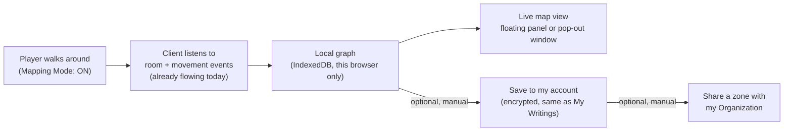

# Plan: Game-client personal cartography (auto-mapping)

Created: 2026-08-13T09:33:00-05:00 · Workspace: /workspace/shattered-archive (+ /workspace/dsl for
the C# service and game logs; /workspace/dsl-mapper and /workspace/merc-mud are READ-ONLY reference
sources, never edited by this plan) · Status: ACTIVE
Task: Give game-client players a personal, vnum-free world map that builds itself as they explore,
can float in-app or pop out to a second monitor, and can be saved/shared through the exact
encryption and Organizations machinery already built for "My Writings" — in 8 independently
deployable, independently testable phases.

> **Ownership.** This plan is **not qwen-farmable**. Every phase ends in a real docker deploy, a
> real play session against the live merc-mud instance, a real screenshot, and end-user
> documentation — all judgment-heavy, human/Claude-verified work. qwen may be used *inside* a phase
> for mechanical transcription (e.g. "port this pure-math file verbatim") but must never be the one
> who checks a phase's box. Whoever picks this up: read Goal + Constraints + Context + the ONE
> phase you're working — the Context section is verified fact (file:line, checked 2026-08-13),
> don't re-derive it.

---

## Goal

A player can flip on "Mapping Mode" and just play — no commands to learn, no vnums, no admin
knowledge required. As they walk around, the client quietly builds a graph of the rooms they've
personally seen and how they connect. They can open a live map (floating panel in-app, or popped
out to its own window on a second monitor), rename rooms in their own words, jot notes ("goblin
camp", "locked door, need a key"), link separate explored zones into a personal world overview, and
— entirely optionally, via an explicit Save action — sync that map to their ShatteredArchive
account, encrypted at rest exactly like their existing Library writings, and optionally share a
zone with their Organization the same way Library content is already shared there. Mapping Mode
costs nothing when it's off (zero listeners registered) and stays cheap when it's on (no server
round-trips during normal play — capture is 100% local, sync is a manual button).

Reached when all 8 phases below are `[x]`, each with a live deploy, a real merc-mud play-test, a
screenshot, a docs/features/world-map.md section, and a signed-off Progress log entry.



---

## Constraints

- **No vnums required, none shown in the UI — but leave room for one.** The client structurally
  never receives a vnum from `room_data` today (confirmed server-side, see Context), so the graph
  cannot and must not depend on one: rooms are identified by a client-generated random id, and two
  rooms with the same displayed name are different graph nodes unless movement actually proves
  they're the same one. **Softened 2026-08-13 per user direction**: there's a live proposal to add a
  vnum field to `room_data` GMCP server-side — timeline, and whether it ships at all, are both
  unknown, not verified in any code (it doesn't exist yet). `DiscoveredRoom` therefore carries an
  optional `vnum?: string | null` from Phase 1 on, always absent today, never required or read by
  any capture/render/layout logic, and never displayed to the player — it exists purely as a seam
  for a future corroborating signal when reconciling independently-built maps (see the dedicated
  Context note below). If the field never arrives, nothing about this plan changes; if it does,
  reconciliation gets stronger for free, without a data-model migration.
- **Zero cost when Mapping Mode is off.** No event listeners registered, no background timers, no
  IndexedDB writes. This must be true structurally (subscribe only inside the mode-on effect), not
  just "rarely triggers."
- **Capture is local-only; sync is manual.** No phase may make Mapping Mode itself talk to the
  network. Only an explicit user action (Save / Load / Share) may call the C# API — mirrors the
  existing Library "Save to cloud" / "Load from cloud" button UX exactly, so players don't learn a
  second mental model.
- **The mapper is a first-class feature module, not a plugin.** `IPluginModule` is documented
  "Self-contained plugin module (NO React)" (`types/types-client/src/plugins/plugin-base.ts:191`)
  and `PluginRuntimeApi` has no rendering surface at all (`plugin-base.ts:131-188`). A plugin could
  at most be a thin data feeder; the actual map lives in `apps/game-client/src/features/cartography/`
  and wires into `MainContainer`/`useMainContainer.ts` the same way Library/Equipment do. Do not
  re-litigate this — it was checked, not assumed.
- **Encryption/sync reuse an existing primitive — don't build a second one.** Personal maps go
  through `LibraryContentCrypto.Encrypt/Decrypt` (HKDF-SHA256 per-account, AES-256-GCM) exactly like
  parchment/notes/books. Shared zone maps go through the Organizations epoch-key envelope exactly
  like org parchment/notes/books (Phase 1/2 of `20260807-1500-organizations-phase1-foundation.md` /
  `20260807-1501-organizations-phase2-content.md`, both COMPLETE and live). No new crypto code.
- **No new hub service registration needed.** game-client already authenticates to DSL/Server as the
  `shattered-web` audience via the `/user/game-sso/start` popup flow (Context). A `MapController`
  under the existing `[AuthorizeApi]` gate just works.
- **Exit visibility is honest, not assumed.** The server only reports OPEN, VISIBLE exits in
  `room_data` (`merc-mud/2.4/src/gmcp_compose.c:163-174` skips `EX_CLOSED` doors and anything not
  currently seeable). "No exit shown this way" must render as *unknown*, never as a wall — a closed
  door will appear once opened. This is exactly the `ExitStatus` distinction DslMapper already
  models (`unknown | created | confirmed | anomalous`).
- **Diff room state yourself; don't trust arrival of an event as proof of anything.** `room_data`
  fires after nearly every server response (not just movement), and a literal `room:"darkness"`
  payload means "can't currently see," not "a new room called darkness" (both verified via a 30-day
  + historical log sweep, Context). The capture engine owns its own name/sector diff against the
  last-known room; it does not lean on `shatteredarchive:movement-succeeded` as sufficient proof
  (that event has a known false-positive on failed moves in existing app code — see Context).
- **Multi-resolution mapping — port-anchored world layer, literal zone layer.** Per user direction
  2026-08-13, validated against DSL/Server's OWN world-map architecture (Context): the World/continent
  layer (Phase 5) anchors a zone's position relative to other zones using the shortest KNOWN path
  between two player-tagged **Port** landmarks, never by aggregating the full winding zone-interior
  walk — a 7-room port-to-port shortcut, not the 30+ room path through the zone's interior, is what
  represents "which way is that continent." The zone DETAIL layer (Phase 2) is untouched by this —
  it keeps showing the literal, complete room-by-room graph. Both views coexist at different zoom
  levels; this plan does not collapse them into one representation. **Port is a first-class,
  player-tagged landmark** (extends Phase 4's POI system with a recognized `'port'` kind, not just an
  arbitrary custom tag) — the client has no way to auto-detect "this room is the port" (no vnum, no
  server flag data), so the player marks it manually. **Recall rooms and player housing stay personal,
  unenforced POI labels only** (Phase 4's ordinary custom-tag mechanism) — do NOT give them the same
  world-layout significance as Port. Direct research against the live merc-mud engine (what
  game-client actually connects to, Context) found no per-clan/kingdom recall-room field and no
  player-housing ownership system in code; treat "my clan's recall spot" as lore/personal labeling
  only unless the user corrects this.
- **Crypto/permission-touching phases (6, 7) need a second pass of scrutiny**, same discipline the
  Organizations plans used: a fresh-eyes review of the actual encryption/permission code before
  checking those phases done, not just "it compiled."
- **Deploy target for every phase = the local dev/test stack**, not the real internet-facing
  shatteredarchive.com (that's a separate machine this repo doesn't deploy to — see the
  centralized-auth-rollout plan's topology correction). Concretely:
  `docker compose -f deploy/docker-compose.shattered-archive-experimental.yml build --no-cache
  game-client && docker compose -f deploy/docker-compose.shattered-archive-experimental.yml up -d`,
  reachable at `game-client.shatteredarchive.dev` (hosts-file entry to this machine). The backing
  MUD is the `simulacrum` merc-mud compose stack this same compose file already resolves via
  `extra_hosts: simulacrum.shatteredarchive.dev:host-gateway`
  (`deploy/docker-compose.shattered-archive-experimental.yml:185-190`). Phases 6-7 additionally need
  the local `shatteredarchive-csharp` container (DSL/Server) rebuilt/redeployed
  (`C:\Projects\DSL\Server\docker-compose.yml`, per the auth-rollout Phase B precedent).
- **Screenshots via the existing browser-test tool**: `C:\Projects\Shattered-AI\tools\browser-test`
  (Playwright, allowlist `localhost` + `*.shatteredarchive.{com,dev}` only — per prior-session
  memory this is the one sanctioned browser automation tool for this workspace, isolated from the
  product repos).
- **Docs deliverable is ONE growing file**, `docs/features/world-map.md`, not one file per phase —
  each phase appends its own section + mermaid diagram, following the structure/tone of
  `docs/features/user-library.md` (TOC, plain-language "what is this", glossary, "why does it do it
  this way?"). Written for a non-technical player, same audience as that doc.

---

## Context (verified 2026-08-13, file:line — trust this, don't re-survey)

**What data the client actually gets, and how (already live, nothing new to build here):**
- GMCP `room_data` → `{"room": "<name>", "sector": "<sector>", "exits": ["N","E",...]}` — composed
  server-side in `/workspace/merc-mud/2.4/src/gmcp_compose.c:128-180`
  (`gmcp_compose_room_data`/`gmcp_send_room_data:277-286`). Confirmed: **no vnum, no area name, no
  room description, no mob list** ever leaves the server in this package. The exit list only
  includes directions that are open AND currently visible (`:163-174`, skips `EX_CLOSED`, requires
  `can_see_room` or infrared without blind). 10-direction rose (`dir_token`), matching
  `merc.h`'s `MAX_DIR`.
- Client-side routing: `game:remote-server:gmcp` → `PACKAGE_EVENT['room_data'] = 'game:room-data'`
  (`apps/game-client/src/features/gmcp/gmcpRouter.ts:23-30,64-76`). **Important nuance**: this
  module's own header comment (`:11-21`) says `attachGmcpRouter()` is **NOT ATTACHED** — the actual
  live producer of `game:room-data` today is `UserScriptRuntime.processGmcpEvent()`
  (`apps/game-client/src/features/userScripts/userScriptRuntime.ts`) off a `shatteredarchive:gmcp-data`
  redispatch. Either way, `game:room-data` with `{room, sector, exits}` is confirmed flowing in
  production — verify which producer during Phase 1 implementation, don't assume `gmcpRouter.ts`
  is it.
- Consumers already reading that event, to copy the subscribe pattern from:
  `apps/game-client/src/hooks/useCompassBlock.ts:70-119` (also emits
  `shatteredarchive:movement-attempt` → `movement-succeeded`/`movement-failed`, and issues moves via
  `DispatchEvent('shatteredarchive:send-command', {cmd})`, `:145-162`) and
  `apps/game-client/src/hooks/useRoomHeader.ts:15-39`. `roomDataStore.ts` is just a last-value cache
  (`getRoomData`/`setRoomData`), not a history — the mapper needs its own store.
- `ListenEvent<T>(name, handler, {key})` / `DispatchEvent<T>(name, payload)` signatures:
  `apps/game-client/src/features/event-emitter/event-dispatcher.ts:80` (Dispatch),`:131` (Listen,
  returns an unsubscribe fn, handler gets `detail` directly). Also `ListenOnce` (`:117`),
  `ListenEventAsync` (`:146`) if useful for one-shot capture actions.
- **Real log evidence** (`/workspace/dsl/GameLogs/ShatteredArchive/Docker/game-server/2026/08/12/server.log-2026-08-12.jsonl`,
  10,550 lines, the latest date with an actual play session as of this survey — `2026/08/13`'s file
  exists but is boot-only noise). JSONL shape: `{"type","subtype","level","timestamp","payload"}`;
  raw terminal text is `type:"game:remote-server:raw"`, `payload:{"type":"raw","data":"<line>"}`;
  GMCP is `type:"game:remote-server:gmcp"`, `payload.data` = `"<package> <json>"` as one string.
  Confirmed room block shape (lines 4133-4159), verbatim:
  ```
  "Guillotine Road"
  "  You are on the west end of Guillotine Road. To the west is the tower city
  gates. Eastward Guillotine Road continues. ..."
  " [Exits: north east south west  ]"
  ```
  immediately followed by `room_data {"room": "Guillotine Road", "sector": "city", "exits": [ "N", "E", "S", "W" ]}`.
  Mob/entity "here" lines are free-form, no shared suffix, sometimes prefixed with aura tags, e.g.
  `"(Red Aura) A gateguard dressed in black armor stands here, glaring about vehemently."` — **no
  vnum, no fixed pattern to anchor a regex on.** Prompt line format (line 4130):
  `<1645/1645hp 1054/1240m 406/406mv 24872tnl> [Chamber of Repose] [NESWUD] [5:30pm]` — a second,
  redundant source of room name + available exit letters, useful as a fallback if GMCP is ever off.
- **Movement & look command corpus — verified 2026-08-13 via a 30-day sweep (2026-07-14 → 08-13,
  5 sample days) plus a historical spot-check back to the start of the corpus (9 dates across
  2026-01/03/05).** No format drift anywhere in the whole history — safe to build against one
  convention, no legacy-format special-casing needed. Findings that change the capture design:
  - **The movement vocabulary is exactly the 10-token compass set** (`n s e w ne nw se sw u d`) —
    full words (`"north"`) and numeric repeat-prefixes (`"3n"`) never appear, corpus-wide. This
    already matches `useCompassBlock.ts`'s `normalizeExit()` table 1:1 — nothing new to add there.
    Two common non-directional transitions worth naming explicitly: `recall` (teleport-to-temple)
    and `enter <object>` (portal use) — both are just instances of the existing "landed here with no
    pending movement" case, not new mechanics.
  - **`room_data` fires after nearly every server response, not just movement** (6,659 times in one
    single day's log) — combat rounds, `look`, chat, all re-emit it. **The capture engine must diff
    the incoming `{room, sector}` against the last-known value itself; it must NOT treat "a
    `game:room-data` event arrived" as "the player moved."**
  - **A `"darkness"` sentinel exists**: while blinded, `room` becomes the literal string
    `"darkness"` (confirmed: `sector`/`exits` stay accurate through it). Left unhandled this creates
    a bogus room node named "darkness" on every blind/dark encounter. The capture engine must treat
    a literal `room === "darkness"` payload as "identity currently obscured" — never create or
    rename a node from it, just leave the current-room pointer where it was.
  - **Failed movement has a stable, exact string** — `"Alas, you cannot go that way.\n"` — but this
    is a fallback/corroboration signal only; the diff rule above is what actually matters, because
    `room_data` fires with the *unchanged* room right after a failed move too.
  - **A real, pre-existing bug this plan must not inherit**: `useCompassBlock.ts:83-107` dispatches
    `shatteredarchive:movement-succeeded` on *any* `game:room-data` arrival while a move is pending —
    it never checks whether the room actually changed. Since `room_data` also fires after a *failed*
    move (reporting the same room), that event alone is not a trustworthy "the move succeeded"
    signal. **The cartography capture engine must do its own name/sector diff and must not treat
    `shatteredarchive:movement-succeeded` as sufficient proof a room changed.** (This is a latent bug
    in existing app code, out of scope for this plan to fix — flagged for awareness, not silently
    patched here.)
  - **`l <target>` (abbreviated `look`) is the mob-examine command** — confirmed abundant real usage
    across the entire corpus, e.g. `l dwa` → a full long-description + condition-bar block (see the
    2026-01-11 example below); a clean, single-line failure (`"You do not see that here.\n"`) when
    the keyword doesn't match anything present; and `N.keyword` disambiguation syntax players
    actually use (`l 2.moon`, `l 2.bear`) when multiple same-keyword targets share a room — Phase 4's
    target-picker should tolerate/pass through that syntax rather than assuming a bare keyword.
    Verbatim example (`server.log-2026-01-11.jsonl`, an early-corpus date, confirming this isn't a
    recent addition): command `l dwa` → `"A positively ancient dwarf is here holding a comically
    large hearing horn. ..."` + `"Dwabin Del'nichi is in excellent condition.\r\n"`.
- **Mob-name capture: use the `l <target>` examine response as the primary source, not ambient
  room-block scraping.** Passive "who's in this room" text (the unique-per-mob "here" lines) has no
  fixed pattern to anchor a parser on — the one existing text-scraping precedent in this codebase,
  opponent-condition detection (`apps/game-client/src/features/combat/opponent-buckets.ts:8-14`,
  `probe-opponent-condition.ts:20-46`), only works because it anchors on a **fixed vocabulary** of
  condition-bar suffixes, which room "here" lines don't share. But the corpus survey above shows
  `l <target>` returns a full, structured, high-quality description on demand — so Phase 4's primary
  mob-sighting mechanism is "the player looks at something normally, then hits 'save last examine'"
  to capture that real response verbatim, not a guess at which ambient line was a mob. The room-block
  **boundary** technique from `text-to-speech.plugin.ts` (`inRoomBlock`, `roomCandidateLines`,
  `ROOM_RENDER_CONFIRM_MS`, keyed off `room_data` arrival timing) is still useful as a secondary,
  lower-confidence "who might be here" checklist (letting the player pick a line to `l` next), but the
  `l`-response capture is the one that actually produces a good note.
- **Future vnum reconciliation seam — per user direction 2026-08-13, NOT verified in any code (it
  doesn't exist yet, so there is nothing to cite).** There is a live proposal to add a vnum field to
  `room_data` GMCP server-side; timeline, and whether it ships at all, are both unknown. Nothing in
  this plan may depend on it arriving — the connectivity-based heuristic (Phase 1) stays the sole,
  sufficient mechanism for telling same-named rooms apart. The only concrete accommodation:
  `DiscoveredRoom.vnum?: string | null` (Phase 1's `types.ts`) stays present-but-unused unless/until
  the server actually sends one. If it ever does, it becomes an extra corroborating signal for "are
  these two independently-discovered rooms actually the same physical room" — relevant to Phase 5's
  zone-linking and Phase 7's org-shared-map merges, both of which are heuristic/manual-only for now
  and would gain a stronger signal later for free, with no data-model migration needed. Do not build
  any vnum-driven reconciliation LOGIC now — there's no real data to design or test it against yet;
  the field is the only thing to add today.

**UI/modal conventions to follow exactly (Explore-agent-verified 2026-08-13):**
- No shared modal registry/context exists. Every modal is one `useState` boolean pair owned by
  `apps/game-client/src/hooks/useMainContainer.ts` (e.g. `isLibraryModalOpen`/`openLibraryModal`/
  `closeLibraryModal`, `:545-547`, exposed `:562-564`) and rendered from
  `apps/game-client/src/pages/MainContainer.tsx` (`:246` Library, `:250-253` Equipment). A Map modal
  gets the identical treatment: `isMapModalOpen`/`openMapModal`/`closeMapModal`.
- Anatomy precedent: `apps/game-client/src/components/EquipmentModal.tsx:71,105-111` +
  `EquipmentModal.module.scss:2-22` — a fixed, centered, click-outside-to-close card
  (`.backdrop{position:fixed;inset:0;display:flex;align-items:center;justify-content:center}` →
  `.modal{width:min(760px,92vw)...}`). **None of the existing modals float, drag, or resize** — that
  part of Phase 2/3 is genuinely new UI, not a reuse. `PluginConfigModal.tsx:3,336` does use
  `createPortal(modal, document.body)` — a portal precedent exists if a floating/draggable panel
  needs to escape a stacking context.
- Pop-out window: the only existing `window.open` call in the whole client is
  `apps/game-client/src/features/auth/gameSso.ts:71` — a named SSO login popup, not a pane pop-out
  precedent. The real precedent for "a genuinely separate window" is `status.html`, wired as a
  second Vite build entry (`apps/game-client/vite.config.ts:108-110`:
  `input:{main:index.html, status:status.html, authCallback:auth-callback.html}`) serving
  `apps/game-client/src/pages/client-status-page.tsx`. Phase 3 adds a `map.html` entry the same way
  — a small standalone bundle, not the whole terminal/socket stack — and relays live state into it
  via `BroadcastChannel`, the exact mechanism already proven working in `DslMapper`'s
  `state/mapStore.tsx:367-396` (`new BroadcastChannel('dslmapper')` + a `window` `storage` listener,
  both merged through a revision-number `HYDRATE` so whichever window has the newer revision wins).
- Existing manual cloud-sync UX to mirror (this is the exact interaction model Mapping Mode's Save/
  Load should feel like — same buttons, same "connectionId-scoped, last-write-wins" semantics):
  `apps/game-client/src/features/library/librarySync.ts` (`pushType`/`pullType`,
  `saveLibraryToCloud`/`loadLibraryFromCloud`, `:37-154`) sitting on top of
  `apps/game-client/src/features/auth/cloudSync.ts`'s `authedRequest()` wrapper (`:20-54`, Bearer
  token from `authTokenStore`, 401 clears it) and its item-level endpoint functions
  (`loadParchmentCloud`/`upsertParchmentCloud`/`deleteParchmentCloud`, `:105-119`, hitting
  `/library/my-writings/parchment[/{id}]`).
- Local storage precedent: `apps/game-client/src/features/library/library-store.ts` — IndexedDB,
  versioned (`DB_VERSION`), one object store per content kind, `by_connection` index, migration
  block inside `onupgradeneeded`. The cartography store mirrors this shape.

**DslMapper (`/workspace/dsl-mapper/game-mapping`) — proven design to port, READ-ONLY reference:**
- `src/types.ts:4-13` — `Direction`/`DIRECTIONS`, the same 10-direction rose
  (N/NE/E/SE/S/SW/W/NW/U/D) the merc-mud engine actually uses. `:22` `ExitStatus =
  'unknown'|'created'|'confirmed'|'anomalous'` — exactly the "auto-detected vs. player-confirmed vs.
  doesn't-fit-the-grid" distinction this plan needs, don't invent a new one.
  `:82-92` `ExitDef{to, oneWay, door, status}`. `:73-80` `Coords{cx, cy, vz}` (vz = vertical level for
  U/D). `:41-45` `Catalog{worlds, continents, areas}` — world/continent/area hierarchy for Phase 5's
  zone linking.
- `src/render/octMath.ts` (23 lines, tiny, port verbatim) — `gridToPixel`/`octagonPoints`, flat-top
  octagon SVG math for an 8-neighbor grid (+ vz level).
- `src/state/mapStore.tsx` — React Context + `useReducer`, `normalizeDoc` defensive parser (never
  trust stored/incoming JSON blindly, `:69-161`), revision-number `HYDRATE` merge (`:182-187`, only
  accept incoming if `incRev > curRev` — the "last write wins" rule to mirror server-side), 50-step
  undo/redo (`:165-176,294-320`), 250ms debounced autosave + `BroadcastChannel`/`storage`-event
  cross-tab sync (`:367-411`).
- `src/components/OpenRendererButton.tsx:4-50` — the pop-out pattern: build a hash-route URL carrying
  scope + level + selection as query params, `window.open(absolute, '_blank', 'noopener')`.
- `src/state/persist.ts:29-48` — `exportToFile`/`importFromFile` (Blob + `<a download>` — note: this
  exact download trick does NOT work inside a Claude Artifact sandbox, but it's fine here, this is a
  real deployed web app, not an artifact).

**C# server-side (DSL/Server, `/workspace/dsl/Server/Server.Web.Public`) precedent for Phases 6-7:**
- Auth: game-client's bearer token is a **`shattered-web`**-audience hub token — confirmed by grep,
  `shattered-game-client` is registered nowhere. Flow:
  `apps/game-client/src/features/auth/gameSso.ts:63-65` opens a popup to this SAME C# site's own
  `/user/game-sso/start` (not the hub directly); `UserController.cs:184-273`
  (`GameSsoStart`/`GameSsoCallback`) does the code exchange "using the SAME shattered-web key already
  registered in Phase B" and rejects on audience mismatch (`:263-266`). Token lands in
  `authTokenStore` via `auth-callback.ts:14-32`. **A `MapController` under `[AuthorizeApi]` just
  works, no new hub service registration.**
- REST shape to mirror exactly (`Controllers/LibraryController.cs`): class route `[Route("library")]`
  (`:33-34`); `[HttpGet("my-writings/parchment")]` (`:133`),
  `[HttpPut("my-writings/parchment/{id}")]` (`:137`), `[HttpDelete(".../{id}")]` (`:142`) →
  `library/my-writings/parchment[/{id}]`. Loosely-typed `JObject` body (no DTO class actually used —
  `Models/UserContent/LibraryContentPayloads.cs`'s `ParchmentPayload` is documentation-only, grep
  confirms nothing deserializes into it). GET returns a raw `JArray` built by `ListWritingItems<T>`
  (`:178-196`, decrypts each row via `_crypto.Decrypt(accountId, row.Payload)` inside a per-row
  try/catch so one bad row doesn't 500 the list). PUT: `TryValidateParchment` (`:248-259`, title
  non-empty, body ≤ `MaxBodyChars=20000`) → `_crypto.Encrypt(accountId, body.ToString(...))`
  (`:228`) → `DBManager.SaveData`. Cap: `MaxParchmentPerAccount=300` (`:120`), checked **only when
  `existing == null`** (`:218-224`, a genuinely new id — updates never re-trip it). DELETE always
  `204` regardless of prior existence (`:241-246`, "a client's delete-reconciliation loop shouldn't
  treat 'already gone' as an error" — copy this exact reasoning for map deletes too).
- Crypto primitive (already cited + verified in the Organizations Phase 1 plan, reuse verbatim, do
  not reimplement): `Services/LibraryContent/LibraryContentCrypto.cs` — HKDF-SHA256 from one
  server-wide master key (`info=accountId`), gzip-then-AES-256-GCM.
- Table-registration convention (miss this and the table silently never gets created): new row model
  mirrors `Server.Datastore/Models/UserBookModel.cs`'s `{Key, SortKey, Timestamp, Payload}` shape;
  new `Constants.TABLE_*` const near `Server.Core/Constants.cs:183`; **must** be added to
  `Server.Web.Public/Managers/AppManager.cs:27-53`'s `DbTables` array or `DBManager.Init` silently
  never creates it (the standing `TABLE_USER_DIRECTIONS` cautionary example).
- Organizations sharing target for Phase 7 (both plans COMPLETE, live, independently reviewed):
  `OrganizationTiers` (Leader > Moderator > Member, `CanManage` ladder check),
  `OrganizationMemberKeyModel` (per-epoch RSA-wrapped org symmetric key),
  `OrganizationContentController.cs` + `OrgParchmentModel.cs`/`OrgNoteModel.cs`/
  `OrgAuthoredBookModel.cs` (`Key="{orgId}#{itemId}"`, `SortKey=orgId`, `Epoch:int`,
  `CategoryPath:string[]` ≤5 segments ≤60 chars each, validated server-side). Route family:
  `library/organizations/{orgId}/content/{parchment,notes,books}` — write needs Moderator+ (or
  service-Admin override), read needs Member+. Game-client UI precedent to extend:
  `apps/game-client/src/components/LibraryModal.tsx` — `TabId` enum (`:28`) already has
  `'organizations'`, tab bar (`:988-1027`... verify current line numbers, file has moved since), and
  an N-level breadcrumb-tree pattern already used for two-level note grouping
  (`groupByTag`/`tagKey`) — extend that pattern for `CategoryPath`, don't invent a new tree widget.
  **Constraint carried over from Organizations Phase 2**: revision history/revert stays
  web-dashboard-only, never in game-client — if map sharing wants version history later, it follows
  that same line, not a new exception.

**mud-builder's map (light comparison point only, not a reuse target — different audience, has
vnums):** `apps/mud-builder-server/src/routes/map.ts` exposes `GET /api/map/:file` (one area, cross-
area exits resolved against a world vnum index) and `GET /api/map` (whole-world graph, areas as
nodes) — read-only, admin-facing. The actual BFS-grid layout happens client-side in mud-builder's
frontend, not server-side. Phase 5's zone linking is the same SHAPE of problem (resolve a graph, lay
it out) but built from what the PLAYER has personally walked, never from admin area data.

**Port-anchored continent positioning — verified 2026-08-13, per user direction, confirms an
existing DSL/Server mechanism rather than proposing a new one:**
- **DSL/Server attempted exactly this — treat as validated CONCEPT, not a validated working
  reference.** Correction, per user direct knowledge 2026-08-13: "the coordinate system originally
  designed never quite fully worked, it was a conceptual idea that wasn't taken to full fruition."
  The code is real (`Server.Core/Constants.cs:110-130` `enum Ports`, 8 named continent-anchor rooms —
  Althainia, Arkania, Icewall, Tropica, Zaven, Shokono, Dojia, Underworld; every `Area` sets
  `StartingLocation` to one via `AreaBase.cs:28`; `Areas/Arkania/AmethystFalls.cs:110-122`'s
  compressed `DirectionsFromPort` shortcut vs. that same area's full `autopilot_directions` walking
  path; `AreaCache.cs:238-241`'s doc comment naming exactly this two-component design;
  `CalculateCoordinates()`/`ContinentOffsets` in `MappingConstants.cs`, only 4 of ~15 continents ever
  got real offsets) — but its presence in the codebase is evidence the IDEA was recognized and
  attempted, not proof the resulting `MapsController.WorldMap()` output is complete or correct today.
  This plan's port-anchored world layer borrows the SHAPE of the idea (port-to-zone shortcut vs.
  intra-zone walk — the user's own terms), built independently from player-experienced data only; it
  is not wired to, and does not need to match, whatever `WorldMap()` currently renders.
- **Ports are conceptual reference points, not necessarily reachable destinations.** Per the user:
  Zaven is "an island that is like a mini continent, and the dock is a reference point but there are
  no portals that start there — it is simply a conceptual starting point." Confirms the plan's
  existing design is already correctly scoped: a player-tagged `'port'` landmark (Phase 4) means "the
  room I personally treat as this zone's anchor," regardless of HOW one actually gets there (walking,
  portal, boat/ship — `Continents` includes a `Ships` value) — Phase 5 never assumes a port is
  portal-reachable.
- **Portals, corrected — two genuinely different kinds, confirmed via a wide log sweep (Jan-Aug
  2026), not the single admin-object model first assumed.** Per the user: "A portal is something a
  user enters that can go to any location: (1) a defined location like a port, outpost, or other
  predefined game-admin-approved area... (2) a user-created spell to a target, which can go nearly
  anywhere." Both confirmed with distinct, distinguishable evidence:
  - **Admin-fixed, named-destination portals**: e.g. from the stable, admin-built hub room "The
    Umbral Gateway" (fixed description, single `S` exit, repeatable byte-identical text across many
    visits — `server.log-2026-07-03.jsonl:43645-43683`, also `2026-01-03`, `2026-08-06`),
    `enter p`/`enter mis` → `"You enter a portal to the Champions Gaming Palace."` /
    `"You walk through a portal to Misery Keep..."` — same fixed destination every time, 35+ files
    across the corpus reference "gaming palace" alone. (The "leads toward the arena" detail could NOT
    be independently confirmed — no room literally named "Arena" appears in any sampled `room_data`
    payload, only PK-broadcast text mentioning "(Arena)"; flagged as unconfirmed, not force-fit.)
  - **Player-cast, target-seeking portals ("nearly anywhere")**: `cast 'nexus' <target-name>`
    (`server.log-2026-06-16.jsonl:5532-5536` and many more targets across the corpus — `symantha`,
    `honey bee`, `khexisth`, etc.) consumes a reagent, raises "a shimmering gate" IN THE CASTER'S OWN
    ROOM, and walking through it produces the DIFFERENT wording `"You walk through a shimmering gate
    and find yourself somewhere else..."`, landing wherever the targeted person/NPC currently is — a
    genuinely variable destination, confirmed different every cast.
  - **Correction to this plan's own earlier evidence**: the "misery keep" example originally cited
    here (from "A Treasure Room," `2026-08-07`) was, per the user, actually an instance of the
    PLAYER-CAST kind, not proof "misery keep" is always an admin-fixed destination — the destination
    NAME alone doesn't reveal which kind a given portal-use was; the qualitative signal (fixed hub
    room + stable description vs. reagent-cast + gate-in-own-room + variable target) does. `enter
    {TARGET}` also takes MANY different portal object names, not literally the word "portal" — Phase
    1's generic `enter <object>` handling (already correct) must not assume the object is always
    named "portal."
  - **Design consequence, unchanged**: because the client can't distinguish these two kinds from
    `room_data` alone (no vnum, no object-type data), Phase 4's `'port'` tag stays a manual player
    assertion either way — this correction sharpens the evidence, it doesn't change the mechanism.
- **Recall — corrected: it is extremely common, the earlier "not found" conclusion was a real
  research gap, not a genuine absence.** Per the user: `recall` "should be in nearly every game log,"
  it can also be typed as the single character `/`, and searches should span more than a handful of
  days ("not everything happens every day"). A full 8-month sweep (not the original 3 days) confirms
  this decisively: **551 occurrences of the bare `recall` command across 110 distinct daily log
  files**, spanning every sampled month. The `/` alias is real but rare (1 confirmed occurrence in 8
  months, `2026-01-23`) and behaves identically — an instant scene change with move-points consumed,
  same shape as `recall`. (Distinct from "word of recall" the SPELL, which appears in spell-list text
  — matching must key off the actual `game:client:input` command, `recall` or `/`, not a text-search
  for the substring anywhere.) Phase 1's classifier for non-directional transitions should recognize
  BOTH `recall` and `/` as the same case.
- **Recall rooms and player housing: still real as GAME LORE, still NOT confirmed as server-side
  mechanisms in the live merc-mud engine or in Organizations — this part of the original research
  stands; the user separately confirmed it rather than correcting it** ("Organizations have no
  defined mapping for ports in this project at this time, they are simply concepts that are needed to
  be known to exist"). `do_recall()` (`act_move.c:1486-1549`) is a single hardcoded global destination
  (`get_room_index(ROOM_VNUM_TEMPLE)`), gated by a room flag and curse — no per-clan/kingdom override
  field exists anywhere in the engine. "Housing" exists only as ordinarily-themed zone content
  (`Areas/Althainia/AbaddonHousing.cs` etc.) with no ownership/ledger code found. The Organizations
  DTO (`OrganizationController.cs`'s `OrganizationPayload`) is just `{id, name, categorySlug,
  createdBy}`. **Design consequence, unchanged**: Port gets real algorithmic significance (Phase 5's
  world layout); recall/housing stay ordinary Phase 4 custom POI labels with no special positioning
  logic.
- **Autoleveling overlaps conceptually but is explicitly out of scope, per the user.** "Auto leveling
  is a work in progress, we can create a plan document to finish this work, fix bugs and integrate
  with this system, there are many genuine overlapping concepts, but it is not strictly in scope of
  this plan — sight seeing mode is the closest conceptual concept" (`autoLevelMode === 'sightsee'` in
  `CommandInput.tsx`, a room-by-room "Prev"/"Next"/"Look" traversal mode — not investigated further
  this session). A dedicated future plan can cover finishing autoleveling and integrating it with
  cartography; this plan does not attempt that, and `20260813-1325-movement-tracking-fix.md`'s Step 4
  is scoped narrowly to fixing autoleveling's specific movement-tracking bug, not a general
  autoleveling overhaul.
- **A likely-existing map-storage surface to check BEFORE building Phase 6 from scratch.** A
  follow-up survey of `Server.Web.Public/Controllers/` (prompted by the user's "the DSL workspace is
  a goldmine... the csharp app is a player made data repository" framing) found
  `Controllers/MapsController.cs` ALSO exposes `GET/POST/PUT/DELETE /maps/user-maps` — full CRUD for
  per-account named custom maps (`UserMapModel`, arbitrary `MapData`), separate from the `WorldMap()`
  action discussed above. **This was not investigated deeply enough to know whether it already fits
  this plan's needs** — Phase 6 below now starts with reading this controller's full implementation
  (encryption? per-item vs. whole-blob? any size cap?) before deciding whether to reuse it or build
  the originally-planned `MapController`/`MapDocumentModel`. Also found, lower priority: `/directions
  /{continent}` (`DirectionsController.cs`) already surfaces the OFFICIAL port-to-zone directions
  for admin-covered continents to players today — worth a light mention in Phase 5's docs as a
  complementary existing resource, not a competitor; and `ContributeController.cs`
  (`/contribute/identify`, `/contribute/creaturelore`) shows this app already has a working
  player-submission-with-moderation pattern, tagged by Continent/Area, that a future org-map-sharing
  refinement could look to if ever relevant.

---

## Steps

### [ ] 1. Mapping Mode + silent auto-capture + a plain list view
- Do: New `apps/game-client/src/features/cartography/` module: `types.ts` (`DiscoveredRoom{id,
  name, sector, coords, firstSeenAt, lastSeenAt, visitCount, vnum?: string | null}` — `vnum` is a
  forward-compatible seam for a proposed-but-unshipped GMCP field (Context/Constraints), always
  `null`/absent today, never read or required by any capture/render/layout logic in this plan, never
  shown in the UI; `DiscoveredEdge{fromRoomId, dir, toRoomId, oneWay, status}` using DslMapper's
  `ExitStatus` vocabulary), `mapStore.ts` (IndexedDB,
  mirrors `library-store.ts`'s per-connectionId/versioned-store shape), `captureEngine.ts` (the
  graph builder: `ListenEvent('game:room-data', ...)` plus `shatteredarchive:movement-attempt` from
  `useCompassBlock.ts` to know which direction is pending — but the engine does its OWN
  `{room, sector}` diff against the last-known room to decide whether a move actually landed
  somewhere new; it does not trust `shatteredarchive:movement-succeeded` alone (Context: that event
  fires on failed moves too, a pre-existing app bug). A payload with `room === "darkness"` is treated
  as "can't see right now," never as a new/renamed room — leave the current-room pointer untouched.
  A room reached with no pending movement — `recall`, login, `enter <object>`, or any other
  non-directional transition — becomes a new disconnected root rather than guessing a link).
  `useMapMode.ts` hook: a persisted on/off
  toggle that subscribes/unsubscribes `captureEngine` — when off, call zero `ListenEvent`s, full
  stop. Add `isMapModalOpen`/`openMapModal`/`closeMapModal` to `useMainContainer.ts` (mirror
  `:545-547,562-564`) and render a new `MapModal.tsx` from `MainContainer.tsx` (mirror `:246`) with
  one tab: a plain sortable list (name, sector, exits known, visit count, first/last seen) of every
  discovered room this connection has recorded. Add the Mapping Mode toggle to an existing settings
  surface (confirm the right one during implementation — this client already has several
  `*SettingsModal.tsx` components with toggle-switch conventions to match).
- Files: /workspace/shattered-archive/apps/game-client/src/features/cartography/{types,mapStore,
  captureEngine,useMapMode}.ts (new), /workspace/shattered-archive/apps/game-client/src/hooks/
  useMainContainer.ts, /workspace/shattered-archive/apps/game-client/src/pages/MainContainer.tsx,
  /workspace/shattered-archive/apps/game-client/src/components/MapModal.tsx (new) +
  MapModal.module.scss (new).
- Verify (Definition of Done for every phase in this plan — referenced, not repeated, below):
  (a) `pnpm --filter game-client build` clean; (b) real deploy —
  `docker compose -f deploy/docker-compose.shattered-archive-experimental.yml build --no-cache
  game-client && ... up -d`; (c) real play session against the live `simulacrum` merc-mud instance
  through `https://game-client.shatteredarchive.dev` — log in, walk a short loop of ~6-10 rooms
  including revisiting one, open My Map, confirm the list matches what was actually walked and the
  revisited room shows `visitCount:2` not a duplicate row; (d) with Mapping Mode OFF, confirm by
  code path (and, if easy, the event-dispatcher's listener registry) that zero cartography listeners
  are registered — no perf-relevant side effect exists to even measure; (e) screenshot of the My Map
  list via the browser-test tool; (f) `docs/features/world-map.md` created with a "What is Mapping
  Mode" section + the first mermaid (walk around → open My Map → see your list); (g) Progress log
  entry with the actual room names walked and the screenshot description; box checked only after (a)-(f).

### [ ] 2. Visual map — floating in-app panel, single zone, auto-layout
- Do: `apps/game-client/src/features/cartography/layout.ts` — port `octMath.ts`'s
  `gridToPixel`/`octagonPoints` verbatim, plus a placement function that walks the graph from a
  chosen root and assigns `{cx,cy,vz}` from each edge's direction (N/S/E/W ±1 axis, diagonals
  ±1/±1, U/D changes `vz`); if a direction would land on a coordinate already occupied by a
  *different* room, mark that edge `status:'anomalous'` and offset it visually rather than
  corrupting the grid (the non-Euclidean-MUD-geometry case DslMapper's `ExitStatus` already
  anticipates). New `MapCanvas.tsx` (SVG, adapts DslMapper's `OctRenderer.tsx`) rendering the
  current zone's rooms/edges with the live "you are here" room highlighted (driven by the same
  `game:room-data` subscription, already-known room resolved by graph position not name). Add a
  "Map" tab to `MapModal.tsx` alongside Phase 1's list tab. Make the modal's content floatable:
  reuse the `createPortal` pattern already established by `PluginConfigModal.tsx` so it can render
  outside the modal's own stacking context, with basic drag (mousedown/mousemove on a header bar) —
  this part has no in-house precedent, build it plainly, don't over-engineer resize/snap for v1.
- Files: /workspace/shattered-archive/apps/game-client/src/features/cartography/layout.ts (new),
  .../MapCanvas.tsx (new) + MapCanvas.module.scss (new), .../MapModal.tsx (extend).
- Verify: DoD (a)-(g) as Phase 1, plus: real play session where the graphical map visibly grows as
  the player walks a small loop (a "figure 8" or similar, so at least one room revisits from a
  different direction — confirms the anomalous-vs-clean-grid path both render sanely); the live
  "you are here" marker moves as the player moves; screenshot shows the actual rendered SVG map, not
  just the list; docs section covers "reading your map" (marker meaning, unknown-vs-confirmed exit
  color/style) with a mermaid of "you move → the dot on your map moves."

### [ ] 3. Pop-out window (second screen)
- Do: New Vite entry `apps/game-client/map.html` + `apps/game-client/src/pages/map-popout-page.tsx`,
  mirroring the `status.html`/`client-status-page.tsx` precedent exactly
  (`vite.config.ts:108-110`'s `input` map gains a `map` entry). This page mounts ONLY `MapCanvas`
  (Phase 2) reading from the SAME IndexedDB store — it has no game connection of its own. A
  `BroadcastChannel('shatteredarchive-cartography')` (namespaced, distinct from DslMapper's own
  channel name so the two apps never collide if ever run side by side) relays: new rooms/edges as
  they're captured, and the current "you are here" room id, from the main window to any open
  pop-out window(s) — same mechanism `DslMapper/game-mapping/src/state/mapStore.tsx:367-396`
  already proved works, adapted from its raw-localStorage doc to this feature's IndexedDB store (the
  broadcast payload is just the delta, not the whole doc, so it stays cheap on a growing map). "Open
  in new window" button on `MapCanvas.tsx` calls `window.open('/map.html', '_blank', 'noopener')`
  (mirrors `OpenRendererButton.tsx`'s pattern, simpler since there's no scope/level query state to
  carry yet — Phase 5 will add that).
- Files: /workspace/shattered-archive/apps/game-client/map.html (new),
  /workspace/shattered-archive/apps/game-client/src/pages/map-popout-page.tsx (new),
  /workspace/shattered-archive/apps/game-client/vite.config.ts,
  /workspace/shattered-archive/apps/game-client/src/features/cartography/{mapStore,captureEngine}.ts
  (add the BroadcastChannel relay).
- Verify: DoD (a)-(g), plus: open the pop-out, drag it to a second monitor (or a second OS window
  position if only one display is available in this test environment — note which in the Progress
  log), walk around in the main window, confirm the pop-out updates live with no page reload;
  confirm closing the pop-out and reopening it still shows the full map (it's reading persisted
  IndexedDB, not just live broadcast deltas); screenshot shows BOTH windows side by side; docs
  section: "put your map on a second screen" with a mermaid of main-window-to-pop-out sync.

### [ ] 4. Manual annotation & correction layer
- Do: Room editing UI (rename with a personal label, free-text note, POI tag/color — "shop",
  "trainer", "danger", `'port'` as a RECOGNIZED kind (Constraints — the only tag Phase 5's world
  layout algorithm looks for, everything else is decorative), plus freeform custom tags including
  personal "recall spot"/"my house" labels with no special positioning behavior) reachable from
  `MapCanvas.tsx` (click a room → inline edit panel).
  Exit correction: mark an exit `oneWay`, add a door/lock note, flip `status` between
  `unknown`/`confirmed` explicitly (never auto-flip to confirmed — that's a player assertion).
  Mob/entity sighting capture, primary mechanism: capture the response text of the player's own
  `l <target>` command (confirmed real, structured, high-quality output across the whole log corpus
  — Context) via a "save last examine" action, attaching that verbatim description to the current
  room; a target-name field should tolerate the `N.keyword` disambiguation syntax players actually
  use (`2.moon`, `2.bear`) rather than assuming a bare keyword. Secondary/lower-confidence mechanism:
  reuse `text-to-speech.plugin.ts`'s room-block boundary technique (`inRoomBlock`/
  `roomCandidateLines`, bound by the `room_data` event's timing) to show a "who might be here"
  checklist the player can tap to fire off an `l` at, rather than trying to auto-classify which
  ambient line is a mob — framed honestly in the UI and docs as "jot down what you saw," not
  automatic mob detection.
- Files: /workspace/shattered-archive/apps/game-client/src/features/cartography/{roomBlockCapture,
  annotations}.ts (new), .../MapCanvas.tsx (extend, click-to-edit), .../RoomEditPanel.tsx (new) +
  its module.scss.
- Verify: DoD (a)-(g), plus: rename a room and confirm the label persists across a reload; add a
  note and a POI tag, confirm both render on the map; walk into a room with visible mobs (per a real
  log sample, e.g. Guillotine Road's gateguard/lady/street-cleaner trio), use "note what's here",
  confirm the candidate-line checklist actually contains those lines, attach one, confirm it shows
  on the room; screenshot of an annotated room with its edit panel open; docs section: plain-language
  "labeling your map" walkthrough, explicitly telling players mob notes are manual, not automatic.

### [ ] 5. Multi-zone world map
- Do: A lightweight zone concept — player-named groupings of rooms (not tied to server area/vnum
  data, since the client never has it), assignable per-room or per-selection in `MapCanvas.tsx`.
  `apps/game-client/src/features/cartography/worldGraph.ts` — resolve zone-to-zone links from any
  discovered edge whose two rooms belong to different zones (the player's own portal/border
  markers), producing a zone-level graph. **Port-anchored positioning** (Constraints/Context — mirrors
  DSL/Server's own `DirectionsFromPort`/`ContinentOffsets` shape, independently derived from player
  data only): when laying out the World view, for any two zones that EACH have at least one room
  tagged `'port'` (Phase 4), prefer the shortest known path between those two port rooms as the
  anchor vector for that zone's relative direction/distance — not the full set of walked edges
  crossing the zone boundary, which can wildly overstate distance (the motivating example: a 7-room
  port-to-port shortcut vs. 30+ rooms through a zone's winding interior represent the SAME relative
  direction; the shortcut is what should drive the coarse layout). Fall back to the general
  boundary-crossing-edge method (no port pair known yet) when a zone has no tagged port. A new
  "World" view (tab in `MapModal.tsx` or its own pop-out route `map.html#/world`) renders zones as
  nodes (reusing `layout.ts`'s octagon math at a coarser scale) with drill-down into a zone's
  detailed `MapCanvas` view on click — the drill-down is UNCHANGED, full literal detail, exactly
  Phase 2's view; the World layer and the zone-detail layer deliberately show different numbers for
  "how far," and the docs (below) must explain why that's correct, not a bug. Update
  `OpenRendererButton`-style pop-out URLs to carry the selected zone (mirrors DslMapper's
  `OpenRendererButton.tsx:30-42` query-param scheme, adapted to zone id instead of world/continent/
  area ids).
- Files: /workspace/shattered-archive/apps/game-client/src/features/cartography/worldGraph.ts (new),
  .../WorldMapView.tsx (new) + module.scss, .../MapCanvas.tsx (zone assignment UI + port tagging),
  .../map-popout-page.tsx (zone-aware routing).
- Verify: DoD (a)-(g), plus: create two zones from real exploration (e.g. walk two separate areas of
  the live merc-mud world), tag a port room in each, assign the rest of each area's rooms to its
  zone, confirm the World view positions the two zones using the port-to-port shortcut direction (not
  a naive aggregate of every boundary-crossing edge); walk a SECOND, longer path between the same two
  zones without a port at one end and confirm it correctly falls back to the boundary-crossing method;
  drill down from World into each zone and confirm the detail view still shows the full literal
  walking distance, unchanged from Phase 2; screenshot of the World overview plus one drill-down; docs
  section: "building a map of the whole world," explicitly using a real-world-feeling worked example
  (the port-shortcut-vs-zone-interior distinction) with a mermaid of zone → world linking, written so
  a non-technical player understands why the World view and the detailed zone view can show different
  "distances" for the same two places on purpose.

### [ ] 6. Cloud sync (personal, encrypted)
- Do: **Step 0, before writing any new C# code**: read `Server.Web.Public/Controllers/MapsController.cs`'s
  `/maps/user-maps` CRUD (`UserMapModel`, arbitrary `MapData`) in full — Context flags this as an
  ALREADY-EXISTING per-account named-custom-map storage surface found late in this plan's research,
  not yet investigated deeply. Specifically determine: (a) is `MapData` encrypted at rest via
  `LibraryContentCrypto`, or stored as plain JSON — if plain, it does NOT satisfy this plan's "encrypted
  just like the user's writings" requirement as-is; (b) is storage per-item or one whole-blob PUT
  (affects which sync pattern, `librarySync.ts`-style diff-upsert vs. whole-collection, actually
  applies); (c) any existing size/count cap. If it already meets the encryption + shape bar, REUSE it
  (extend/adapt rather than duplicate) and skip straight to the client-side work below against its real
  routes. Only build the originally-planned new surface if it genuinely doesn't fit (e.g. unencrypted,
  or structurally incompatible) — record which path was taken and why in the Progress log, don't
  silently pick one. **If building new** (fallback path, described below): new
  `Server.Datastore/Models/MapDocumentModel.cs` (mirrors `UserBookModel`'s
  `{Key, SortKey, Timestamp, Payload}` shape), new `Constants.TABLE_USER_MAPS`, registered in
  `AppManager.cs`'s `DbTables` array (do not skip this — it's the standing silent-failure trap).
  New `Controllers/MapController.cs` mirroring `LibraryController`'s parchment handlers exactly:
  `[Route("library")]`, `GET/PUT/DELETE library/my-maps[/{id}]`, `TryValidateMap` (cap the payload
  size — the exported map JSON can get large with many rooms; pick a sane byte cap, document the
  number chosen), per-account count cap mirroring `MaxParchmentPerAccount`, `_crypto.Encrypt/Decrypt`
  via the existing `LibraryContentCrypto` DI'd instance, DELETE always `204`. **Client side** — extend
  `cloudSync.ts` with `loadMapsCloud`/`upsertMapCloud`/`deleteMapCloud` hitting `library/my-maps/*`
  (same `authedRequest` wrapper, no new auth code); new `mapSync.ts` mirroring `librarySync.ts`'s
  `pushType`/`pullType` diff-and-upsert orchestration exactly. Add Save/Load buttons to `MapModal.tsx`
  matching the existing Library Save/Load UX 1:1 (no new interaction pattern for the player to learn).
- Files: /workspace/dsl/Server/Server.Datastore/Models/MapDocumentModel.cs (new),
  /workspace/dsl/Server/Server.Core/Constants.cs,
  /workspace/dsl/Server/Server.Web.Public/Managers/AppManager.cs,
  /workspace/dsl/Server/Server.Web.Public/Controllers/MapController.cs (new),
  /workspace/shattered-archive/apps/game-client/src/features/auth/cloudSync.ts,
  /workspace/shattered-archive/apps/game-client/src/features/cartography/mapSync.ts (new),
  .../MapModal.tsx (Save/Load buttons).
- Verify: DoD (a)-(g) — deploy BOTH `game-client` (experimental compose) AND the local
  `shatteredarchive-csharp` container (`dotnet build -c Release` then `docker compose -f
  C:\Projects\DSL\Server\docker-compose.yml up -d --build`, per the auth-rollout Phase B deploy
  recipe) — plus: build a small map in one browser profile, Save, open a second browser profile
  (simulating a second device) logged into the SAME account, Load, confirm the graph + all Phase 4
  annotations round-trip intact; **directly inspect the live DB row and confirm it holds ciphertext,
  not plaintext room names** (same discipline as the Organizations Phase 1 byte-level check — this
  is a security-relevant step, don't just trust that encryption "ran"); confirm a 401/expired-token
  case degrades to a clear "please log in again" message, not a crash; screenshot of the two-profile
  round trip; docs section: "your map travels with your account" with a mermaid of the save/load
  flow, explicitly noting it's a manual action, not automatic background sync.

### [ ] 7. Organization sharing
- Do: **C# side** — `OrgMapModel.cs` mirroring `OrgParchmentModel.cs` exactly (`Key="{orgId}#{itemId}"`,
  `SortKey=orgId`, `Epoch:int`, `CategoryPath:string[]` ≤5 segments/≤60 chars, same validation),
  extend `OrganizationContentController.cs` with the `maps` content type alongside
  parchment/notes/books (write = Moderator+ or service-Admin override, read = Member+, encrypt/
  decrypt via the caller's current-epoch `OrganizationMemberKeyModel` unwrap → org key →
  AES-256-GCM, identical to the existing content types — this is a 4th case in an already-generic
  pattern, not new architecture). Audit log gains map create/edit/delete/share entries automatically
  if the existing audit-log call sites are structured generically (verify during implementation; if
  they're type-specific, add the map case explicitly). **Client side** — a "Share with my
  Organization" action on a zone (from Phase 5's World view or per-zone panel) that pushes that
  zone's rooms/edges/annotations into an org's shared map collection; extend `LibraryModal.tsx`'s
  existing `'organizations'` tab (it already has an N-level `CategoryPath` breadcrumb pattern for
  parchment/notes/books — this is the SAME pattern with a 4th content type, add a Maps section to
  `OrganizationsPane.tsx`, don't build a new tree widget) to browse and view shared org maps
  read-only inside `MapCanvas.tsx`.
- Files: /workspace/dsl/Server/Server.Datastore/Models/OrgMapModel.cs (new),
  /workspace/dsl/Server/Server.Web.Public/Controllers/OrganizationContentController.cs,
  /workspace/shattered-archive/apps/game-client/src/components/OrganizationsPane.tsx,
  /workspace/shattered-archive/apps/game-client/src/features/cartography/{orgMapSync,worldGraph}.ts.
- Verify: DoD (a)-(g), plus two REAL test accounts in the same org (per this repo's established
  live-verification discipline, not simulated): Leader/Moderator shares a zone map, a plain Member
  can view it, a non-member of the org gets 403; edit the shared map as a second Moderator, confirm
  the first Moderator sees the update on next Load (last-write-wins, consistent with Organizations
  Phase 2's stated model — no revision history in game-client, that stays web-dashboard-only per
  its explicit constraint); screenshot of the org's shared map viewed by a second account; docs
  section: "sharing your map with your clan/kingdom" with a mermaid of the org-share flow, plus an
  explicit non-technical note that sharing is opt-in, per-zone, and reversible.

### [ ] 8. Polish & performance hardening (stretch — do last, may be trimmed)
- Do: JSON export/import (mirrors DslMapper's `persist.ts:29-48` Blob-download trick — this is a
  real deployed app, not a sandboxed artifact, so `<a download>` works fine here) for players who
  want a personal backup outside the cloud sync path. A real long-session performance check:
  capture continuously for a genuinely large session (several hundred rooms, e.g. by walking a big
  chunk of the live world or replaying a long log's movement sequence against a scratch character)
  and confirm no perceptible input lag or memory blow-up — tune `layout.ts`'s placement algorithm or
  add virtualization to `MapCanvas.tsx`'s SVG rendering if it does. Settings for capture verbosity
  (e.g. whether room notes/mob sightings from Phase 4 are captured automatically vs. always manual).
- Files: /workspace/shattered-archive/apps/game-client/src/features/cartography/{exportImport,
  perf-notes}.ts (new), .../MapCanvas.tsx (virtualization if needed).
- Verify: DoD (a)-(g), plus a concrete before/after performance note (frame timing or input-latency
  observation, however this codebase's existing perf-sensitive features — e.g. autoleveling — are
  informally verified, follow that same bar) recorded in the Progress log; export a map to a file
  and re-import it into a fresh profile, confirm round-trip fidelity; screenshot of the export/
  import UI; docs section: "backing up your map" + a short "how big can my map get" note.

---

## Progress log

- 2026-08-13T09:33:00-05:00 plan created. Grounded via direct reads (merc-mud's `gmcp_compose.c`,
  DSL/Server's `LibraryController.cs`/Organizations plans, DslMapper's full `game-mapping` source,
  game-client's event/modal/sync plumbing) plus three parallel Explore/general-purpose research
  agents (UI-shell & modal conventions; mob-text-capture precedent + a real 2026-08-12 game-log
  sample; DSL/Server REST shape + confirmed `shattered-web` auth audience + a light mud-builder
  map-graph comparison). Key premise corrections made during research, not assumed from the user's
  phrasing: (1) the "ShatteredArchive csharp service" is DSL/Server's `Server.Web.Public`
  (`shatteredarchive-csharp` container), not a C# project inside the ShatteredArchive repo itself —
  confirmed no `.csproj` exists there; (2) GMCP `room_data` genuinely carries no vnum/description/
  mob-list (server-side proof, not inference), which structurally validates the user's "no vnums"
  requirement rather than just satisfying it by UI convention; (3) the plugin system cannot host UI
  at all (`IPluginModule` docs "NO React"), settling "plugin vs. feature module" before any code was
  written.
- 2026-08-13T10:24:24-05:00 deepened movement/look research at the user's request, before any code:
  a 30-day sweep (2026-07-14→08-13, 5 days) plus a historical spot-check across the whole corpus
  (9 dates, 2026-01/03/05) — both via targeted `Grep`, no bulk file reads. Confirmed the movement
  vocabulary is exactly `n s e w ne nw se sw u d` (no full words, no repeat-prefixes) plus `recall`/
  `enter <object>` as non-directional transitions; confirmed abundant real `l <target>` mob-examine
  usage including `N.keyword` disambiguation syntax; confirmed zero format drift across the entire
  available history (earliest sampled: 2026-01-02). Two findings materially changed the plan and are
  now folded into Context/Constraints/Phase 1/Phase 4 above: (a) `room_data` fires on ~every server
  response, not just movement, so the capture engine must diff room state itself rather than react
  to the event's mere arrival; (b) a literal `room:"darkness"` sentinel appears while blinded and
  must not be treated as a new room. Also surfaced: `useCompassBlock.ts:83-107` dispatches
  `shatteredarchive:movement-succeeded` on any `game:room-data` arrival while a move is pending, with
  no check that the room actually changed — a real false-positive on failed moves in existing app
  code, independent of this plan.
- 2026-08-13T13:25:29-05:00 **superseding the line above**: at user request this bug is now being
  fixed, in its own plan (`20260813-1325-movement-tracking-fix.md`) rather than folded in here —
  investigation there found the bug exists TWICE independently (`useCompassBlock.ts` AND
  `autoleveling-engine.ts`, the latter never actually wired to the former despite appearances) and
  that typed/stacked movement commands (e.g. `n;n;n;e;e;e`) aren't tracked by either today at all.
  Once that plan lands, this plan's Phase 1 `captureEngine.ts` should consume its shared
  `movementTracker` primitive directly rather than re-deriving room-diffing/darkness-handling itself
  — check that plan's status before starting Phase 1 below.
- 2026-08-13T13:19:12-05:00 softened the "no vnums, ever" constraint per user direction: there's a
  live server-side proposal to add a vnum field to `room_data` GMCP, timeline/shipping unknown. This
  is NOT verified in any code (can't be — it doesn't exist yet); recorded as user-stated intent, not
  research fact. Added a forward-compatible `vnum?: string | null` field to `DiscoveredRoom`
  (Phase 1's `types.ts`), always absent today, never required/read by any logic, never shown in the
  UI — purely a seam so a future vnum can strengthen reconciliation (Phase 5 zone-linking, Phase 7
  org-map merges) without a data-model migration later. No reconciliation LOGIC was added — nothing
  to build against yet. Updated: Constraints' vnum bullet, a new dedicated Context bullet, and Phase
  1's Do.
- 2026-08-13T13:38:47-05:00 adopted port-anchored continent positioning for Phase 5, per user
  direction, after a dedicated research pass. Confirmed DSL/Server already implements exactly this
  dual-path concept (a compressed `DirectionsFromPort` shortcut anchors each area's world position,
  separate from its full in-zone walking path — `Server.Dsl/Cache/AreaCache.cs`,
  `Server.Dsl/Maps/MappingConstants.cs`, live at `MapsController.WorldMap()`) — this plan's Port
  landmark + shortest-known-port-to-port-path world layout independently mirrors that SHAPE using
  only player-experienced data, never the official vnum-based model. Flagged one open question back
  to the user rather than assuming: per-clan/kingdom recall rooms and player housing described in
  their message were NOT found as server-side mechanisms in the live merc-mud engine (`do_recall()`
  is a single hardcoded global destination; no ownership system found for "housing" areas) — treated
  as lore/personal-labeling only (ordinary Phase 4 custom POI tags, no positioning significance)
  unless corrected. Updated: a new Constraints bullet (multi-resolution mapping), a new dedicated
  Context bullet (port/portal/recall/housing research), Phase 4's POI list (`'port'` as a recognized
  kind), and Phase 5's Do/Verify (port-anchored world layout algorithm + fallback + a worked-example
  requirement for the end-user docs).
- 2026-08-13T18:32:59-05:00 corrected several 13:38 claims after direct user pushback, plus a redone,
  wider research pass (the earlier one used too narrow a log window and missed a command alias — a
  real methodology gap, not just new information). Corrections, all now reflected in Context: (1) the
  DSL/Server port/coordinate system is a validated CONCEPT, not a validated WORKING reference — per
  the user it "never quite fully worked... wasn't taken to full fruition"; softened all "already does
  this, live" framing accordingly. (2) Zaven clarified as a port that's a conceptual reference point
  only, unreachable by portal — confirms (doesn't change) the existing "port = player-tagged anchor,
  not necessarily portal-reachable" design. (3) Portals are genuinely two kinds, both now
  evidence-backed via a full Jan-Aug 2026 sweep: admin-fixed named-destination portals (e.g. "Champions
  Gaming Palace" from the stable "Umbral Gateway" hub) vs. player-cast target-seeking portals (`cast
  'nexus' <target>`, reagent-consuming, gate rises in the caster's own room, lands wherever the target
  currently is) — and this plan's own earlier "misery keep" example was mischaracterized: that specific
  instance was the player-cast kind, not proof of an admin-fixed destination; the destination NAME
  never tells you which kind, only the departure-room/casting context does. (4) `recall` is NOT rare —
  551 occurrences across 110 days in a full 8-month sweep; the original "genuinely absent" conclusion
  was a real research failure (3-day window, and missed the `/` alias entirely, which is real but rare
  — confirmed via one full example). (5) Autoleveling ("sightsee mode" is the closest overlapping
  concept) confirmed explicitly out of scope for this plan, deferred to a possible future dedicated
  plan, not created now. (6) A likely-existing map-storage surface, `MapsController.cs`'s `/maps/
  user-maps` (`UserMapModel`), was found in the same follow-up pass and had NOT been investigated
  before this plan's original Phase 6 was drafted — Phase 6 now opens with reading it fully and
  reusing it if it fits (encrypted, right shape) rather than assuming a new `MapController` is needed.
  Updated: the DSL/Server-coordinate-system bullet, the Zaven bullet (new), the portals bullet
  (rewritten), the recall bullet (rewritten), a new autoleveling-out-of-scope bullet, a new
  MapsController.cs bullet, and Phase 6's Do (Step 0 investigation prerequisite).
