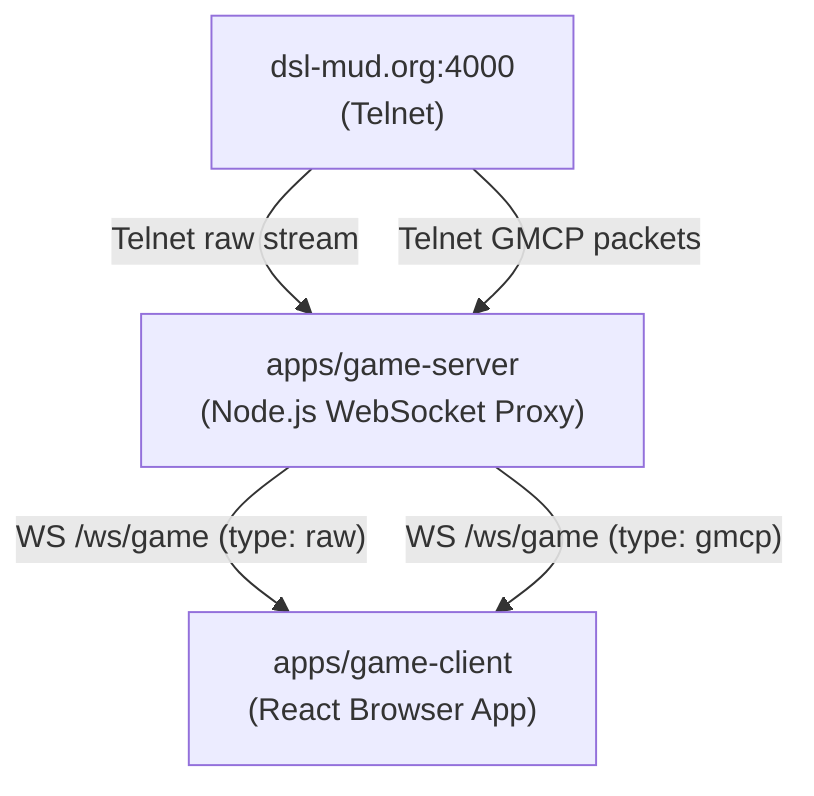
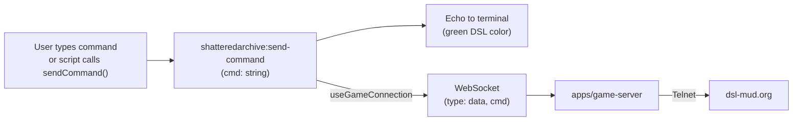

# Event Flow: Shattered Archive Game Client

This document describes the full data flow from the MUD server to the browser terminal, including all intermediate events and their transformation points.

## High-Level Flow



---

## Game Client — Detailed Event Pipeline

```mermaid
graph TB

  WS["WebSocket /ws/game"]

  WS -->|type='raw'| RAW_EMIT["DispatchEvent<br/>game:remote-server:raw"]
  WS -->|type='gmcp'| GMCP_EMIT["DispatchEvent<br/>game:remote-server:gmcp"]
  WS -->|type='error'| ERR_EMIT["DispatchEvent<br/>game:remote-server:error"]
  WS -->|type='close'| CLOSE_EMIT["DispatchEvent<br/>game:remote-server:close"]

  subgraph RuntimeSingleton["RuntimeSingleton (remap layer)"]
    RAW_EMIT -->|ListenRedispatchMap| SA_RAW["shatteredarchive:raw-data"]
    GMCP_EMIT -->|ListenRedispatchMap| SA_GMCP["shatteredarchive:gmcp-data"]
    ERR_EMIT -->|ListenRedispatchMap| SA_ERR["shatteredarchive:server-error"]
    CLOSE_EMIT -->|ListenRedispatchMap| SA_CLOSE["shatteredarchive:server-closed"]
  end

  subgraph UserScriptRuntime["UserScriptRuntime (parser layer)"]
    SA_RAW -->|processRawEvent| CHAT_PROBE{"Chat probe"}
    SA_RAW -->|processRawEvent| SPECIAL{"Special line<br/>detection"}
    SA_RAW -->|processRawEvent| OMIT{"Omit check<br/>(trigger rules)"}

    SA_GMCP -->|processGmcpEvent| GMCP_PARSE{"GMCP parser<br/>(keyword prefix)"}
    GMCP_PARSE -->|tick| EV_TICK["game:tick"]
    GMCP_PARSE -->|char_data| EV_CHAR["game:char-data"]
    GMCP_PARSE -->|room_data| EV_ROOM["game:room-data"]
    GMCP_PARSE -->|affect_data| EV_AFFECTS["game:affects-trueup"]
    GMCP_PARSE -->|add_affect| EV_AFF_ADD["game:affect-added"]
    GMCP_PARSE -->|remove_affect| EV_AFF_REM["game:affect-removed"]
    GMCP_PARSE -->|login_data| EV_LOGIN["game:character-login<br/>+ shatteredarchive:identity-updated"]
    GMCP_PARSE -->|all| EV_GMCP_RAW["game:gmcp"]
  end

  CHAT_PROBE -->|isChat=true| EV_CHAT["shatteredarchive:chat-line"]
  SPECIAL -->|flee / death / level-up / damage| EV_SPECIAL["event:flee:success<br/>event:flee:failed<br/>event:creature-death<br/>event:damage<br/>event:level-up"]

  OMIT -->|not omitted| EV_WRITE["shatteredarchive:write-terminal"]
  EV_WRITE -->|ShatteredArchiveTerminal| TERMINAL["xterm.js Terminal"]

  subgraph EqDeltas["useEquipmentDeltas"]
    SA_RAW -->|processLine| EQ_PARSE{"Equipment delta<br/>parser"}
    EQ_PARSE -->|wield| EV_WIELD_P["event:wield:primary"]
    EQ_PARSE -->|wield secondary| EV_WIELD_S["event:wield:secondary"]
    EQ_PARSE -->|wear| EV_WEAR["event:gear:wear<br/>event:gear:wear:[slot]"]
    EQ_PARSE -->|stop using| EV_REMOVE["event:gear:remove<br/>event:gear:remove:[slot]"]
    EQ_PARSE -->|disarm| EV_DISARM["event:disarm"]
  end

  subgraph UserTriggers["User Script Triggers (per-user)"]
    SA_RAW --> UT["User triggers fire<br/>if matchText matches"]
    UT -->|sendCommand| SC["shatteredarchive:send-command"]
    UT -->|writeTerminal| EV_WRITE
    SC -->|useGameConnection| WS2["WebSocket /ws/game<br/>(type: data)"]
  end

  EV_CHAT --> CHAT_STORE["Chat store<br/>(ChatPane)"]
```



---

## Outbound Command Flow



---

## Plugin & Script Event Routing

Plugins and user scripts can subscribe to any event in `ROUTED_WINDOW_EVENTS` (defined in `apps/game-client/src/features/plugins/routed-gmcp-events.ts`):

```
shatteredarchive:raw-data    — primary game text event
game:tick
game:char-data
game:room-data
game:affects-trueup
game:affect-added
game:affect-removed
game:character-login
game:gmcp

event:disarm
event:wield:primary
event:wield:secondary
event:gear:wear
event:gear:remove
event:flee:success
event:flee:failed
event:damage
event:creature-death
event:level-up
```

All events are dispatched on `window` via `CustomEvent`. See [game-client.md](../game-client.md) for full payload documentation.
