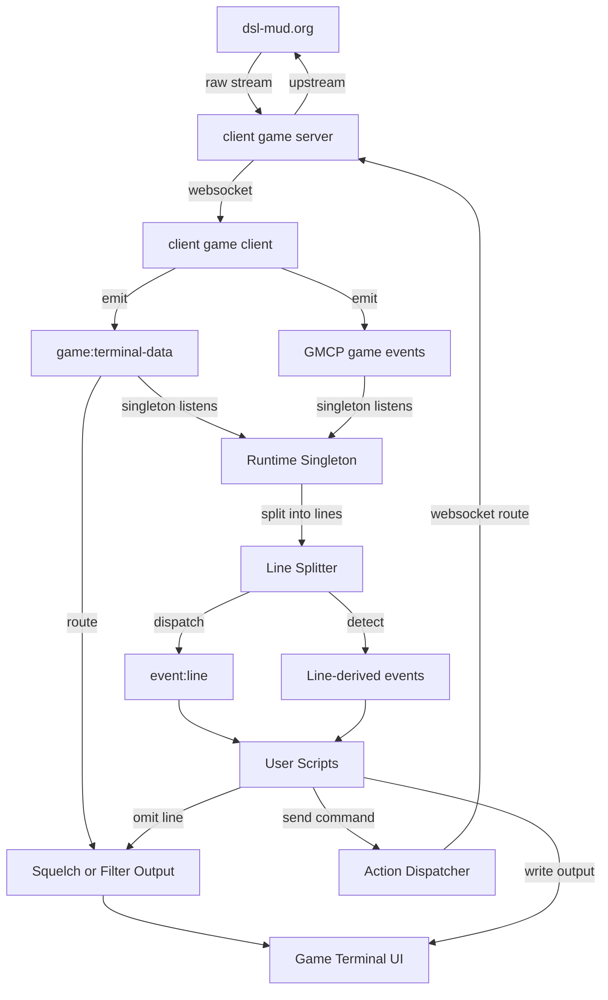

```mermaid
graph TB

  A["dsl-mud.org"] -->|raw stream| B["client game server"]
  B -->|websocket| C["client game client"]

  C -->|emit| T["game:terminal-data"]
  C -->|emit| G["GMCP game events"]

  T -->|singleton listens| R["Runtime Singleton"]
  G -->|singleton listens| R

  R -->|split into lines| L["Line Splitter"]
  L -->|dispatch| EL["event:line"]
  L -->|detect| ED["Line-derived events"]

  EL --> S["User Scripts"]
  ED --> S

  %% ✅ red link: terminal stream goes into squelch/filter path
  T -->|route| SQ["Squelch or Filter Output"]

  %% scripts can still omit
  S -->|omit line| SQ

  %% output (only if not squelched)
  SQ --> UI["Game Terminal UI"]

  %% scripts may also write output
  S -->|write output| UI

  %% outbound commands
  S -->|send command| AD["Action Dispatcher"]
  AD -->|websocket route| B
  B -->|upstream| A

```