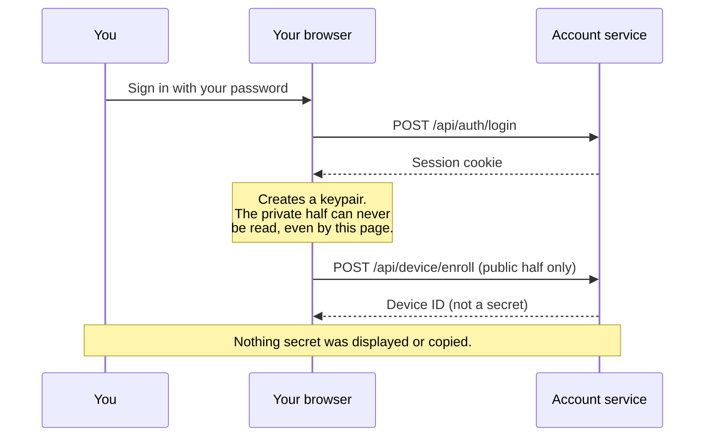
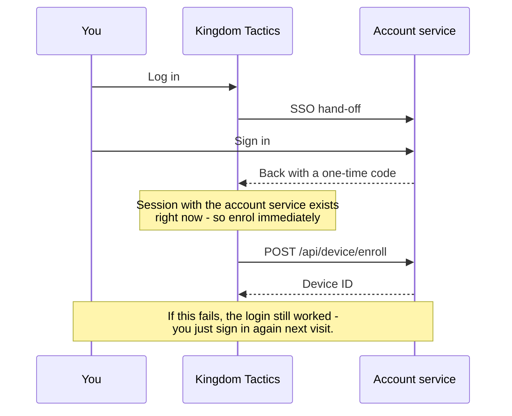
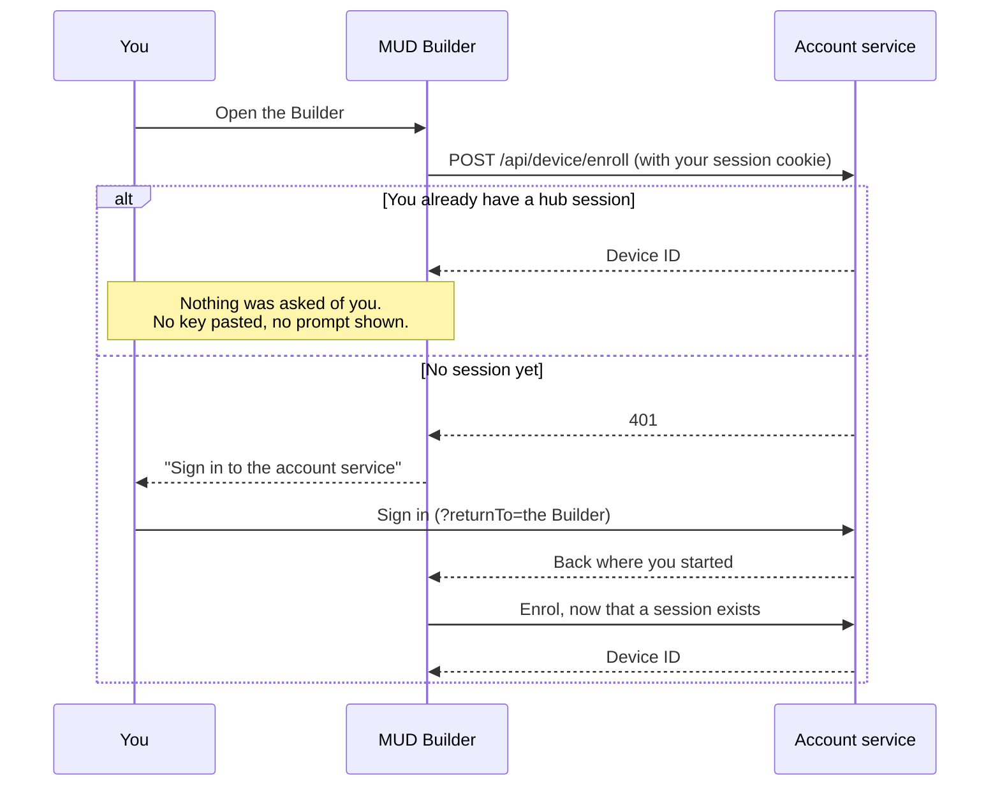
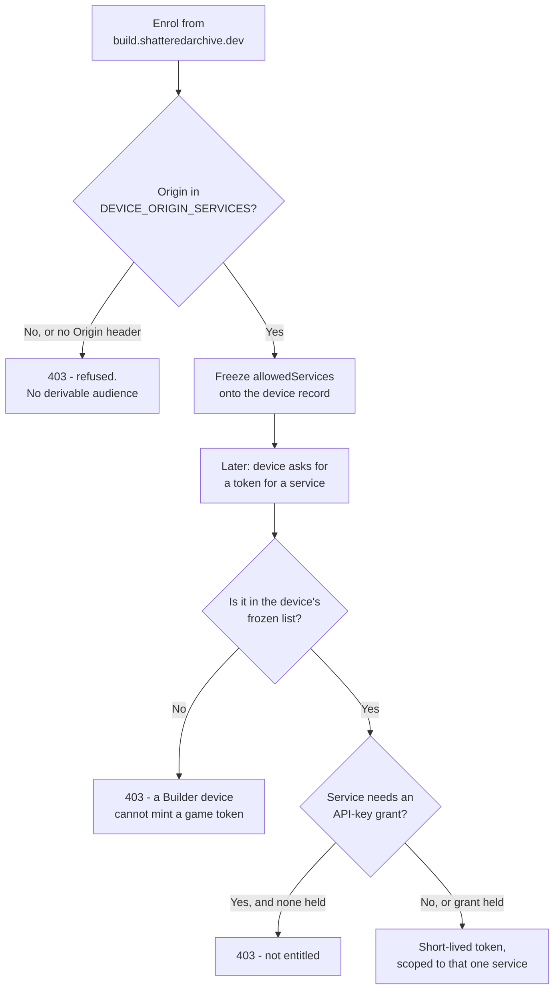
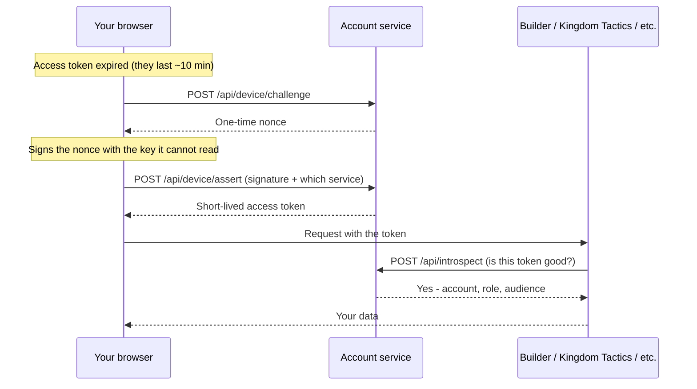
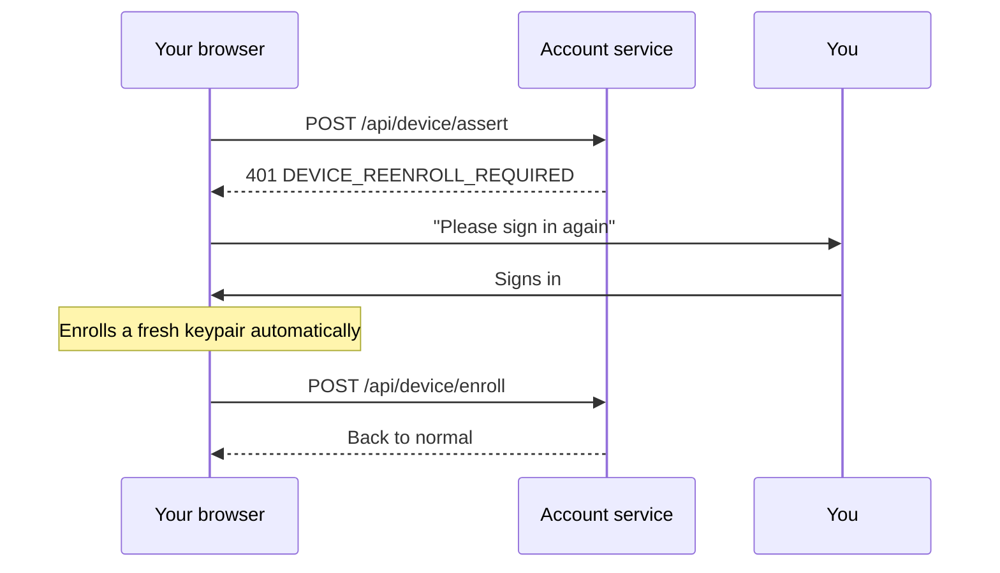

- [Overview](#overview)
- [Folder Path](#folder-path)
- [Concepts](#concepts)
- [API Endpoints](#api-endpoints)
  - [Auth](#auth)
  - [Account](#account)
  - [Keys](#keys)
  - [Introspect](#introspect)
  - [Health](#health)
- [Configuration](#configuration)
- [Deployment](#deployment)
- [Host-only scripts](#host-only-scripts)

---

# Overview

`auth-server` is a centralized login service (port **62000**) other Shattered Archive apps
validate bearer tokens against. It does nothing by itself: it only manages accounts and
issues/verifies per-service API keys and browser sessions mapped to one master identity.
Signup is open and username-based, gated by a 3-question anti-bot challenge. Phase 2 added
the browser UI (`apps/auth-client`, [`docs/auth-client.md`](./auth-client.md)) and a real
`/api/introspect` consumer — `mud-builder-server`'s `GET /api/auth/introspect-check`
(diagnostic-only proof that the mechanism works). Phase 4 went further: `mud-builder-server`'s
actual write guard (`authGuard`) now falls back to introspection for any bearer token its own
local `builder-auth.json` store doesn't recognize, so a key minted through `auth-client` with
`service: 'mud-builder-server'` authenticates real mutations there — local master/API-key
holders are unaffected and never depend on `auth-server` being reachable, since the local
store is always checked first. Both are code-complete and live-verified against real local
processes; since 2026-07-24, the fallback is also **wired into the deployed
`mud-builder-server`** in the experimental compose stack — see [Deployment](#deployment).
(It was left unwired through Phase 2/4 by deliberate choice, not an oversight, until asked
for.)

For local setup instructions, see [`../apps/auth-server/README.md`](../apps/auth-server/README.md).

# Folder Path

- `apps/auth-server`

# Concepts

- **Sessions ARE key records.** A login mints a short-TTL (24h) key record with
  `kind:'session'`, delivered via an httpOnly `SameSite=Lax` cookie (`sa_session`). One
  verification path (`key-store.ts`'s `verify()`) covers both browser sessions and
  service API keys.
- **Epoch-based invalidation.** Every account has an integer `epoch`; every key/session
  records the epoch it was minted at. A password change or an explicit "rotate master"
  bumps the account's epoch, instantly invalidating every previously issued key/session —
  no need to touch each record. Both of those actions mint a **fresh** session at the new
  epoch before responding, so the caller doesn't appear logged out.
- **Forced password change.** Both the system-issued signup password and any
  operator-issued temp password set `mustChangePassword: true`. While set, every route
  except `GET /api/auth/me`, `POST /api/account/change-password`, and
  `POST /api/auth/logout` returns 403.
- **At-rest encryption.** Every JSON store except the anti-bot question pool (which is
  meant to be hand-edited) is AES-256-GCM encrypted under a key held externally — see
  `apps/auth-server/README.md`'s security section for the exact threat model.
- **Server-to-server introspection.** `/api/introspect` is gated by a per-service Ed25519
  signed assertion (`X-Service-Assertion` header), never a session cookie. Multiple
  concurrently-valid keys per service are supported so rotation never causes an outage.
- **Device-bound credentials.** A signed-in browser enrolls a keypair whose private half it
  can never read or export, then *signs* a challenge to obtain short-lived access tokens.
  Nothing replayable is stored on either side. See
  [Device-bound credentials](#device-bound-credentials) below.

---

# API Endpoints

## Auth

### `GET /api/auth/challenge`

Per-IP throttled. Returns 3 random question prompts (never answers).

```json
{ "challengeId": "...", "prompts": [{ "questionId": "q1", "prompt": "..." }] }
```

### `POST /api/auth/signup`

```json
{ "username": "alice", "challengeId": "...", "answers": { "q1": "...", "q2": "...", "q3": "..." } }
```

A failed challenge creates **no account** and never reveals which answer was wrong (400).
On success, `201` with the one-time password **shown exactly once**:

```json
{ "username": "alice", "password": "...", "note": "..." }
```

### `POST /api/auth/login`

```json
{ "username": "alice", "password": "..." }
```

Sets the `sa_session` cookie. Returns:

```json
{ "id": "...", "username": "alice", "mustChangePassword": true, "emailOnFile": false, "emailVerified": false }
```

### `POST /api/auth/logout`

Session-guarded. Revokes the current session and clears the cookie.

### `GET /api/auth/me`

Session-guarded (allowed even mid-`mustChangePassword`). Same response shape as login.

### `POST /api/auth/forgot-password`

```json
{ "username": "alice" }
```

**Always** returns the same generic message, whether or not the account/email exists
(anti-enumeration). Mails a reset link only if the account has a verified email.

### `POST /api/auth/reset-password`

```json
{ "token": "...", "newPassword": "..." }
```

Applies the new password (12-char minimum) and bumps the account's epoch. Does **not**
auto-login.

## Account

All routes below are session-guarded and blocked while `mustChangePassword` is set,
**except** `change-password` itself.

### `POST /api/account/change-password`

```json
{ "currentPassword": "...", "newPassword": "..." }
```

Verifies the current password, bumps epoch, mints a fresh session (new `sa_session`
cookie in the response).

### `POST /api/account/email`

```json
{ "email": "alice@example.com" }
```

Mails a verification link. Does not touch `email`/`emailVerifiedAt` until verified.

### `POST /api/account/email/verify`

```json
{ "token": "..." }
```

### `POST /api/account/rotate-master`

No body. Bumps epoch (independent of a password change), mints a fresh session.

## Keys

All routes below are session-guarded and blocked entirely during `mustChangePassword`.

### `GET /api/keys`

Lists the caller's API keys (excludes sessions, never returns the token hash).

### `POST /api/keys`

```json
{ "service": "some-consumer", "label": "laptop", "expiresAt": null }
```

`expiresAt`: an ISO date in the future, or `null`/omitted for no expiration. Plaintext
token shown exactly once.

### `POST /api/keys/:id/rotate`

New token for the same id/label; the old value stops working immediately.

### `DELETE /api/keys/:id`

Revokes the key. 404 (not 403) for a key belonging to someone else.

## Introspect

### `POST /api/introspect`

Server-to-server **only** — never reachable via a browser session cookie. Requires an
`X-Service-Assertion` header: a compact, Ed25519-signed, ≤60s-lived assertion
(`{service, iat, exp, nonce}`) from a key registered via `register-service` (see
[Host-only scripts](#host-only-scripts)).

```json
{ "token": "the-api-key-or-session-token-to-check" }
```

An invalid/missing/unverifiable **assertion** is `401`. An unknown/expired/revoked
**token** being checked is a normal `{"valid": false}` — not an error:

```json
{
  "valid": true,
  "accountId": "...",
  "service": "some-consumer",
  "label": "laptop",
  "username": "melchaleve",
  "expiresAt": null,
  "tokenType": "api",
  "globalRole": "user"
}
```

`username`, `expiresAt`, and `tokenType` were added in Phase 15 — additive, existing
consumers that only read `valid`/`accountId`/`service`/`label` are unaffected.
`username` is the account's login name (looked up fresh from the account store, not
cached on the key). `expiresAt` is `null` for a key minted with no expiration, or an ISO
timestamp; a **session** token always has one (24h TTL), an **API** key only if its owner
chose one at mint time. `tokenType` is `"api"` or `"session"`, mirroring which kind of
credential was checked — useful for a consumer that wants to gate a sensitive action to
short-lived, purpose-scoped tokens only (a real example is in progress: see
`.ai-plans/20260725-1223-mud-builder-phase15-engine-rebuild-auth-hardening.md`'s Step 4,
a `mud-builder-server` guard that will require `expiresAt` within 7 days).

`globalRole` (Phase A, additive like the Phase 15 fields) is the account's hub-global
tier: `owner`, `admin`, `moderator`, or the default `user`. Tiers are assigned host-side
via `grant-tier`/`revoke-tier` (see [Host-only scripts](#host-only-scripts)); an HTTP
admin surface with the strictly-below management rule arrives in Phase A2. `tokenType`
can now also be `"sso"` or `"obo"` — see the next section.

`service` is the token's **audience**. As of Phase A, consumers must treat a valid token
minted for a DIFFERENT service as a refusal — use `matchesAudience()` from
`@shatteredarchive/services-server` at every introspect call site. Cross-service access
goes through the on-behalf-of exchange below, never by forwarding a user's token.

## SSO hand-off + token exchange (Phase A)

The cross-site login flow. The constellation spans two TLDs, so no cookie can cover it —
consumers hand the browser to the hub and their **backend** redeems a one-time code.
Service private keys are never exposed to any client; every exchange requires a service
assertion as proof of service trust.

1. Consumer sends the browser to
   `https://auth.shatteredarchive.dev/sso/authorize?service=<name>&redirect_uri=<uri>&state=<opaque>`.
2. auth-client walks the user through login (and forced password change, if pending),
   then shows the consent card. Deny returns `redirect_uri?error=access_denied&state=…`.
3. Approve calls `POST /api/sso/approve` (session-guarded) and sends the browser to
   `redirect_uri?code=<one-time>&state=…`.
4. The consumer's backend redeems the code at `POST /api/token-exchange` and stores the
   resulting bearer token however it likes; the browser never sees it.

### `POST /api/sso/approve`

Browser-side, session-cookie guarded (and blocked during `mustChangePassword`). Both the
`service` and the exact `redirectUri` must be pre-registered (`register-service` +
`register-redirect-uri`); the failure is one generic `400` that never says which check
failed.

```json
{ "service": "some-consumer", "redirectUri": "https://consumer.example/auth/callback" }
```

→ `201 { "code": "…" }` — single-use, 60s TTL, held in memory only (a restart voids
outstanding codes, by design). Any redeem attempt **burns** the code, even a mismatched
one.

### `POST /api/token-exchange`

Server-to-server only, gated by `X-Service-Assertion` exactly like introspect — there is
no client-side exchange path.

**`authorization_code`** — the login redemption. The code must have been approved for
the ASSERTING service (an assertion from service 1 can never redeem service 2's code)
with the same exact `redirectUri`:

```json
{ "grantType": "authorization_code", "code": "…", "redirectUri": "https://consumer.example/auth/callback" }
```

→ `201` with a **7-day** `tokenType:"sso"` bearer token whose `service` (audience) is
the caller:

```json
{
  "token": "…", "accountId": "…", "username": "melchaleve",
  "service": "some-consumer", "expiresAt": "…", "tokenType": "sso", "globalRole": "user"
}
```

**`on_behalf_of`** — the ONLY sanctioned cross-service path (raw token forwarding is
banned). The subject token must be valid, of kind `api` or `sso`, and its audience must
be the ASSERTING service; the target must be a different registered service:

```json
{ "grantType": "on_behalf_of", "token": "<caller-audience token>", "targetService": "other-service" }
```

→ `201`, same shape, with a **2-minute** `tokenType:"obo"` token audience-scoped to
`targetService` and still bound to the same account. `session` and `obo` subject tokens
are refused — hub sessions never leave the hub, and OBO tokens cannot be chained into
further hops.

Client helpers for all of this (`exchangeAuthorizationCode`, `exchangeOnBehalfOf`,
`matchesAudience`, plus the `GLOBAL_TIERS`/`SERVICE_TIERS` ladders and the
strictly-below `canManage`) live in `services/services-server/src/auth-introspect-client.ts`
and `auth-tiers.ts`.

## Admin (Phase A2)

Session-guarded like the account/keys routes, **plus** `requireElevated`: a plain
`user` tier is `403` on everything here, the list included. Every rule is enforced
server-side — auth-client's Admin tab merely mirrors it.

The strictly-below rule, concretely: an actor may only **manage** (change roles,
issue recovery for) an account whose CURRENT tier sits strictly below their own —
peers refuse (an admin cannot touch a peer admin) — and may only **assign** tiers
strictly below their own (owner → admin/moderator/user; admin → moderator/user;
moderator → user). `owner` is never assignable over HTTP; appointing an owner stays
`grant-tier`, host-side.

### `GET /api/admin/users?query=&offset=&limit=`

Paged (default 25, max 100), username-substring searchable. Rows carry
username/globalRole/createdAt/mustChangePassword/email-state, LIVE credential counts
(non-revoked, non-expired, per kind), and a `manageable` flag; the response includes
`assignableTiers` for the caller. Never password hashes, never token material.

### `POST /api/admin/users/:id/role` · `POST /api/admin/users/:id/temp-password`

Role assignment (body `{"role": "…"}`) and one-time recovery passwords (shown exactly
once; forces a password change and bumps the epoch, so every prior session/key dies).
Unknown ids are `404`; known-but-unmanageable targets are `403`. Both actions append
to `DATA_DIR/audit.log` (plain JSONL: `{at, actorId, actorUsername, action, targetId,
targetUsername, detail}` — written, never read back; grep it).

### `GET /api/admin/services`

The delegation surface's data: every registered service with its active key count and
SSO redirect URIs. Domain roles are delegated — each service administers its own tiers
in its own UI; auth-client renders link-outs, never a remote role editor.

`GET /api/auth/me` also gained an additive `globalRole` so clients can decide whether
to show admin affordances.

## Device-bound credentials

### What this is, and why it exists

Before this, staying signed in meant a browser kept a **copy of a secret** — a token in
`localStorage`. Anything that could run JavaScript on the page could read that token, copy
it, and reuse it later from anywhere.

A device-bound credential removes the copy. The browser generates a **keypair** and marks
the private half *non-extractable*: the browser will use it to sign things, but there is no
API — not for our code, and not for an attacker's — that can read the key's bytes back out.
To prove who it is, the browser signs a one-time challenge instead of presenting a secret.

The practical consequences, and it's worth being precise about each:

| | Before (stored token) | Now (device key) |
|---|---|---|
| What's kept on the device | A reusable secret | A key that cannot be read or copied |
| What a page-level attacker can take | The token — usable later, anywhere | At most one access token, expiring in ~10 minutes |
| Can they stay in after you notice? | Yes, until you revoke the token | No — they cannot enroll without a fresh sign-in |
| Shown on screen at any point | Yes, the token | **Nothing** |

That last row matters if you ever share your screen or stream: **the normal sign-in flow no
longer displays a secret at any point.**

This does *not* make a compromised page harmless. While malicious code is running on the
page it can still ask for a token and act as you. What it can no longer do is walk away
with something that keeps working afterwards.

### Enrolling a device (one time, per browser)



Enrollment **always requires a real sign-in**. That is deliberate: if a device could be
enrolled using only a token, an attacker who stole a token could enroll their own key and
keep access permanently — exactly the problem this design exists to remove.

Kingdom Tactics does this **automatically** as part of its normal SSO login, so there is no
separate step for the user there:



The MUD Builder reaches the same end state without a login of its own. It enrols from its
access probe, so a user who already has a hub session never sees a prompt at all — and a user
who doesn't gets one link, not a credential to copy:



The audience a device may later ask for is decided **here**, at enrollment, from the origin it
enrolled at — never from the later request:



### Everyday use — silent, no prompts



You see none of this. The token is held in memory only, never written to disk, and is
re-minted silently whenever it expires.

**One token per service.** The signature names which service the token is for, and the
resulting token works *only* there. A token for the Builder is refused by Kingdom Tactics.
This is the same service-isolation rule the rest of the hub follows.

### When a device stops working

Three situations end an enrollment, and all of them are recoverable by signing in again:



1. **You changed your password** (or reset it, or an admin issued a temp password). Every
   enrollment for the account stops working immediately. This is intentional — if you
   changed your password *because it leaked*, any device the attacker enrolled must die
   with it.
2. **You revoked the device** from your device list, or used "sign out everywhere".
3. **The browser discarded the key.** Safari deletes this kind of storage after **7 days
   with no interaction** with the site (a click, tap or keypress — scrolling doesn't
   count). Installing the site to your home screen exempts it from that.

There is also one case where device sign-in is never offered at all: the page must be loaded
over **https**. Browsers only expose the cryptography this depends on in a "secure context",
and they decide that from the address's scheme and hostname — *not* from what the name resolves
to. So `http://localhost` counts, but `http://some.hostname` does not, even when a hosts entry
points that name at 127.0.0.1. Every service in this stack is reached by hostname over https
(dev included — the local stack serves TLS with a certificate covering `*.shatteredarchive.dev`),
so this is satisfied in normal use; if someone does reach a service over plain http, the Access
tab now says so explicitly rather than quietly hiding the option.

For admins fielding questions: *"it asked me to sign in again after two weeks off"* is
expected Safari behaviour, not a fault. Point the user at **Add to Home Screen** if it
becomes a recurring annoyance for them.

### Endpoints

#### `POST /api/device/enroll`

Session-guarded, and blocked during a forced password change. Body:
`{ publicKeyJwk, label }`. The JWK must be an EC **public** key on P-256 — a JWK containing
a `d` field is rejected outright rather than trimmed, because its presence means the client
exported private key material that was supposed to be unexportable.

Returns `201 { deviceId, label }`. **No secret is ever returned.**

#### `POST /api/device/challenge`

Public. Body `{ deviceId }` → `{ nonce, expiresAt }`. A nonce is single-use, expires in 2
minutes, and is bound to the device it was issued to.

Deliberately returns a nonce even for a device ID that doesn't exist. Otherwise this
endpoint would be an oracle for discovering valid device IDs; the failure surfaces at
`assert` instead.

#### `POST /api/device/assert`

Public — the signature *is* the authentication. Body
`{ deviceId, nonce, signature, service }` → `{ token, expiresAt, service }`.

The signed bytes cover the device ID, the nonce, **and the service**, so a signature
captured for one service cannot be replayed to mint a token for another. The nonce is
consumed *before* the signature is checked, so a wrong signature still burns it and the
challenge cannot be used as a grinding target.

Failure returns `401`. When the device needs re-enrollment (unknown, revoked, or invalidated
by a password change) the body carries `code: "DEVICE_REENROLL_REQUIRED"` so the client can
start a sign-in rather than showing a dead end. The three underlying reasons are
deliberately indistinguishable to the caller.

#### Cross-origin access (operators: read this before deploying)

Each site enrolls its **own** device key, because browser key storage is scoped per origin —
a key created on `auth.shatteredarchive.dev` simply does not exist for
`build.shatteredarchive.dev`. Enrollment therefore happens from each site directly, as a
cross-origin call carrying your session cookie.

That works without weakening the cookie, because the hub's sites all sit under one domain
(`shatteredarchive.dev`) and so count as *same-site* — but each origin must be named
explicitly in **`DEVICE_ORIGIN_SERVICES`** on auth-server, paired with the service it is
allowed to reach:

```
DEVICE_ORIGIN_SERVICES=https://build.shatteredarchive.dev=mud-builder-server,https://kingdom-tactics.shatteredarchive.dev=kingdom-tactics-server
```

**This mapping is the security boundary, not just an allowlist.** A device asks for a token by
naming a service, so if the browser's choice were honoured, a script running on *any* enrolled
site could mint a token for a *different, more privileged* one — an XSS on the game would
become Builder write access. Instead the audience is decided by **where the device enrolled**,
resolved through this map and frozen onto the device record. The service named in a later
request is only ever checked against it. This map is deliberately a copy of the routing nginx
already performs (`deploy/nginx/edge-subdomains.conf`): an origin may reach exactly the
upstream the edge routes it to, and nothing else — so keep the two in step.

Use `origin=svc1|svc2` when one origin genuinely talks to several backends.

If an origin is missing from that list, its enrollment is refused and users there stay on the
old sign-in path. **The default is empty, i.e. deny everything** — that is deliberate, so a
forgotten config fails closed rather than silently allowing any site to drive an enrollment
with a user's cookie. Wildcards are not supported and never will be: a wildcard is invalid for
credentialed requests, and reflecting arbitrary origins would hand any hostile page the ability
to enroll itself against a signed-in account.

The origin check is enforced **server-side**, not left to CORS. CORS is advisory — a browser
refuses to expose a disallowed *response*, but the request still arrives, and a non-browser
client sends whatever `Origin` it likes or none at all. An enrollment with no recognised origin
has no derivable audience, so it is refused rather than defaulted.

Each entry is an **origin** — scheme, host, and port only, matched as an exact string against
the browser's `Origin` header. Surrounding whitespace and a trailing slash are tolerated;
nothing else is. The verified behaviour:

| Value | Result | |
|---|---|---|
| `https://build.shatteredarchive.dev` | allow | the correct form |
| `https://build.shatteredarchive.dev/` | allow | trailing slash is trimmed |
| `https://build.shatteredarchive.dev:443` | **deny** | browsers omit default ports — never write `:443` or `:80` |
| `http://build.shatteredarchive.dev` | **deny** | scheme is part of the origin |
| `https://BUILD.shatteredarchive.dev` | **deny** | matching is case-sensitive; use lowercase |
| `build.shatteredarchive.dev` | **deny** | a bare hostname is not an origin |

Two that catch people out: `localhost` and `127.0.0.1` are **different origins** to a browser,
so a dev who browses via one needs that exact form listed. And a *port* difference makes a
different origin even though cookies ignore ports entirely — which is precisely why local dev
works at all: `localhost:60080` calling `localhost:62000` is cross-origin (so it needs an
allowlist entry) yet same-host for cookies (so the session cookie is still sent).

Current values: the experimental stack maps the Builder and Kingdom Tactics origins to their
own services; the production stack is **deliberately empty**, because neither of those clients
is deployed there yet. Local dev values live in `apps/auth-server/.env`.

> **`.com` apps cannot use this path.** `shatteredarchive.com` is a different registrable
> domain from `shatteredarchive.dev`, so a `.com` origin calling the `.dev` hub is
> cross-**site**, and a `SameSite=Lax` cookie is not sent at all. Enrollment there would have
> no session to authenticate. This is a limit of the *cookie*, not of CORS, so no allowlist
> entry can fix it — a `.com` app must use the SSO code flow instead. Listing a `.com` origin
> here would appear to work right up until the first enrollment silently 401s.

#### Entitlement: making the API key the grant

By default, any signed-in account may enrol a device for any service its origin maps to. For a
privileged service that is too generous — authoring access should be something an operator
*grants*, not something every account has. `DEVICE_GRANT_REQUIRED_SERVICES` adds that check:

```
DEVICE_GRANT_REQUIRED_SERVICES=mud-builder-server
```

For a listed service, a device may only mint a token if the account **also holds an active API
key for that service**. The API key stops being something a user pastes into an app and becomes
the entitlement record: granted and revoked in auth-client's API keys tab, while the device key
remains the thing that actually authenticates. Revoking the key withdraws that service from
every one of the account's devices at once.

The check runs at **mint** time (every ~10 minutes), not at enrollment, so a revocation takes
hold on the next renewal rather than only on the next enrollment — which for a working device
would be never.

**Empty by default, and switching a service on is not a no-op:** it immediately refuses every
account that has no key for that service. Kingdom Tactics should stay open — anyone signed in
may play. The Builder is the natural candidate to turn on.

#### Which apps use this

| App | How it enrols |
|---|---|
| MUD Builder | **Automatically** on page load when you already have a hub session. Otherwise it offers a sign-in link that brings you straight back, and a manual "Enrol this device" fallback |
| Kingdom Tactics | **Automatically**, right after the normal SSO login — no extra step for the user |
| auth-client | Does not enrol — it is same-origin with this service and uses the session cookie directly. It is where you *manage* the devices the other apps enrolled (see "Managing your devices") |

Kingdom Tactics enrols during the login hand-off because that is the one moment a session with
this service is guaranteed to exist. If it fails, the login still succeeds — the user just gets
asked to sign in again next visit, exactly as before device credentials existed.

The Builder instead enrols from its access probe: if the browser is not yet bound but the user
already has a hub session, it binds silently and the page simply works. **Nothing is pasted and
nothing is prompted.** If there is no session yet, it links to the hub's login with a
`returnTo`, and the user lands back on the Builder already set up.

Each app needs two matching settings: its own origin mapped in this service's
`DEVICE_ORIGIN_SERVICES`, and `AUTH_SERVER_PUBLIC_URL` set on *its* server so it can tell its
browser where this service lives. Miss either and that app quietly keeps its old login.

#### Signing in from another app (`?returnTo=`)

The hub's login accepts a `returnTo` query parameter, so an app that needs a session can send
the user here and get them back:

```
https://auth.shatteredarchive.dev/?returnTo=https%3A%2F%2Fbuild.shatteredarchive.dev%2F
```

The destination is validated against the **same configured origins** as device enrollment
(exposed for that purpose by the public `GET /api/device/origins`). An unvalidated `returnTo`
is a classic open redirect: the victim sees a genuine, trusted login URL and is handed to an
attacker's page afterwards. Matching is on the exact **origin** — scheme, host and port — so a
lookalike host like `build.shatteredarchive.dev.attacker.test` is refused, as is the right host
on the wrong scheme or port. A relative path, a `javascript:` URL, or an unparseable value are
all refused, and the user simply lands on their account page.

The hand-back only happens from a **fully onboarded** session, so arriving with a `returnTo`
can never skip a forced password change.

#### `GET /api/device` · `POST /api/device/:id/revoke` · `POST /api/device/revoke-all`

Session-guarded device management. The list never includes key material. Revocation is
scoped to the signed-in account, is a tombstone rather than a delete (so it stays
auditable), and enrollment/revocation both append to `audit.log`.

### Managing your devices

The **Keys & devices** tab in auth-client lists every browser bound to your account — its
label, the services it may reach, when it enrolled and when it was last used — with a
per-device Revoke and a Revoke-all. Revoked entries stay (they are permanent tombstones
server-side) but collapse behind a *Show revoked* toggle.

Keys and devices share one tab because they are **different axes of the same question**, and
picking the wrong one is the common mistake:

| | Scope | Revoking it… |
|---|---|---|
| **API key** | one service, all your devices | cuts that service off everywhere you are signed in |
| **Device** | one browser, all services | kills the stolen laptop; your desktop keeps working |

Neither substitutes for the other, which is why device revocation is not just "rotate the key
again".

Two things the UI says out loud, because both surprise people:

- **There is no "this device" marker.** The device key lives in the IndexedDB of the origin
  that enrolled it (`build.shatteredarchive.dev`), and the hub is a different origin — it
  genuinely cannot tell which row is the browser you are reading in. Consumer apps default the
  label to something like `Chrome on Windows` at enrolment so the list stays readable.
- **Revoking is not enough for a lost laptop.** Whoever holds the device holds its cookies
  too, including a possibly still-live hub session — which can silently enrol a *new* device
  moments later, since enrolment is automatic. Changing your password bumps the account epoch
  and invalidates every session and every enrolment at once. That, not the revoke button, is
  what ends the access.

### When a secret must still be shown

Device enrolment displays nothing secret, but a few paths genuinely must reveal a value once —
an issued API key, a rotated master key, a one-time password. Those are exactly the moments
someone is likely to be on a call with an operator, so they use a masked box rather than plain
text:

- **Hidden by default.** Revealing is always a deliberate click.
- **Copy works without revealing**, so the ordinary path never puts the value on screen.
- **Auto re-hides** after a few seconds.
- **Hides instantly if you switch away** (tab change, or focus leaving the window). This is the
  one that matters in practice: revealing a key, alt-tabbing to paste it, and leaving it visible
  on a screen you are no longer watching.

To be straight about the limit: this cannot stop a screenshot taken while the value is
revealed. It shrinks the exposure window from "until someone dismisses it" to a few seconds of
deliberate action — it is not a reason to relax about showing secrets.

## Health

### `GET /health`

```json
{ "status": "ok", "uptimeSeconds": 12345 }
```

---

# Configuration

See `apps/auth-server/README.md`'s [Environment variables](../apps/auth-server/README.md#environment-variables)
table.

---

# Deployment

Deployed at `https://auth.shatteredarchive.dev` (port 62000, `expose`-only, never
`ports:`-published) in both `deploy/docker-compose.yml` and
`deploy/docker-compose.shattered-archive-experimental.yml`, behind the edge nginx's
resolver+variable pattern (same as `build.shatteredarchive.dev`) so the edge starts
cleanly even if `auth-server` isn't running. The data-encryption key is delivered via a
mounted file in a dedicated `auth-server-secrets` volume — self-generated on first boot,
persists across container recreation, kept separate from `auth-server-data` so a leaked
data volume alone can't be decrypted.

Consumers are wired into deploy on a case-by-case basis. `mud-builder-server` (present only
in the experimental compose, not prod) is the first: as of 2026-07-24, its compose service
block sets `AUTH_SERVER_URL` (the `auth-server.shatteredarchive.dev` docker-network alias —
`localhost`, the container's own default, does not resolve to the auth-server container) and
`SERVICE_PRIVATE_KEY_PATH`, and mounts a git-ignored `apps/mud-builder-server/secrets/`
bind mount (mirroring `auth-server-secrets`'s intent, but a plain bind mount rather than a
named volume since it holds a per-install PEM file an operator minted, not
server-self-generated state) containing `shattered-service.key`, the private half printed
once by `register-service mud-builder-server` when it was registered against the deployed
`auth-server`'s live data. Rotating it: register a NEW key, replace the mounted file,
recreate `mud-builder-server`, confirm `GET /api/auth/introspect-check` reports `valid:true`
for a real account key, THEN `revoke-service-key mud-builder-server <old-key-id>` — revoking
before the new key is confirmed live would 401 every account-key holder in between.

**Phase A (SSO + token exchange + global roles) is live as of 2026-07-27** — both
`auth-server` and `auth-client` containers rebuilt and recreated; the bind-mounted data
dir and the `auth-server-secrets` key volume carried everything across, and a live E2E
(signup → login → forced change → `/api/sso/approve` → `authorization_code` exchange →
introspect, then `grant-tier` picked up **without a restart**, an `on_behalf_of` exchange
against `mud-builder-server` as the target audience, code-replay refusal, and a
revoked-service-key 401) passed end to end through the edge at
`https://auth.shatteredarchive.dev`. Evidence trail:
`.ai-plans/20260727-0905-auth-rollout-phaseA-hub-sso-roles.md`.

Wiring a NEW consumer now has one extra registration step beyond the key: its SSO
callback must be registered with `register-redirect-uri <service> add <uri>`
(exact-match) or `/api/sso/approve` will refuse the hand-off. Both registration scripts
follow the same live-data procedure as `register-service` (run on the deploy host with
the container's `DATA_ENCRYPTION_KEY`; move `apps/auth-server/.env` aside first — its
`override:true` load clobbers inline env vars — and restore it after).

Host-machine note for edge E2E runs: the dev TLS chain trusts a CA in the **Windows
system store**, and `auth.shatteredarchive.dev` resolves via the hosts file — so probe
with `node --use-system-ca` (curl fails the handshake with exit 35; that's the CA
bundle, not an outage).

**Phase B (C# `Server.Web.Public` clean-cut identity replacement) is done as of
2026-07-27** — `shattered-web` is registered (key id `570aac0b4cbc`); the legacy
JWT/password login was deleted outright, replaced by the SSO hand-off + JIT
provisioning. Evidence trail:
`.ai-plans/20260727-1022-auth-rollout-phaseB-csharp-clean-cut.md`.

**Deployment topology correction (2026-07-27, user-clarified):** the
`shatteredarchive-csharp` container this repo can see and redeploy
(`C:\Projects\DSL\Server\docker-compose.yml`, a separate compose project — NOT part
of either compose file in this repo) runs on the SAME machine as this repo's own
`auth-server`/`auth-client` dev stack. It is a **local development/testing replica**,
not the real internet-facing `shatteredarchive.com` — that is a separate, unrelated
remote machine this repo does not deploy to. (`docker-compose-prod.yml` in the DSL
repo is a template meant to be copied to that OTHER machine, not a description of
what runs here.) Earlier phrasing in this doc and in the sub-plan describing this as
"the live production site" was wrong and has been corrected; `shattered-web`'s
registered redirect URI is `http://localhost:5000/user/sso/callback` (this dev
machine's own port), not the unrelated `shatteredarchive.com` domain.

The C# site's own container hit the same DNS trap noted above **from inside its own
container, not just from the host**: `auth.shatteredarchive.dev` resolves to
`127.0.0.1` there too (the hosts-file entry leaks into container DNS regardless of
which compose project the container belongs to), so a container-side call to the
public hub URL fails outright. Fix: the site's container joined the internal
`shatteredarchive_shatteredarchive` bridge network (created by this repo's
experimental compose) alongside its own `sa-shared` network, and reaches the hub over
`http://auth-server.shatteredarchive.dev:62000` — the same internal-alias pattern
`mud-builder-server` already uses. This internal-alias join is specific to this dev
machine's docker networks and should NOT be assumed to apply on the separate real
production host without first checking how that host actually reaches whatever auth
hub it uses.

**This split matters for any future consumer that redirects a browser (not just
server-to-server calls):** the browser-facing `/sso/authorize` consent URL must stay
the PUBLIC `https://auth.shatteredarchive.dev`, never the internal alias — a real bug
caught only by a genuine live E2E (local certification against a scratch hub didn't
surface it, since there both audiences were reachable identically). The C# port's fix
was two distinct config fields: an internal `BaseUrl` for introspect/exchange, and a
public `AuthorizeBaseUrl` for the browser redirect — falling back to `BaseUrl` when
unset (e.g. local dev, where both audiences coincide).

**Phase D (game-client wiring) is done as of 2026-07-27.** `game-client` (the
browser MUD client, a separate origin/dev-server from the C# site) is a **public
client of `shattered-web`** — it has no service key of its own, by design (a
browser bundle can't hold a private key). Instead, the C# site's backend performs
the SSO code exchange on game-client's behalf, using the SAME `shattered-web` key
already registered for Phase B, then hands the resulting bearer token to
game-client over a URL **fragment** (`#auth_token=...&expires_at=...`) — never a
query string or a cookie (a different origin can't read the site's `jwt-token`
cookie anyway, and a fragment never reaches any server or log). `shattered-web`
now carries TWO registered redirect URIs: `/user/sso/callback` (the site's own
login) and `/user/game-sso/callback` (this hand-off) — registered via the same
`register-redirect-uri` script as any other consumer.

**Real bug caught by live testing, not review:** the C# `AuthHubClient`'s
`AuthorizeUrl(state)` was originally hardcoded to the site's own redirect URI for
every caller, so a real browser following the game-client hand-off would have
landed on the site's OWN callback (wrong cookie, wrong flow) instead of
game-client's. Fixed with `AuthorizeUrl(state, redirectUri)` /
`ExchangeAuthorizationCodeAsync(code, redirectUri)` overloads that take the
caller's actual redirect URI explicitly — the hub's `sso-code-store.redeem()`
requires an EXACT match between the URI used at approve-time and exchange-time,
so a generic default silently produces the wrong flow rather than an error.

Once a token exists, game-client uses it as a normal `Authorization: Bearer`
credential against the C# site's own per-account content API
(`/api/user-content/scripts`, `/api/user-content/plugin-configs` — see the C#
side's own docs for that surface) via a `/api/site/*` dev-proxy in local dev and
an absolute cross-origin call in production, relying on `Cors:AllowedOrigins`
rather than the historical `AllowAnyOrigin` default. Login is entirely optional —
game-client works fully logged-out; the only effect of logging in is enabling
cloud save/load of that connection's scripts and plugin configs from the
in-client Account panel.

Live E2E evidence trail: `.ai-plans/20260727-1420-auth-rollout-phaseD-game-
client-wiring.md` — a real hub signup, the full game-sso redirect chain, a real
bearer token, and PUT/GET round trips against the live C# backend, run fresh
multiple times across the phase's steps.

**Phase F (Kingdom Tactics) is done as of 2026-07-28.** Unlike game-client,
`kingdom-tactics-server` **is** a real backend and performs its **own** SSO code
exchange with its **own** registered Ed25519 key — a standard Phase A consumer,
not a borrowed-key one. `join` frames on the `/ws/kt` gateway carry an optional
bearer token (introspected server-side, attached to the claimed seat as an
accountId) purely additively — a missing, invalid, expired, or unreachable-hub
token all degrade to the same fully-anonymous join, never a rejection. A
separate, browser-facing hand-off (`GET /api/kt/auth/start` /
`GET /api/kt/auth/callback`, both new HTTP routes — this service's first ever
beyond `/` and `/health`) mints the token kt-client stores, over the same safe
URL-fragment mechanism as game-client's Phase D. Once a match decides, kt-server
persists match history + a replayable action log (never the hidden-outcome
combat salt — replay reconstruction happens server-side, the client only ever
sees the resulting state sequence) and, separately, account-scoped army-layout
saves, all per-account JSON files gated by the SAME introspection wiring as the
WS resolver — but with the OPPOSITE failure policy (a missing/invalid token 401s
these HTTP routes; there's no anonymous equivalent for "my match history").

Deployed single-subdomain (`kingdom-tactics.shatteredarchive.dev`, added
2026-07-28) — the edge nginx proxies `/api/kt/`, `/ws/kt`, and `/health` to
`kingdom-tactics-server` and everything else to `kingdom-tactics-client`,
mirroring `build.shatteredarchive.dev`'s pattern; kt-client itself makes only
relative-path calls (no separate client/server subdomain pair, no baked-in
absolute API origin). This service's own server-to-server hub calls
(introspect/exchange) use the internal docker alias
(`http://auth-server.shatteredarchive.dev:62000`, no TLS, matching
mud-builder-server's convention) while the browser-facing `/sso/authorize`
redirect stays the public edge — the same public-vs-internal split Phase B/D
already established, implemented here via `AUTH_SERVER_URL`/
`AUTH_SERVER_PUBLIC_URL`.

Live E2E evidence trail: `.ai-plans/20260727-1930-auth-rollout-phaseF-kingdom-
tactics.md` — real hub logins, the full WS join + HTTP hand-off flows, a
determinism-proven match replay, and (Step 4) the complete chain re-run through
the actual deployed containers and edge nginx routing, not just direct
container-to-container calls.

See [`deploy.md`](./deploy.md) for the general
deployment architecture.

---

# Host-only scripts

These are **never** HTTP routes — they run on the host with direct access to the
encrypted stores:

| Script | Purpose |
|---|---|
| `pnpm --filter @shatteredarchive/auth-server temp-password <username>` | Issue a one-time recovery password for an existing account (forces a password change on next login) |
| `pnpm --filter @shatteredarchive/auth-server register-service <name>` | Generate an Ed25519 keypair for a consuming service; prints the private key once |
| `pnpm --filter @shatteredarchive/auth-server revoke-service-key <name> <keyId>` | Second half of a no-downtime service-key rotation |
| `pnpm --filter @shatteredarchive/auth-server grant-tier <username> <owner\|admin\|moderator\|user>` | Assign a hub-global tier (Phase A; HTTP admin surface arrives in A2) |
| `pnpm --filter @shatteredarchive/auth-server revoke-tier <username>` | Clear an account back to the plain `user` tier |
| `pnpm --filter @shatteredarchive/auth-server register-redirect-uri <service> <add\|remove\|list> [uri]` | Manage a service's registered SSO redirect URIs (exact-match, http(s) only) |

> Don't add a `--` before the arguments — on this repo's pinned `pnpm@11.x`,
> `pnpm --filter <pkg> <script> -- <args>` forwards the literal `--` through as an argument
> instead of stripping it. None of these scripts take flag-shaped arguments, so it's never
> needed.
