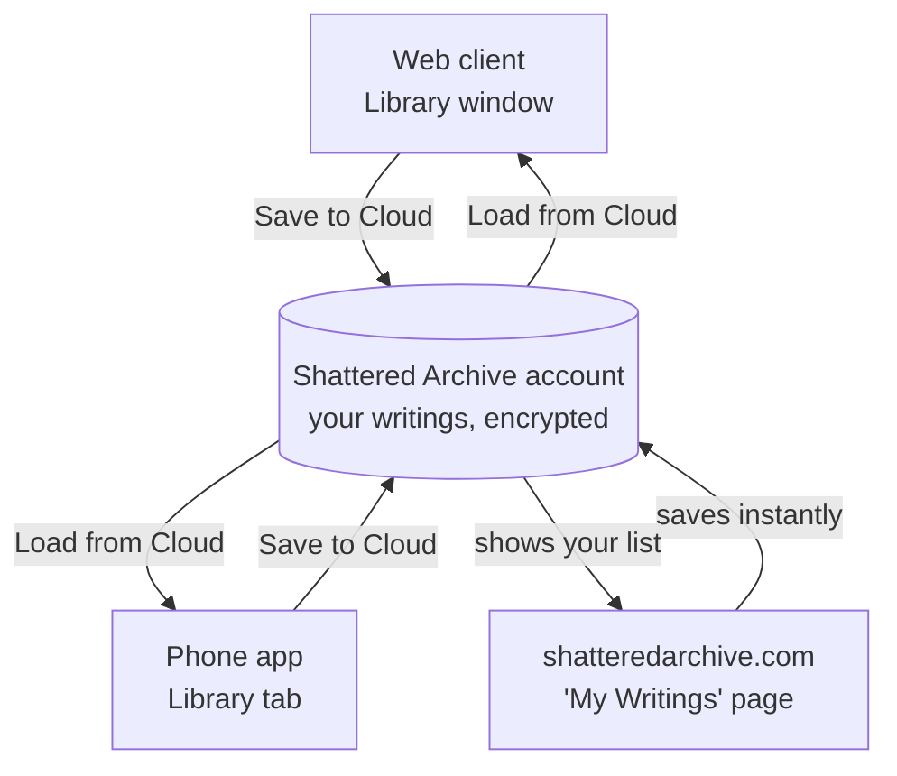
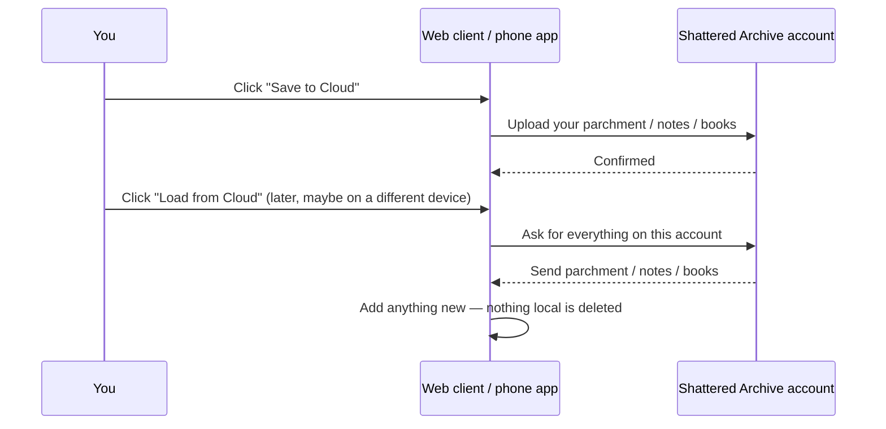

# Library Sync & My Writings — User Guide

How your parchment, notes, and books move between the web client, your phone,
and a browser page — and how they're kept private while they do.

This is the companion to [Scripting & Sharing](scripting-and-sharing.md), which
covers scripts and plugins. Library content works differently in a few
important ways — most notably, **it merges instead of replacing** — so it gets
its own guide.

---

## The three things you can write

| | What it is | Found in |
|---|---|---|
| **Parchment** | A simple document — title + body | Library → Parchment |
| **Notes** | A message filed under a board ("spool"), like `note` or `storynote` | Library → Notes |
| **Books** | A document with multiple numbered pages | Library → Books |

All three can carry an optional **tag**, which just groups similar items
together in the sidebar — purely for your own organizing, nothing else reads it.

---

## Three places you can write

- The **web client** and **phone app** each keep their own local copy and only
  talk to your account when you press **Save to Cloud** / **Load from Cloud**.
- The **My Writings** page at `shatteredarchive.com/library/book-editor` skips
  the local copy entirely — it edits your account's writings directly, so
  changes there are saved the moment you make them. No app install needed.

All three end up reading and writing the same account storage, so something
you write on your phone shows up in the web client after a Load, and something
you write on the My Writings page shows up on both after a Load.

---

## Saving and loading (web + phone)

Same **Save to Cloud** / **Load from Cloud** buttons you already use for
scripts and plugins (**Web:** File → Account… · **Phone:** Settings →
Account) — logging in is optional, and everything works fine without it.

> **This is the one thing that works differently from scripts/plugins:**
> Loading your library content **adds and updates** — it never deletes
> anything already on your device. Scripts and plugin settings still fully
> **replace** what's on the device, same as always. Both clients tell you
> which is which before you confirm a Load.

**Why the difference?** Deleting is genuinely risky here — a device has no
reliable way to tell "I deleted this on purpose" apart from "I've simply never
seen this yet" (say, a book you only ever wrote through the My Writings page).
Rather than guess and risk erasing something you never got to see, Load always
just adds. If you want something gone everywhere, delete it directly — on
whichever client or page currently has it.

One small wrinkle on the web client only: each saved **connection** (a MUD
server + character) keeps its own separate parchment/notes/books, the same way
it keeps its own separate scripts. Saving only ever removes a cloud item if
that exact connection created it and then deleted it locally — it will never
touch something created by your phone or the My Writings page.

---

## The My Writings page

`shatteredarchive.com/library/book-editor`, while logged in, has a **My
Writings** panel: three tabs (Parchment / Notes / Books), a list on the left,
an editor on the right. Create, edit, or delete an item and it's saved right
away — there's no separate Save button and nothing local to sync.

This is the fastest way to jot something down from a computer that doesn't
have the game installed, or to clean up/organize writings without opening
either app.

---

## Privacy — who can read your writings

**Short version: nobody but you, by default — not even a raw copy of the
database would show your words in the clear.**

- Every account's writings are scrambled (encrypted) before they're stored,
  using a key unique to that account. Two different accounts' identical text
  produces completely different scrambled output, and one account's key
  cannot unscramble another account's writings.
- On top of that, content is compressed before it's scrambled — the same way
  uploaded game logs already are — so storage stays small.
- This protects your writings if the underlying storage file or a backup of
  it were ever exposed, and it closes off any future access-control bug from
  being able to actually read the text, not just block the request.

**Being straightforward about the limits:** the server itself still holds the
key and can decrypt on your behalf when you ask for your own writings — that's
what lets the page and both apps show them back to you. This isn't protection
against someone who has fully compromised the server itself; it's protection
against the far more common risks (a leaked backup, a bug that returns the
wrong account's rows).

**No sharing between accounts yet.** Right now nobody else can read your
writings under any circumstance — there's no "share this note with a friend"
feature. A consistent way to deliberately share content across accounts is
planned as future work, separate from this.

---

## Troubleshooting

**I loaded on a different device and my old stuff didn't disappear, even
though I deleted it on the first device.**
Expected — see [Saving and loading](#saving-and-loading-web--phone) above.
Load never deletes. Delete it on the device/page where you actually see it.

**A note I made on my phone isn't showing up on the web client.**
Make sure you've clicked **Save to Cloud** on the phone and **Load from
Cloud** on the web client — sync is manual on both ends, nothing happens
automatically.

**I created something on the My Writings page and don't see it after loading
on the web client.**
Confirm you were logged into the same account on both. My Writings items have
no connection attached, so they should appear for every connection after a
Load — if they don't, check the account, not the connection.

**Can someone else read what I wrote?**
No — see [Privacy](#privacy--who-can-read-your-writings). If you're looking
for a way to deliberately share a note or book with another player, that
isn't built yet.
