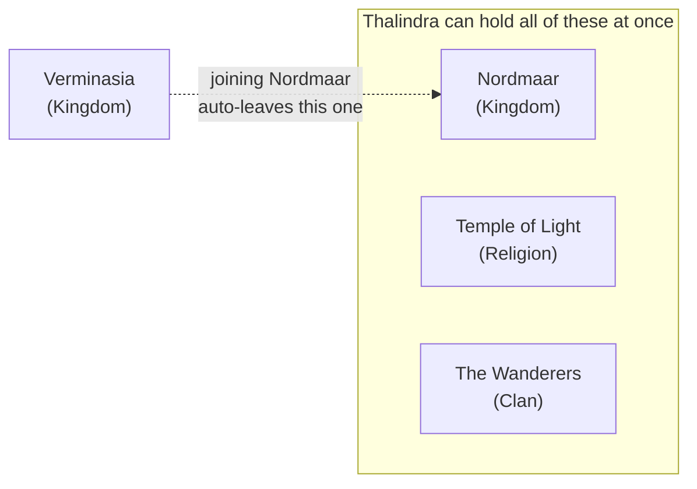
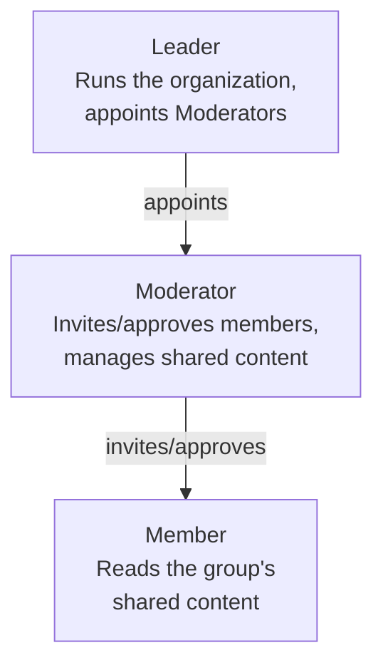
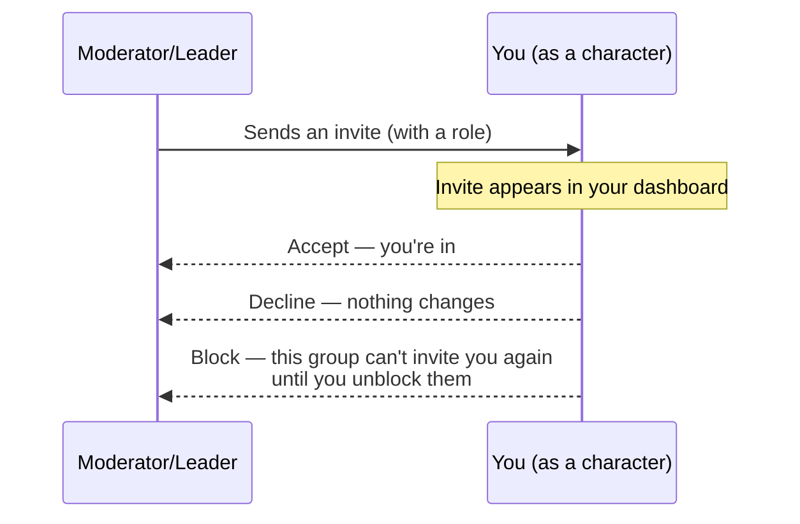

# Organizations (Kingdoms, Clans, Groups) — User Guide

> **Where this fits today:** the whole feature is real and usable across **all
> three** ways you can play — the **website**, the **game client**, and the
> **phone app**. Creating a group, invites, roles, bans, and browsing/writing
> shared content all live under **Library → Organizations**. Two things stay
> website-only by design: revision history/undo and the audit log — see
> "Where each piece lives" below for the full breakdown.

## What is an Organization?

An Organization is a group your character can belong to — a kingdom, a clan, a
religion, or just a private group of friends. It's the difference between writing
something *just for yourself* (your personal Library) and writing something that's
shared with everyone in your group.

| Type | Who can start one | Example |
|---|---|---|
| Kingdom / Clan / Religion | A site administrator, on request | Verminasia, a religious order |
| Friend group | Anyone | "Me and my regular hunting party" |

These "types" are called **categories**, and site administrators can add new ones over
time — the four above are just the starting set, not a fixed list.

## Playing as a character, not your login name

You don't join an Organization as your site login — you join **as one of your
characters**. If you play Thalindra the ranger and Korgath the fighter, each of them can
have their own separate standing in the group: Thalindra might be Verminasia's Leader
while Korgath is just a rank-and-file Member of the same kingdom. Everything you do
inside a group — writing a recruitment flyer, being listed on the roster — shows up
under that character's name, not your account username.

Two people never get confused with each other this way, and neither do two characters
you happen to play yourself.

## One kingdom at a time — but many *kinds* of group

A character can belong to several Organizations at once, as long as they're different
*categories*: one Kingdom, one Religion, and one Clan, all at the same time, is
completely normal. What a character can't do is belong to two Kingdoms at once, or two
Religions at once — joining a second one of the same category automatically and
immediately leaves the first.

This matches how it plays out in the world — "they went from Verminasia to Shalonesti"
describes one move between two kingdoms, not somehow belonging to both. Your Religion
and Clan memberships are untouched by a Kingdom move, and vice versa.

## Roles — who can do what

Every organization has three character-level roles. Higher levels can manage lower
ones, but never a peer at the same level — a Moderator can't remove another Moderator,
only a Leader can.

- **Leader** — runs the organization. Usually its founder, or someone a site
  administrator appointed for an official kingdom/clan/religion.
- **Moderator** — a Leader's trusted second-in-command. Can invite new members, approve
  people asking to join, and manage the group's shared writings.
- **Member** — a regular part of the group. Can read what the group shares.

Because roles belong to a *character*, one account's two characters in the same group
can hold two different roles — your veteran character might be a trusted Moderator
while a newer alt is just a Member, and each needs their own invite to get there (there's
no shortcut for "my other character just joins automatically").

### Acting in an administrative capacity

Some people — official kingdom staff, site moderators — need to help run *several*
same-category groups at once (say, moderating both Nordmaar and Shalonesti). Since a
character can only hold one Kingdom at a time, that wouldn't normally be possible. For
exactly this situation, a Leader (or a site administrator) can grant someone an
**account-level** role instead of a character one: it's tied to your login, not any
character you play, isn't subject to the one-per-category rule, and represents "I'm
here in an administrative capacity," not "I'm playing a persona in this group." It's
deliberately restricted to Moderator/Leader — there's no such thing as an account-level
Member, since that would just be roleplay presence again, which is what characters are
for.

## Joining a group

There are two ways in:

- **Someone invites you.** You pick which of your characters to join with when you
  accept — nobody can hand you a role higher than their own, so a Moderator can invite
  you as a Member, but never as a Leader.
- **You ask to join.** Anyone can send a join request as one of their characters; it's
  visible to every Moderator and Leader of that group, and any of them can approve or
  deny it. A request always starts you as a plain Member — you can't request your way
  straight into a leadership role.

## Leaving, removing, and banning

These look similar but mean very different things, on purpose.

- **Leaving is always your choice**, for any one character, any time. No permission
  needed, and it doesn't affect any of your other characters or other groups.
- **A Moderator+ can remove one character** the same ordinary way — think "this
  character moved on," not a punishment. It doesn't touch that person's other
  characters, and they're free to be invited back or ask to join again right away.
- **Banning is different, and deliberately heavier.** A ban acts on the whole account,
  not one character — every character that account has in that group is removed at
  once, and the account can't join or ask to join again until unbanned. Because it's a
  serious action, the group's Moderators must give a written reason, and the ban list
  itself is only visible to that group's own Moderators and Leaders — not to ordinary
  Members, and not to the person who was banned.

Either way — a normal removal or a ban — access is cut off immediately, in a way that's
actually trustworthy: see below.

## Privacy — who can read a group's shared content

This is the part that took the most care to get right, so here's the honest version,
not the marketing version.

Each organization has its own private key, generated when it's created. When an account
joins (through any of its characters), that key is individually locked to *that
account* — nobody else's copy works for them, and theirs doesn't work for anyone else.
When an account loses its last foothold in the group — its last character leaves or is
removed, it's banned, or its account-level administrative role is revoked — the group's
key is **replaced**, and everyone who's still there gets a fresh copy of the new one.
The old key is discarded completely — not hidden, not archived, gone. That's what makes
"removed means removed" actually true, rather than just a promise: even if someone kept
a copy of something the group wrote while they had access, once they're cut off they
can't unlock anything new, and the group's *current* content has moved on to a key they
never had.

**The honest caveat:** the site itself still holds the master key that makes all of
this work, the same way it already does for your own personal Library writings. This
protects you against, for example, someone getting hold of a backup of the site's
database — they'd find only locked content, not readable text. It does not protect
against the extremely unusual case of the live server itself being taken over. That's
the same tradeoff your personal writings already make, just applied per-group instead
of per-account.

**Content never crosses between groups.** Verminasia's shared writings are invisible
to Nordmaar's members unless someone is explicitly a part of both.

## Sharing content in a group

A Moderator+ can write parchment, notes, and multi-page books that belong to the group
itself rather than any one person — the same three writing types as your personal
Library, just owned by the Organization. Every Member can read them.

Content is filed into folders, up to five levels deep — for example
`Verminasia → Recruitment → {flyer}` or `Verminasia → Story Notes → {chapter 3}` — so a
group's writings stay organized as they grow, the same way your own Library's tags do
today. Everything a Moderator writes is stamped with the character name they were
acting as when they wrote it (or, for a site administrator or an account-level
Moderator stepping in without a character, their account name, clearly marked so it's
never confused with a real member's writing).

## Seeing what happened — history and undo

Every Moderator+ action leaves a trail, visible to that group's own Moderators and
Leaders (not to ordinary Members): who created, edited, or deleted a piece of shared
writing; who joined, left, was removed, or was banned; who granted or revoked a role.
It's a record to check when something needs explaining, not something anyone browses
day to day.

Every edit to a shared piece of writing also keeps its own history — every past version
is kept, nothing is thrown away when it's edited again. On the website only (not in the
game client or phone app), a Moderator+ can open an item's History and restore an
older version if needed. Restoring doesn't erase what came after it — it adds the old
version back as the newest one, so the full history stays intact either way.

## Where each piece lives

**Website** — log in and go to **Library → Organizations**. This is the full
experience: see every group you're part of, create a new one, respond to invites,
and — once you pick a group — manage its members, send invites, review join
requests, handle bans, grant administrative roles, read and write its shared
content, browse revision history, and check its audit log, all from that one page.

**Game client** — open the **Library** window (from the **Game** menu) and pick the
**Organizations** tab, alongside your personal Parchment/Notes/Books. Pick which
group and which of your characters you're acting as, browse its shared content in
the same folder structure as the website, and — if that character is a Moderator or
Leader — create, edit, and delete items there too.

**Phone app** — from the **More** menu, tap **Organizations**. Same idea as the game
client: pick a group and a character, browse and edit shared content in its folders.

**Website-only, by design, on all three:** creating a new group, invites, join
requests, roles, and bans are managed from the website only — the game client and
phone app are for browsing and writing a group's shared content once you're already
in it, not for running the group itself. Revision history/undo and the audit log are
also website-only, since they're moderation tools rather than everyday reading/writing.

## Related reading

- [`library-sync.md`](library-sync.md) — how your own personal writings sync between
  devices; the same privacy approach this document describes is built on that one.
