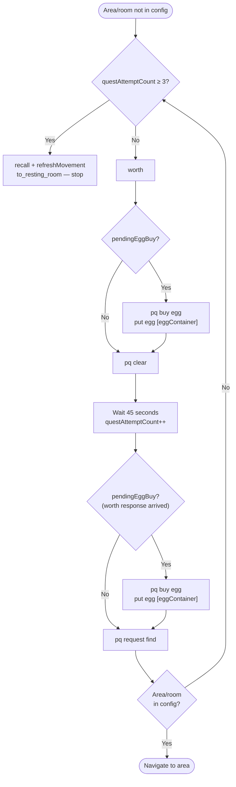
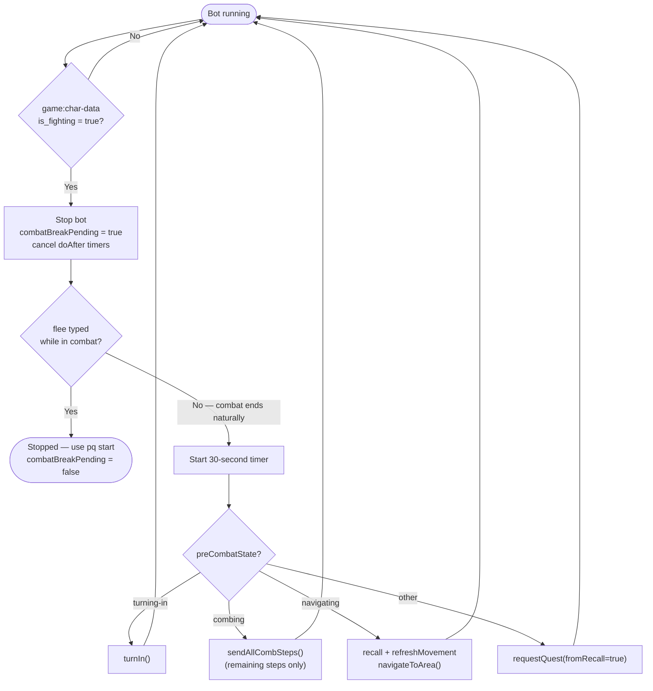

# Quest Bot

Automates the full DSL quest cycle for characters based in Wargar, Thaxanos, Shadow, Darkonin, or Verminasia.

## Main quest flow

```mermaid
flowchart TD
    START([pq start]) --> KNOCKDOWN_OFF["Disable Knockdown triggers"]
    KNOCKDOWN_OFF --> ATTEMPT{"Quest retries exhausted?<br/>(3 consecutive failures)"}
    ATTEMPT -- Yes --> GIVEUP["recall + refreshMovement<br/>to_resting_room — stop"]
    ATTEMPT -- No --> ALIAS["Run startAlias (if set)"]
    ALIAS --> FROM_RECALL{"First run or<br/>combat resume?"}

    FROM_RECALL -- "Yes (fromRecall=true)" --> RECALL_PATH["recall + refreshMovement<br/>Walk quest_master path"]
    FROM_RECALL -- "No (auto-restart)" --> BEES_GET{"beeContainer set?"}
    BEES_GET -- Yes --> GET_BEES["get bees [container]"]
    BEES_GET -- No --> WALK_QM
    GET_BEES --> WALK_QM[Walk to_quest_master path]
    RECALL_PATH --> EGG_CHECK

    WALK_QM --> EGG_CHECK{"eggQpThreshold > 0<br/>and QP ≥ threshold?"}
    EGG_CHECK -- Yes --> BUY_EGG["pq buy egg<br/>put egg [eggContainer]"]
    EGG_CHECK -- No --> PQ_REQ[pq request find]
    BUY_EGG --> PQ_REQ
    PQ_REQ --> ITEM["Capture: Vile thieves have stolen..."]
    ITEM --> AREA["Capture: Look in vicinity of area for room"]
    AREA --> GO["May the gods go with you!"]
    GO --> AREA_KNOWN{"Area + room<br/>in config?"}
    AREA_KNOWN -- No --> BAD_QUEST["See: Bad quest area retry"]
    AREA_KNOWN -- Yes --> NAV_START[Walk to start_point]
    NAV_START --> NAV_AREA[Walk start_to_area]
    NAV_AREA --> COMB["Comb: send all steps synchronously<br/>(get all.keyword → move) × N → get all.keyword"]
    COMB --> PICKUP{"Item picked up?<br/>(terminal pattern match)"}
    PICKUP -- Yes --> TILDE["~ + recall<br/>refreshMovement"]

    TILDE --> WALK_QM2[Walk quest_master path]
    WALK_QM2 --> PQ_COMP[pq complete]
    PQ_COMP --> WORTH[worth]
    WORTH --> GEM_CHECK{"gold ≥ 600 and<br/>gem_merchant set?"}

    GEM_CHECK -- Yes --> GEM_WALK[Walk gem_merchant path]
    GEM_WALK --> GEM_POUCH{"gemPouch set?"}
    GEM_POUCH -- Yes --> PUT_GEM["put blue 'gem pouch'"]
    GEM_POUCH -- No --> RECALL2
    PUT_GEM --> RECALL2["recall<br/>refreshMovement"]
    GEM_CHECK -- No --> RECALL2

    RECALL2 --> REST_WALK[Walk to_resting_room]
    REST_WALK --> REST_CMD[rest_command]

    REST_CMD --> BEES_PUT{"beeContainer set?"}
    BEES_PUT -- Yes --> PUT_BEES["put bees [container]"]
    BEES_PUT -- No --> AUTO
    PUT_BEES --> AUTO

    AUTO{Auto-restart?}
    AUTO -- No --> IDLE([Idle])
    AUTO -- Yes --> COOLDOWN["You can now quest again."]
    COOLDOWN --> ATTEMPT

    IDLE --> STOP(["pq stop"])
    STOP --> KNOCKDOWN_ON["Re-enable Knockdown triggers"]
```

> **refreshMovement** — after each `recall`, sends `refreshCommand` twice if `move ≤ max_move / 3` (GMCP). Skipped if movement is still healthy.

> **Comb** — all steps for the assigned room are sent to the server in a single synchronous burst: `get all.keyword`, move, `get all.keyword`, move … ending with a final `get all.keyword`. The bot then waits for a pickup confirmation line in the terminal output.

## Bad quest area retry

When the assigned area or room is not in the config, the bot clears the quest and re-rolls up to 3 total attempts before giving up.

## Combat break and auto-resume

## Configuration reference

| Field | Default | Purpose |
|-------|---------|---------|
| `homeLocation` | `wargar` | Determines all navigation path arrays used |
| `startAlias` | _(empty)_ | Alias name executed before each quest cycle |
| `beeContainer` | _(empty)_ | Container holding beeswax earplugs (e.g. `shelf`). Retrieved on auto-restart cycles only (`to_quest_master` path). Not retrieved on manual `pq start` or combat resume — use `startAlias` for those cases. Returned to container after resting |
| `gemPouch` | `gem pouch` | Gem pouch to put blue gems into after buying. Leave blank to skip the put step |
| `autoRestart` | `true` | Auto-loop on `You can now quest again.` |
| `debug` | `false` | Log each navigation step and state transition |
| `refreshCommand` | `cast refresh` | Command sent twice after recalling when movement is at or below one third of maximum. Set to `quaff potion` or any alternative |
| `eggQpThreshold` | `0` | Run `pq buy egg` at the start of the next cycle when QP reaches this value. `0` disables |
| `eggContainer` | _(empty)_ | Container to stash the egg in after buying. Defaults to `gemPouch` if blank |
| `customAreas` | `[]` | JSON array of additional quest areas |

## Home path keys

| Key | Description |
|-----|-------------|
| `quest_master` | Walk from recall point to the quest master. Used on `pq start` and after combat resume |
| `to_quest_master` | Walk from resting room to quest master (includes buffs such as `c fly`/`c pass`). Used on auto-restart cycles only |
| `to_resting_room` | Walk from recall point back to the resting room |
| `rest_command` | Commands to enter rest state (e.g. `rest pew`) |
| `gem_merchant` | Walk from quest master to gem merchant + buy command. Empty = skip step |
| `justice_bind` | Walk to Arkane justice bind point |
| `icewall_port` | Walk to Icewall ship portal |
| `alth_port` | Walk to Althainia ship portal |
| `alth_arena` | Walk to Althainia via gaming portal |
| `tropica_port` | Walk to Tropica ship portal |
| `succubus` | `c gate bloody nose` gate path |
