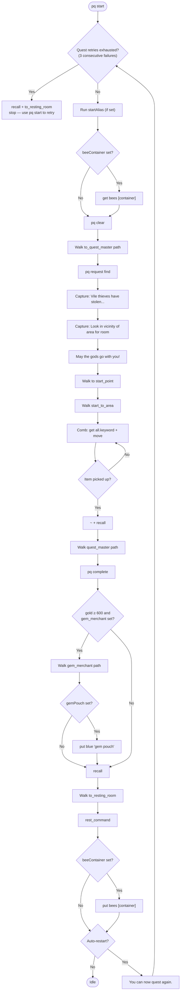
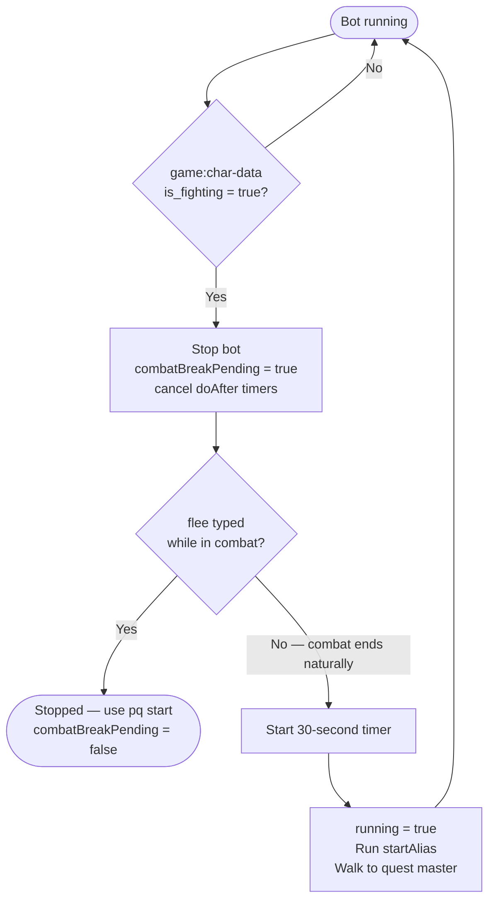
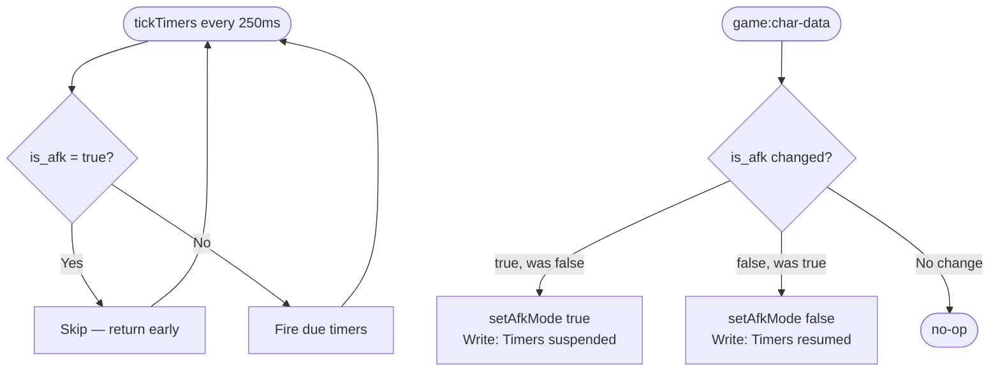

# Quest Bot

Automates the full DSL quest cycle for characters based in Wargar, Thaxanos, Shadow, Darkonin, or Verminasia.

## Main quest flow

## Combat break and auto-resume

## AFK timer guard

## Configuration reference

| Field | Default | Purpose |
|-------|---------|---------|
| `homeLocation` | `wargar` | Determines all navigation path arrays used |
| `startAlias` | _(empty)_ | Alias name executed before each quest cycle |
| `beeContainer` | _(empty)_ | Container holding beeswax earplugs (e.g. `shelf`). Picks up at cycle start, returns after resting |
| `gemPouch` | `gem pouch` | Gem pouch to put blue gems into after buying. Leave blank to skip the put step |
| `autoRestart` | `true` | Auto-loop on `You can now quest again.` |
| `debug` | `false` | Log each navigation step and state transition |
| `customAreas` | `[]` | JSON array of additional quest areas |

## Home path keys

| Key | Description |
|-----|-------------|
| `quest_master` | Walk from recall point to the quest master |
| `to_quest_master` | Walk from resting room to quest master (includes `pq request find`) |
| `to_resting_room` | Walk from recall point back to the resting room |
| `rest_command` | Commands to enter rest state (e.g. `rest pew`) |
| `gem_merchant` | Walk from quest master to gem merchant + buy command. Empty = skip step |
| `justice_bind` | Walk to Arkane justice bind point |
| `icewall_port` | Walk to Icewall ship portal |
| `alth_port` | Walk to Althainia ship portal |
| `alth_arena` | Walk to Althainia via gaming portal |
| `tropica_port` | Walk to Tropica ship portal |
| `succubus` | `c gate bloody nose` gate path |
