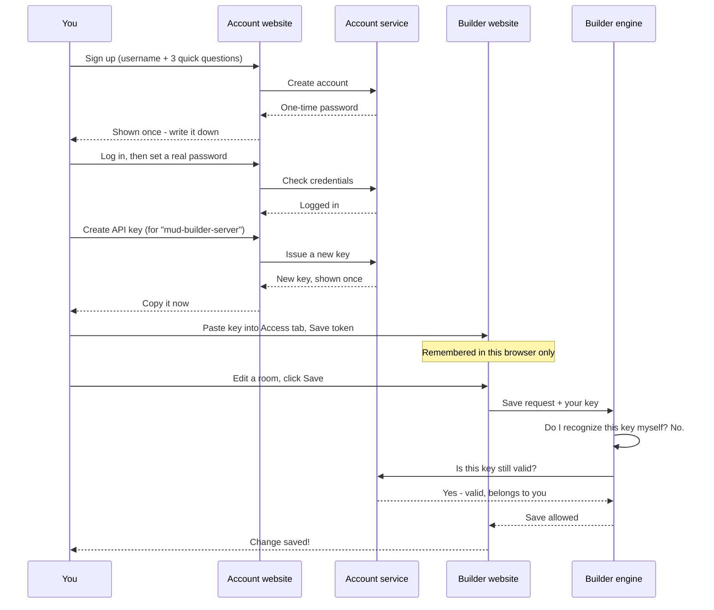
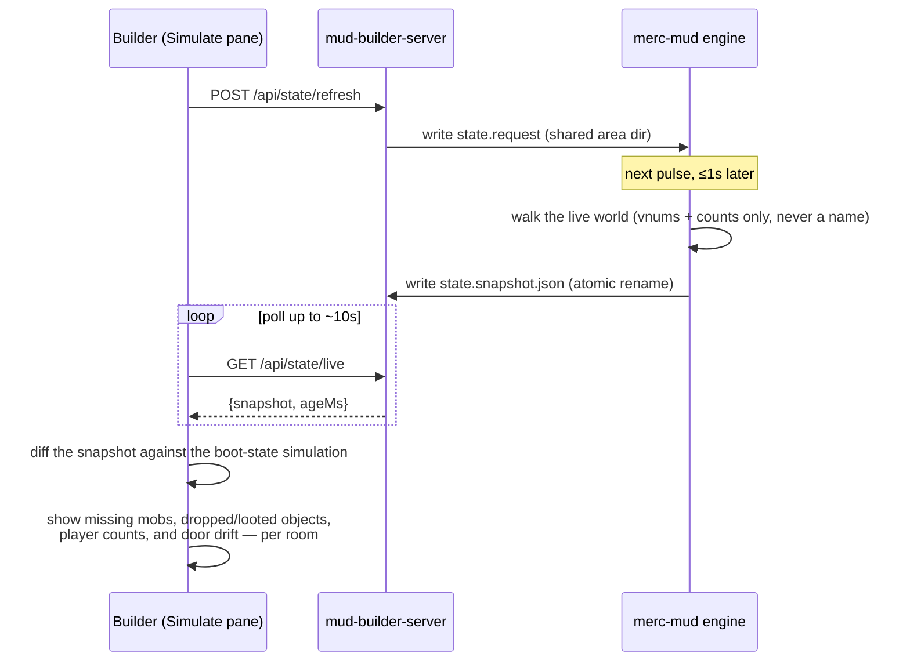
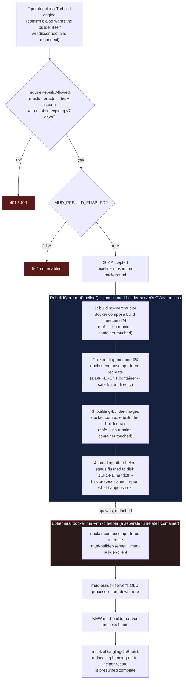

# MUD Builder

A graphical world-building tool for the Merc 2.4 MUD at `C:\Projects\merc-mud`.
Edit rooms, mobs, objects, resets, scripts, and more in a browser, preview the
exact area-file text that will be written, and push changes into the
**running** game without disconnecting anyone.

## The pieces

| Piece | Where | What it does |
|---|---|---|
| `mud-builder-client` | `apps/mud-builder-client` (dev port **60080**) | React UI: browse areas, edit rooms in forms, preview/download, save, reload |
| `mud-builder-server` | `apps/mud-builder-server` (port **61000**) | REST API over the MUD's `area/` folder; the only thing that touches disk |
| `merc-area` | `services/merc-area` | Pure TypeScript parser/emitter for the Merc 2.4 `.are` format (verified by round-trip tests over the entire shipped area corpus) |
| `area_reload.c` | `merc-mud/2.4/src` | In-game **zero-downtime hot reload** of one area file |
| `copyover.c` | `merc-mud/2.4/src` | **Fresh-slate warm reboot** that keeps players connected (recovery fallback) |

## Core concepts

### Preview-first editing
The UI never writes silently. Every edit path goes: form (or flagged Manual
edit) → **Preview** (exact generated file + diff vs disk) → Download and/or
Save. **Manual edit is available on every tab** (Areas, Mobs, Objects,
Resets): it shows the exact generated file text, editable. "Parse & apply"
validates the text and — only when syntactically valid — applies it back to
the model, so the forms immediately show the change. That round trip is the
bridge between technical and non-technical collaborators: one person can
paste a snippet of area code, the other reviews the same change as forms.
Invalid text never touches the model; saves made after a manual edit are
labeled `MANUAL EDITS`.

### The write gate
`mud-builder-server` refuses all disk writes (Save, reload signals) with HTTP
403 unless it was started with `MUD_WRITE_ENABLED=true`. Local dev runs are
preview/download-only by default; the experimental docker deployment (later
phase) sets the flag. Set it manually only when you *intend* to write to
`C:\Projects\merc-mud`. Every save is atomic and leaves a timestamped backup
in `area/backups/`.

### Two reload tiers (both keep players connected)
1. **Hot reload** (`reload.signal`, `areload` command, "Hot reload" button) —
   the game re-parses ONE area file into staging memory and, only if it is
   completely valid, upserts the live prototypes **in place**. Zero
   interruption; on any error the world is untouched and the reason is logged.
   Deletions are deliberately deferred (a live mob may still reference the
   prototype). Helps/socials sections are skipped.
2. **Copyover** (`copyover.signal`, `copyover confirm` command, "Copyover"
   button) — the whole world is rebuilt from disk while every playing
   connection survives the exec ("the world shimmers"). This is the recovery
   path: use it after a failed hot reload, to apply deletions, or to compact
   string space. If the exec fails, the game keeps running untouched.

### Why the docker mount matters
`merc-mud/docker-compose.yml` bind-mounts `./2.4/area` into the container, so
the files the builder writes on the host ARE the files the running game
reloads. Without that mount the game only sees the copy baked into its image.

## Everyday workflows

Start everything for local building:

```bash
# 1. the game (from C:\Projects\merc-mud)
docker compose up -d

# 2. the API (writes OFF by default; add MUD_WRITE_ENABLED=true deliberately)
pnpm --filter @shatteredarchive/mud-builder-server dev

# 3. the UI → http://localhost:60080
pnpm --filter @shatteredarchive/mud-builder-client dev
```

Then in the UI: pick an area → pick a room → edit → **Preview** → Save →
**Hot reload** → check it in game (`telnet localhost 4000`).

See [commands.md](./commands.md) for the full command crib sheet.

## Getting started: your account and API key (plain-language walkthrough)

This section is for anyone opening the builder for the first time, written with
no assumed technical background. It covers four separate pieces of software —
two you visit in a browser, two that just run quietly in the background — and
how they connect: you create an account on the **account website**, use it to
generate an **API key** (a long random password made just for this purpose),
and paste that key into the **builder website** so it will let you save
changes.

**You may not need any of this.** A local copy you started yourself is
read-only (preview and download, no Save) until someone deliberately turns on
writing — see [The write gate](#the-write-gate). The shared team site at
`build.shatteredarchive.dev` always has writing turned on, so anyone using it
needs an account and a key. If you're not sure which situation you're in, try
opening the builder and clicking the **Access** tab — it will tell you.

### Step 1 — start the four pieces (skip this if you're using the shared team site)

If you're using `build.shatteredarchive.dev` / `auth.shatteredarchive.dev`,
someone else already has these running — skip to Step 2. If you're setting up
your own local copy, open a separate terminal window for each command below
and leave it running (closing the window stops that piece).

```bash
# 1. The game itself — there has to be a world for the builder to edit.
#    (run this from C:\Projects\merc-mud)
docker compose up -d
```
What it does: turns on the actual MUD game.

```bash
# 2. The account service — remembers usernames, passwords, and API keys.
pnpm --filter @shatteredarchive/auth-server dev
```
What it does: runs quietly in the background; nothing to click here.

```bash
# 3. The account website — where you'll sign up and create your key.
pnpm --filter @shatteredarchive/auth-client dev
```
What it does: gives you a page at `http://localhost:62080`.

```bash
# 4. The builder's engine — reads and writes the game's world files.
pnpm --filter @shatteredarchive/mud-builder-server dev
```
What it does: runs quietly in the background; nothing to click here either.

```bash
# 5. The builder website — where you actually edit the world.
pnpm --filter @shatteredarchive/mud-builder-client dev
```
What it does: gives you a page at `http://localhost:60080`.

(Steps 2 and 4 have no webpage of their own — they're the "engines"; steps 3
and 5 are the two pages you'll actually look at.)

### Step 2 — create your account

Open the account website (`http://localhost:62080` locally, or
`https://auth.shatteredarchive.dev` on the shared team site).

1. Click **"Need an account? Sign up"**.
2. Type a username.
3. Answer the three short questions on screen — this just proves you're a
   person and not an automated script; it isn't a security question you need
   to remember.
4. Click **"Create account"**.
5. A one-time password appears on screen. **Write it down now** — it is shown
   exactly once and can't be recovered later.
6. Click **"Continue to login"** and log in with your username and that
   password.
7. The site will immediately ask you to **set a real password** (at least 12
   characters) to replace the one-time one. This is required before you can do
   anything else — pick something you'll remember.

You're now logged into the account website, with an "Account" page and an
"API keys" page in the top navigation.

### Step 3 — create your API key

An API key is just a long random code the builder can use to recognize you
automatically, so you don't have to type a username and password into it.

1. Click **"API keys"** in the navigation.
2. Under "Create a new key," choose **`mud-builder-server`** from the Service
   dropdown — this just labels the key as "for the MUD builder."
3. Type a short label for yourself, e.g. `my laptop`.
4. Click **"Create API key"**.
5. Your new key appears on screen. **Copy it now** (there's a Copy button) —
   like the password above, it's shown exactly once and the site does not
   keep a readable copy of it anywhere.

### Step 4 — give that key to the builder

1. Open the builder website (`http://localhost:60080` locally, or
   `https://build.shatteredarchive.dev` on the shared team site).
2. Click the **"Access"** tab.
3. Paste your key into the **"Token"** box.
4. Click **"Save token"**.
5. The page should now say your token was accepted. You can now edit rooms
   and click Save — see [Everyday workflows](#everyday-workflows) above for
   the actual editing steps.

The key is remembered only in that one browser (nothing is sent anywhere
except this builder site). If you switch computers or browsers, repeat Step 4
with the same key — no need to make a new one.

### How it all connects



The last exchange (Builder engine asking the Account service to confirm a key)
only happens for keys made on the account website. The builder also has its
own separate keys it can hand out directly, without any of this — see
[Access guard and audit trail](#access-guard-and-audit-trail-phase-9) for the
full technical picture, including the master key and key rotation/revocation.

## Deployed stack (Phase 3): build.shatteredarchive.dev

The builder ships in the **experimental** compose stack
(`deploy/docker-compose.shattered-archive-experimental.yml`) behind the edge
nginx as the `build.` subdomain:

- **URL:** `https://build.shatteredarchive.dev` (UI); `/api/*` and `/health`
  are proxied by the edge to the `mud-builder-server` container (port 61000).
- **Write gate:** the compose service definition is the ONLY place in the repo
  that sets `MUD_WRITE_ENABLED=true`. Everywhere else (local dev, standalone
  image) the builder is preview/download-only.
- **Volume layout:** the game keeps running from its OWN compose
  (`C:/Projects/merc-mud/docker-compose.yml`), so bringing the experimental
  stack up or down never interrupts the MUD. Game and builder share the same
  host directory — `C:/Projects/merc-mud/2.4/area` — mounted at
  `/opt/merc-mud/area` (game) and `/mud/area` (builder). Saves, `backups/`,
  and the reload/copyover signal files therefore land directly in the live
  game's area directory.
- **Edge resilience:** the `build.` vhost uses nginx's resolver+variable
  pattern, so the edge starts and serves everything else even when the
  builder containers are down.

```bash
# start/refresh just the builder pair (game and other services untouched)
docker compose -f deploy/docker-compose.shattered-archive-experimental.yml \
  up -d --build mud-builder-server mud-builder-client
```

## Mob and object editors (Phase 3)

The **Mobs** tab edits every `#MOBILES` stat: descriptions, race, level,
alignment, hitroll, hit/mana/damage dice, AC, positions, sex, size, wealth,
and checkbox grids for act / affected-by / offense / immune / resist /
vulnerable flags. The **Objects** tab edits `#OBJECTS` entries: the five
values are re-labelled and re-typed per item type using the same table
`db2.c load_objects` uses (weapon class + damage dice, container capacity,
drink liquid, wand/staff charges, potion spells…), plus wear/extra flag
grids, level/weight/cost/condition, and an extra-descriptions editor.

Two preservation rules keep odd area files safe in both editors:

- **Word fields are verbatim.** Race, damage type, positions, sex, size,
  material, item type, and condition are stored exactly as written; the
  inputs suggest known values but never coerce an unknown one.
- **Unlisted flag bits survive.** The checkbox grids only touch the bits they
  list; anything else in the vector is preserved (`(+unlisted bits preserved)`
  appears when that happens). Mob `F`-removal lines and object `A`/`F` affect
  lines are preserved verbatim and noted in the form.

## Creating and deleting things (Phase 4)

Every entity tab has **+ Add** (rooms on the Rooms tab or the Areas dashboard, mobs, objects). New entities
get the first free vnum in the area's declared min/max range (mob/object/room
numbers are treated as one namespace to keep things unambiguous) and a
minimal template that boots as-is — rename and stat it in the form.

**Delete** is reference-checked: an entity still named by resets, room exits,
shops, specials, or scripts cannot be deleted — the button reports exactly
which lines reference it (e.g. `reset #3 (M): mob 3705 into room 3712`).
Remove those references first (Resets tab, exit editor, Scripts tab). Two
safety layers back this up: the client blocks the delete outright, and the
server 400s any save whose in-range references dangle (`validateRefs`), so a
broken world can't reach disk even through manual edits. Cross-area
references (a door into another zone) are warnings shown in the preview, not
errors — stock areas link outward all the time.

Deletion drift to know about: the in-game **hot reload only upserts** — a
deleted prototype stays live until the next **copyover** (the UI reminds you
when a delete is saved). The file on disk is correct immediately.

## Resets tab (Phase 4)

The Resets tab edits `#RESETS` — what spawns where on every area repop.
Resets are listed in file order because order is meaning: `G`/`E` load onto
the mob of the closest `M` line above, `P` fills the closest `O`. Each row is
a compact form for its command letter (M mob→room, O object→room, P
object→container, G give, E equip, D door state, R randomize exits) with
vnum pickers suggesting the area's own mobs/objects/rooms (free-typed numbers
are allowed for cross-area vnums, with a caption showing what resolves
locally). Rows reorder with ↑/↓ and comment lines are preserved read-only.

## Shops and specials (Phase 5)

Both live on the **Mobs tab**, under the stat fieldsets, because both attach
to a mob by vnum:

- **Shopkeeper** — "+ Make shopkeeper" adds a `#SHOPS` entry for the mob:
  profit percentages (buy/sell), open/close hours, and up to five item types
  the keeper will buy from players (unlisted numeric types written by hand are
  preserved "(as written)"). Remember the keeper still needs an `M` reset to
  stand somewhere and `G` resets for stock to sell. One shop per keeper — a
  duplicate (only possible via manual edit) blocks the save, because the game
  silently keeps just the last one.
- **Special function** — attaches a C behavior from `special.c`'s `spec_table`
  (`spec_cast_mage`, `spec_guard`, `spec_janitor`, …). The picker lists the
  table mirrored into `SPEC_FUNS`; an unknown name **blocks the save**, since
  the game refuses to boot on one (`load_specials: bug + exit`). Prefixes of
  known names are accepted, exactly like the game's `spec_lookup`.

## Creating a new area file (Phase 5)

"+ New area" in the Areas sidebar takes a file name, a display name, and a
vnum range. The server validates the range against every area in `area.lst`
(overlap = 400), writes the new `.are` file **before** registering it (a crash
between the two steps leaves a harmless orphan file, never a
listed-but-missing area that would kill the next boot), and backs up
`area.lst`. The new area opens immediately in every tab.

One caveat, straight from the C side: **hot reload only covers areas the game
saw at boot** (`area_reload.c` refuses others by design), so a brand-new file
needs one **copyover** to enter the world. The create response and UI toast
both say so. After that first load it hot-reloads like any other area.

## Area header, socials, and the World tab (Phase 6)

The **Areas** tab now has an "Area header" fieldset: name, credits, and the
vnum range are editable like any other field. Range edits are guarded twice —
the form warns inline the moment the range no longer covers a vnum the file
defines, and the server rejects the save (400) for both that shrink case and
for a grow that overlaps any other area in `area.lst`. Untouched ranges are
never re-checked, so stock files with historically loose ranges keep saving.
A rename/credits change is live after a plain hot reload (the C side commits
`name`/`credits` in place).

The **Socials** tab edits `#SOCIALS` (stock: only `social.are` has them). Each
social is up to 8 act()-style messages; a blank field means "unset" and is
written as `$` (the file format cannot represent an empty message). Stock
socials that end early (fewer than 8 lines) keep their short form byte-for-byte
unless you explicitly add lines. One C-side caveat, surfaced in the UI:
**socials load into the global table at boot only** — hot reload deliberately
skips `#SOCIALS`, so saved changes take effect at the next copyover.

The **World** tab is a read-only dashboard: one row per `area.lst` entry with
its vnum range, entity counts, and an expander listing every cross-area
warning, reference error, or parse failure. It is a single `GET /api/world`
aggregate — the place to spot a broken file or a dangling cross-area link
before the game does.

## Skills &amp; spells as data (Phase 7)

Skills and spells live in a compiled C table (`const.c skill_table`), not in
area files. Phase 7 makes their **data** authorable without recompiling: the
**Skills** tab edits `skills.dat`, an optional overlay file the game reads at
boot (between gsn assignment and area loading, so object spell slots resolve
against the final table). No file present = the game boots exactly its
compiled table; a bad row is logged (`bug`) and skipped, never fatal — the
loader deliberately avoids the stock `fread_*` helpers, which exit the process
on malformed input.

What is editable per skill: per-class levels and ratings, target, minimum
position, mana, beats (wait), damage noun, and the wear-off messages (the
object wear-off can be explicitly "unset", which the file writes as `@`).
What is **not**: the skill's name (player files save skills by name and C
code hardcodes lookups — it is the row's identity), its slot (objects
reference spells by slot in `.are` files), and gsn wiring. New skills or new
spell *functions* still require C code.

The spell function is chosen by name from a registry mirroring `const.c`
(98 functions). A safety rule is enforced in the browser, in the server
(400), and in the C loader (row skipped): the *(spell function, target)*
combination must already exist somewhere in the compiled table — magic.c
builds the cast argument from `target` and the function blindly casts it,
so an unproven pairing is a crash vector.

Saves apply at the next **copyover** (the overlay loads at boot only; gsn/slot
bindings and live affects make mid-run swaps unsafe). "Remove overlay" deletes
`skills.dat` and returns the compiled table at the next copyover. Self-test:
`docker exec -w /opt/merc-mud/area merc-mud2.4 ../src/rom --skills-test`.

## Skill groups as data (Phase 8)

Skill **groups** — the bundles behind character-creation costs (`customize`),
`gain`, and training — live in `const.c group_table` and follow the same
overlay pattern: the **Groups** sub-view on the Skills tab edits `groups.dat`,
loaded at boot right after `skills.dat`. Editable per group: the per-class
ratings and the member list. Ratings use the game's sentinel scheme, exposed
in the UI as an "available" toggle: `-1` = not available to that class, `0` =
free/auto (the creation basics), `1+` = cost in creation points or trains.
Group **names** are identity and read-only (player files persist known groups
by name; creation hardcodes the basics/default groups), and groups can only be
modified — never added, removed, or reordered — because every C loop over the
table stops at the first empty row.

Members may name skills *or other groups*, and resolve exactly like the game's
`group_add`: skill first, then group, both by case-insensitive **prefix**
(stock itself relies on this — `illusion` lists `invis`, which resolves to the
skill "invisibility"; the UI shows each member's resolution). Two rules are
enforced in the browser, the server (400), and the C loader (row skipped):
every member must resolve to a compiled skill or group, and membership must
stay **acyclic** — the game's `group_add`/`gn_add` recurse unconditionally, so
any cycle (even a group listing itself) would overflow the stack at the first
login that touches it.

Saves apply at the next **copyover**, same as skills; "Remove overlay" deletes
`groups.dat`. The `rom --skills-test` self-test covers the groups loader too.

## Access guard and audit trail (Phase 9)

For a plain-language, step-by-step version of creating an account and API key
(no jargon, exact clicks), see
[Getting started: your account and API key](#getting-started-your-account-and-api-key-plain-language-walkthrough)
above. This section is the technical reference.

Whenever writes are enabled, every mutating request (`PUT`/`POST`/`DELETE`
under `/api/*`) requires a bearer token; requests without one get a 401 and
touch nothing. Reads — the UI, previews, downloads — stay open. There are two
kinds of credential, both sent as `Authorization: Bearer <token>`:

- **The service master key.** Generated by the server on **first run** with
  writes enabled and stored at `<area>/auth/builder-auth.json` on the bind
  mount (Phase 12b — installs that still have the old
  `<area>/backups/builder-auth.json` are migrated automatically at boot) —
  git-ignored, unique per install, surviving container recreation. Read it off
  the host once; it authorizes everything, including key management. It can
  also be rotated **from the host** at any time with
  `pnpm generate-master-key` (optionally `-- --key <value>` to designate the
  key): the file is rewritten atomically, the running server picks it up
  without a restart, and **every API key is revoked** — reprovision them in
  the Access tab afterwards.
- **API keys**, minted in the UI's **Access** tab with the master key. Each
  has a label, can be **rotated** (same key, new secret — the old value dies
  instantly) and **revoked** (permanent). Keys authorize saves but not key
  management. Only sha256 hashes are stored; the plaintext appears exactly
  once, in the show-once box right after create/rotate. The master key itself
  can also be rotated from the Access tab (the browser swaps to the new value
  automatically, and `builder-auth.json` is rewritten).
- **A centrally-issued account key**, minted from `auth-client`'s Keys page
  (tag it with service `mud-builder-server` — that field is just a label for
  your own organization, the server doesn't filter on it) against your
  `auth.shatteredarchive.dev` login. The builder falls back to asking
  auth-server about any bearer token its own local store doesn't recognize —
  master-key and local-API-key holders never pay that round trip or depend on
  auth-server being reachable, since the local store is always checked first.
  Deployed stack only (wired 2026-07-24; see `docs/auth-server.md`'s
  Deployment section for the compose wiring).

Paste a token once in the Access tab; it lives in this browser's localStorage
and rides along on every request. The tab reports what the server thinks of
it: master (key management unlocked), API key (saves enabled), or rejected.

Every accepted mutation and key-lifecycle event appends one JSON line to
`<area>/backups/audit.log` — when, method, route, HTTP status, and the acting
credential (`master` or `key:<id> (<label>)`), never a token value. Audit
failure never blocks the save it describes. A corrupt `builder-auth.json`
**locks** the builder (everything 401s) and is never overwritten — it may hold
the only copy of the master key; fix or delete it on the host and restart.
Deleting it deliberately and restarting is also the reset path: a fresh master
is generated and all API keys are gone.

Local development needs none of this: with `MUD_WRITE_ENABLED` unset the guard
is off (there is nothing to protect), and `MUD_BUILDER_AUTH=off` exists to
test write flows locally without tokens — never set it in a deployed compose.

Phase 15 adds a THIRD, more narrowly-gated credential requirement on top of
this — see [Engine rebuild and redeploy](#engine-rebuild-and-redeploy-phase-15)
below.

## Importing an existing .are file (Phase 10)

The Areas page's **Import .are file…** control brings an area authored
elsewhere (another builder install, a hand-written file, an old backup) into
the world through the same safety funnel as everything else. Pick a file or
paste its text, then **Validate**: the server runs the full quarantine suite —
parse, canonical round-trip stability (the text it would write must survive
its own parse→emit cycle byte-identically), `#AREA` header and vnum-range
sanity, range overlap against every area in `area.lst`, vnum-reference
integrity, and script validation — and returns a report **without touching
disk**. Errors block the commit outright; warnings (formatting normalization,
cross-area references, an existing file) just inform. The report includes the
entity summary and the exact canonical text a commit would write, downloadable
as a file.

**Commit** re-validates server-side (never trusting a stale report), writes
atomically, and registers new files in `area.lst` (with the same backup
semantics as every other save). A brand-new file loads at the next **copyover**
— hot reload only covers areas the game saw at boot. Replacing an existing
file requires the explicit **overwrite** checkbox, takes a timestamped backup
first, and *can* hot-reload. Imports are mutations: they need a builder token
and appear in the audit log (previews do not — they never write). Uploads are
capped at 2 MB and must be plain text.

The Access tab (master key only) also gains an **Audit log** panel: the most
recent entries from `backups/audit.log`, newest first, via `GET /api/audit`
(read-only — the API never truncates or rewrites the log file).

## Multi-builder safety and real cross-area links (Phase 11)

Two credentials can edit at the same time without silently clobbering each
other. Every area load carries a **content hash** of the on-disk file; the UI
sends it back on save, and if the file changed in between (another builder,
an import) the server answers **409 — nothing is written** and the editor
shows a conflict panel with the two honest ways out: **Reload from disk**
(discard your edits) or **Save anyway** (overwrite theirs — explicit confirm,
their version lands in a timestamped backup first). Saves without a hash keep
the old unconditional behavior, so raw API users are unaffected until they
opt in.

Alongside that, **advisory presence**: while you have an area open, your
credential (key label or `master`) heartbeats every ~20 s. The area sidebar
shows 👥 badges for other builders' open files, and a banner appears inside
the editor when someone else is on *your* file. It is never a lock — entries
expire ~60 s after the last heartbeat (a crashed browser cannot wedge an
area), nothing touches disk, and presence traffic is never audited.

Cross-area references are now **checked, not assumed**. The server keeps a
world vnum index (every mob/object/room in every `area.lst` file, cached per
file and refreshed on change) and resolves each out-of-range reference
against it. A reference that another area really defines shows up as a
**resolved link** — "room #3700 — Entrance to Mud School (school.are)" — in
the preview pane, the import report, and the World dashboard; clicking it
opens the defining area (and selects the room, for rooms). Only vnums that
**no listed area defines** remain warnings, now worded "not defined in this
file or any listed area" — so a warning means a real dangling reference, not
a guess. In-range references to missing entities stay hard errors even when
some other file defines the vnum: that is a range-overlap smell, not a
healthy link.

## World map (Phase 12)

The **Map** tab draws the world instead of listing it. In **Area** mode any
area's rooms render as an SVG grid: exits are compass directions (all ten of
them since Phase 12b — the diagonals own the corner cells and up/down rooms
are placed in the nearest free cell), so the layout walks the exits
breadth-first and most areas fall onto a natural grid — no graph library
involved. Drag to
pan, wheel to zoom. Clicking a room opens it in the Rooms tab (its focused
editor); cross-area exits appear as dashed **portal stubs**
labeled with the neighboring file and room name, and clicking one swaps the
map to that area. Dangling exits (a target no listed area defines) draw
nothing — the validation warnings are the place to chase those.

**World** mode shows every `area.lst` entry as a node (sized by room count)
with an edge for each real cross-area connection, powered by the Phase 11
world vnum index — link thickness is the number of connecting exits and
hovering an edge lists each one (`#3014 south → #3700 Entrance to Mud
School`). Clicking a node drills into that area's map. Unparseable areas
render dashed red so a broken file is visible at a glance.

Everything map-related is **read-only**: two GET endpoints
(`/api/map/:file`, `/api/map`), no writes, nothing audited, and clicking
never mutates — editing stays on the editing tabs.

The skills/groups overlays also gained the areas' conflict safety: GET
carries a `baseHash` (`null` while the game still runs its compiled stock
table), saves send it back, and a mismatch is a 409 with the same conflict
panel — reload or consciously overwrite, with the loser backed up first.
Saves without a hash (raw API users) stay unconditional.

## Mapping fidelity: the 10-direction rose, teleports, and honest exits (Phase 12b)

The engine itself grew four doors: **northeast, northwest, southeast,
southwest** (doors 6-9 in the `.are` format, commands `ne`/`nw`/`se`/`sw` in
the game). Everything is additive — stock areas load byte-for-byte unchanged —
and every editor surface (room exits, door resets, the map) offers all ten
directions.

Rooms can also **teleport**: a room script (`R <room> entry` in `#SCRIPTS`)
with a `warp <vnum>` line moves anyone who *walks* in — `echo` tells the
walker why, `echoroom` tells everyone else. Warp arrivals never re-trigger the
destination's scripts, so teleports cannot chain. The Scripts tab has an
**+ Add room script** button beside the mob one; room scripts hot-reload like
everything else.

The map now tells the truth about exits instead of drawing plain lines, with a
legend on the page:

- **two-way** passages draw as plain edges; **one-way** exits (no reverse
  exit) get an arrowhead; **non-returning** exits (the reverse door leads
  somewhere *else* — the classic trap) draw dashed red with an arrowhead;
  an exit that **loops back** into its own room draws a small ring.
- Doors (any lock state) mark the edge midpoint with an amber diamond whose
  tooltip names the state (door / pickproof / no-pass).
- Script **teleports** draw as dotted violet arrows — cross-area warps get a
  portal stub just like cross-area exits.

The World dashboard grew **limit-pressure flags** (⚖): for every mob and
object it compares world-wide spawn demand (M / G / E / P resets everywhere)
against the tightest declared reset limit (`-1` = unlimited, `>50` = the old
format's implicit 6). When demand exceeds the limit the *defining* area is
flagged — "once N exist, further resets mostly skip" — which is exactly how a
rare item drifts toward inaccessible. The stock corpus ships with ~44 such
flags (e.g. `ofcol2.are` object #616: 14 resets vs limit 6).

Reference warnings also got honest: anything the world-wide resolver PROVES
undefined now renders as **✖ INVALID** (red) in the preview pane and the
World dashboard — the search already happened, that vnum exists nowhere — while
anything found in another area stays a clickable link. And the select
dropdowns are readable again (the app forces a dark `color-scheme`, so the
native option list no longer paints light-on-light).

## Reset simulator: see what actually spawns (Phase 13)

The Resets tab gained a **Simulate** pane that answers the most common builder
question — *"what does this area actually spawn, where?"* — straight from the
parsed model, before any reload. A pure simulator in `merc-area`
(`simulateResets`) mirrors stock `db.c reset_area` semantics exactly: the
`LastMob` state machine threaded across the whole reset list (an unrelated
reset between an `M` and its `G` can break the chain, just like the real
game), `M` limits, `G`/`E` give-and-equip with the `>50 → 6` / `-1 →
unlimited` limit decoding, `P` into the most-recently-created matching
container, `D` door lock states on both sides, and `R` reported as
"randomized" without inventing an order.

- **Per-room accordion**: every room that receives a spawn shows its mobs with
  full gear trees (equipped slots + carried items, `P`-nested container
  contents recursively), room objects with contents, door states, and a
  randomized-exits marker. Identical loadouts group into one entry with a
  count ("3 guards"); any gear variance keeps entries separate.
- **Warnings, not silence**: the cases `db.c` silently skips — broken vnum
  refs, a `G`/`E` with no live mob, a `P` with no container — surface as
  warnings at the top. Cross-area vnums resolve through the world index
  (Phase 11), so stock files simulate warning-free.
- **Boot-state only**, and the pane says so: it models a fresh boot with empty
  rooms — repop drift from players and kills is out of scope.
- **Click-through both ways**: each room in the Areas editor offers "See what
  spawns here →" (jumps to the Simulate pane filtered to that room), and the
  **Map tab grew a "Spawns" toggle** that overlays per-room mob counts as
  green badges on the room nodes, with a legend entry while it's on.
- Everything is read-only (`GET /api/areas/:file/spawn`) and reflects the
  last **saved** state, like the World and Map tabs — the MUD is never
  involved, let alone restarted.

## New spells: C codegen assist (Phase 14a)

The Skills tab gained a third sub-view — **"New spell (codegen)"** — that lets a builder
author a brand-new spell declaratively and get back a reviewable C patch, without ever
writing, compiling, or deploying anything themselves.

- **Scope correction, stated plainly:** skill DATA has been authorable via skills.dat
  since Phase 7, but skills.dat can only overlay data onto a row that **already exists**
  in the compiled `skill_table[]` — the C loader (`load_skills_overlay`) skips any row
  whose name it doesn't already recognize, every boot, forever. A brand-new spell's
  deployable artifact is therefore **not** a skills.dat row; it's a fourth patch section —
  a new `skill_table[]` struct literal in `const.c`. `MAX_SKILL` (150) has deliberate
  headroom over the ~100 stock rows for exactly this. Once that section is compiled in,
  the spell is an ordinary stock row from then on, editable via the existing Skills
  sub-view like "armor" or "bless" always have been.
- **Closed archetype set, each lifted from a real stock spell body, not invented:**
  `damage` (`spell_flamestrike`/`spell_acid_blast` shape — `dice(base + level/div, size)`,
  optional save-halves), `buff` (`spell_armor` — no save, self/other guard messages),
  `debuff` (`spell_blindness` — bitvector-gated guard, save negates), `heal`
  (`spell_cure_light` shape), `cure` (`spell_cure_blindness` shape, strips an existing
  compiled condition — blindness/poison/plague — never invents a new one).
- **The generated patch has four labeled sections** (`magic.h` decl, `magic.c` function,
  `skills_data.c` fun_registry line, `const.c` skill_table row), each anchored to a
  verbatim quoted line from current source — never a line number, since those drift.
  const.c's anchor is deliberately an "insert BEFORE the next entry" anchor, not "insert
  after the previous one": that array's entries are multi-line struct literals, so
  anchoring on a predecessor's mere opening line would land the insertion in the middle of
  that predecessor's own entry.
- **Nothing is ever auto-deployed.** Specs persist as builder metadata in
  `<area>/codegen/spells.json` (the game never reads this file); the patch is
  preview-and-download only. Applying it to `merc-mud/2.4/src`, compiling, and
  redeploying the engine stays a human action.
- **Verified end-to-end** (2026-07-24): a generated "spark bolt" damage spell was applied
  to a scratch copy of the engine, compiled cleanly, booted in a throwaway container, and
  actually cast in a live session — `skill_lookup` resolved it by name, mana was deducted
  correctly, and it dealt damage exactly per its spec. A follow-up review pass
  compile-verified all five archetype templates together in one scratch build (zero
  compiler warnings), with each new row proven to resolve by name at boot via a skills.dat
  overlay naming all five ("5 row(s) applied, 0 skipped" + `rom --skills-test` ALL PASS).

## Map exit editor: drag-to-connect, edit, and delete (Phase 14b)

The Map tab's Area mode gained an **"Edit exits" toggle** that turns the read-only room
grid into a lightweight exit editor — no new server surface, no new save mechanism, just
the existing preview-first + baseHash pipeline pointed at the exits inside the full
AreaFile the Areas tab already edits.

- **Staged, not live.** Turning edit mode on fetches the full AreaFile (`api.getArea`,
  never the `/api/map` projection — that payload lacks non-exit room fields and would
  destroy data if saved) and every change becomes an op (`addExit` / `updateExit` /
  `removeExit`) appended to an ordered list, replayed immutably over that base model. The
  rendered map is always the REPLAYED result, so what you see staged is exactly what
  Save would write. Per-item undo in the tray is just "drop the op, re-replay" — there is
  no separate undo stack to keep in sync.
- **Drag a room onto another room to connect them.** The direction is inferred from the
  two rooms' relative grid position (nearest of the 8 compass doors — up/down stay
  picker-only, since there's no geometry to infer them from), defaulting to a two-way
  exit. If the target's reverse-door slot is already occupied, or the target isn't a
  room in this area, the exit downgrades to one-way with a tray warning rather than
  silently overwriting or failing. A keyboard path (Enter to arm "connect from #vnum",
  Enter on a second room to complete it) mirrors the same flow for accessibility.
- **Click an edge to edit or delete it.** The popover shows the current lock state and
  key vnum, an "also remove reverse" checkbox (offered only when the reverse exit
  genuinely points back here — a non-returning neighbor's exit is never silently
  touched), and Delete. A cross-area edge (resolved the same way the Map tab already
  resolves portals) opens read-only — creating or editing a link into another area's
  file is out of scope here; use that area's own file.
- **RoomEditor's exit form was quietly capped at 6 doors** — a pre-12b leftover from
  before the engine's diagonal doors existed. Fixed alongside this work: the "+ add
  exit" button and its door allocator now span the full 10-direction rose, matching the
  direction dropdown (which already listed all 10) and the map's own fidelity.
- **Verified end-to-end** (2026-07-24): a scratch area on the deployed edge had two rooms
  PUT in, then a two-way exit staged and saved exactly the way the UI does it (GET for
  baseHash → apply the op → PUT with that hash) — the GET afterward showed the exit on
  BOTH rooms with the correct reversed door, `/api/map` drew it as a resolved internal
  edge, and a second PUT reusing the now-stale hash 409'd as expected. The area and its
  `area.lst` registration were removed afterward; the live game was never restarted.

## Live repop drift: Compare live (Phase 14c)

The Simulate pane's boot-state view (Phase 13) answers "what spawns on a fresh
boot" — it never reflected what's actually happened since (kills, loot,
players dropping things, doors left open). A **"Compare live"** button closes
that gap with a second, genuinely live engine feature: a read-only snapshot
handshake with the running game, diffed against the same boot simulation.

- **Signal-file handshake, not a socket** — the same proven mechanism as hot
  reload/copyover. The builder writes `state.request` into the shared area
  dir; the game's `update_handler` pulse (checked once a second, same cost
  model as `reload.signal`) sees it, walks the live world, and writes
  `state.snapshot.json` (atomic tmp-then-`rename()`, so a concurrent read can
  never see a torn file), then deletes the request.
- **Vnums and counts only — never a name.** The engine-side writer
  (`state_snapshot.c`) is a strictly read-only traversal: no allocation, no
  game string ever written. Room/mob/object names are resolved back
  client-side from the parsed area file the builder already has — the same
  reason the boot simulator never needed the game running at all.
- **What gets diffed**: for every room in the CURRENT area either the boot
  simulation or the live snapshot mentions — mobs missing (killed and not yet
  re-spawned), objects missing (looted) or present that were never placed
  (player-dropped), how many players are standing there right now, and any
  door whose open/closed/locked state has drifted from what a fresh boot
  would show, in **either** direction. `state.snapshot.json` covers the whole
  world (the engine has no concept of "area"), so the pane filters it down to
  this area's own rooms before comparing — otherwise every OTHER area's
  populated rooms would read as false "extra" drift here.
- **Map tab gets a Boot/Live sub-toggle**, but only once a live snapshot
  actually exists — asking the Map tab for live data never itself pokes the
  game; only the Simulate pane's "Compare live" button does that. Selecting
  Live swaps the familiar green spawn badges to an amber variant with a live
  per-room mob count, so which mode you're looking at is obvious at a glance.
- **Verified end-to-end** (2026-07-26): deployed via the Phase 15 rebuild
  pipeline (engine + both builder containers rebuilt and recreated for real,
  `StartedAt` confirmed newer on all three, `Melchaleve` and all 54 area
  files intact afterward). Live checks against the deployed stack: an
  unauthenticated refresh 401s and a real one 202s with the snapshot
  appearing within the poll bound (1767 populated rooms world-wide, 73 in
  midgaard's own range); `midgaard.are`'s live snapshot, scoped to its own
  143 rooms and diffed against its boot simulation, showed real organic
  drift accumulated over the deployment's uptime — three rooms missing an
  object the boot state expects (picked up and carried off) and one door
  that boots open now reading `locked` — genuine, unstaged evidence the
  detection works against real game state, not just synthetic tests. A hot
  reload of `midgaard.are` afterward applied cleanly (`143 rooms upd/0 new`),
  proving the new pulse hook doesn't disturb the existing reload path; the
  audit log's line count was identical before and after every refresh call.
- **Never hangs.** The pane polls for up to ~10 seconds after asking for a
  refresh; if the game never answers (engine not yet rebuilt, or the write
  gate is off), it says so in plain text instead of spinning forever.



## Engine rebuild and redeploy (Phase 15)

A THIRD action beyond Hot Reload and Copyover, on its own **Engine** tab. Those two apply
**content** changes (area files, skills.dat/groups.dat overlays) without touching compiled
code. This one applies **code** changes — a C patch to the engine, or a change to the
builder apps themselves — by recompiling and redeploying for real. It is the only action
in the builder that briefly restarts the live game.

### Who can trigger it

Two independent gates, both required:

- **`MUD_REBUILD_ENABLED=true`** — a deployment-wide switch, off by default. If it's off,
  the Engine tab shows a plain "not enabled" message and `POST /api/rebuild` 501s for
  everyone, including the master key.
- **`requireRebuildAllowed`** — passes for the master key, or for a **centrally-issued
  account** (minted via auth-client, never a local API key — a key's label is free text,
  never a real identity check) holding **admin tier or above** in this service's own
  [role store](#delegated-roles-and-per-account-content-phase-g) **and** whose token
  expires within 7 days. A "forever" account key
  never qualifies, even for an admin-tier account — this action is deliberately gated
  behind a short-lived credential, not just an identity check.

`GET /api/rebuild/status` reports both the current pipeline status and a `canTrigger`
flag for the calling token — the Engine tab uses `canTrigger` to hide the button entirely
for anyone not eligible, rather than show it and let the click fail.

### What happens when it runs



Two things drive that shape, both found the hard way and worth understanding before
touching this code:

- **A container cannot safely recreate itself in-process.** If `mud-builder-server` ran
  `docker compose up --force-recreate` on ITSELF directly, the daemon's "stop the old
  container" step kills the very process issuing that command mid-operation — proven
  live during Step 6's spike (a deliberately-blocking test attempt got SIGKILLed the
  moment its own container was torn down). The fix is the ephemeral helper: a disposable,
  unrelated `docker:cli` container (pinned by digest) does the final recreate instead,
  spawned **detached** (`-d`) so the spawning call returns immediately rather than waiting
  on a command that's about to kill it.
- **Bind-mount paths must be absolute, never relative, when the compose command runs
  from inside a container.** `merc-mud/docker-compose.yml`'s own volumes use relative
  paths (`./2.4/area`). Step 6 proved that invoking `docker compose up` with a relative
  volume source, from inside a container talking to the host daemon over the socket,
  makes the daemon silently create and mount a brand-new **empty** directory instead of
  the real one — no error, no warning. Every volume the pipeline touches gets a small
  generated override pointing at the real, absolute host path instead.

### Verified live (2026-07-25) — the full pipeline, start to finish, against the real stack

Not a toy, not mocked, not partial — every phase ran for real and was independently
confirmed:

- **`mercmud24` rebuilt and recreated**: new container ID, new `StartedAt`, freshly
  compiled from the live source tree. Confirmed genuinely running (not just "started") by
  opening a real TCP connection to port 4000 and reading the MOTD banner from the
  newly-booted process. `area/` and `player/` were verified intact afterward — real area
  files, real player names present, not the empty phantom directory the Step 6 spike
  showed a relative-path mistake would silently produce.
- **The builder images were built, then the pair recreated via the ephemeral helper**:
  both `mud-builder-server` and `mud-builder-client` show new container IDs and the SAME
  `StartedAt` second (confirming the helper recreated them together, as one `docker
  compose up` call), and the OLD `mud-builder-server` process — the one that issued the
  handoff — did not survive to see any of this, exactly as designed.
- **The NEW `mud-builder-server` process resolved its own dangling status on boot**:
  `GET /api/rebuild/status` on the freshly-recreated container reported `phase: "complete"`
  with a log entry explaining why (`resolveDanglingOnBoot()` — the pre-recreate process
  could never have observed this outcome itself, by design), and `GET /api/capabilities`
  /`canTrigger` both confirmed the new process is fully healthy and ready to run again.

One real bug was caught and fixed along the way, exactly what a first live run is for:
the first attempt failed at the `mercmud24` recreate step because `docker compose` infers
its project name from the compose file's own directory when no `name:` is set in the
file — `merc-mud/docker-compose.yml` has none, so the container-side invocation path
(`/host-merc-mud/...`) derived a DIFFERENT project name than every host-side invocation
ever had (`host-merc-mud` vs. `merc-mud`). Compose treated it as a brand-new project and
tried to create a second container sharing the fixed `container_name: merc-mud2.4`,
failing loudly with a name conflict — a safe, loud failure, not silent damage; the live
game was completely untouched by the failed attempt (verified: unchanged container ID
before and after). Fixed by passing an explicit `-p <project>` on every compose
invocation in the pipeline (`merc-mud` / `shatteredarchive`, matching the real deployed
project names exactly) rather than relying on directory-basename inference anywhere,
redeployed, and the retry succeeded completely.

## Delegated roles and per-account content (Phase G)

Two additive features layered on top of the centralized-auth wiring (Phase 2/4), neither
of which changes anonymous or master-key behavior at all.

### Roles

mud-builder has its own tier ladder, separate from — but bootstrapped by — the hub's
global one: `owner > admin > manager > trusted > user`. An account with no grant is
`user` by default, which unlocks nothing extra. The **Roles** tab shows your own standing
(local tier, plus your hub-global role if you have one) always; a management table for
granting tiers to other accounts only appears if you're actually allowed to grant
anything — a hub owner or admin (checked via the same introspect call every other
centrally-issued token already goes through), an existing local admin or owner, or the
master key.

**'owner' can never be granted from the Roles tab, by anyone** — the ceiling on every
granter, including the master key, is `admin`. This mirrors the hub's own rule for its
global ladder exactly (its 'owner' tier is host-script-only too): getting a local
'owner' row into `roles.json` is a host-side, hands-on-the-file operation, not an HTTP
action, closing off privilege-escalation via the API entirely. In practice this doesn't
matter for what roles actually unlock today — `admin` tier is already everything a
service admin needs (see below).

This is the mechanism that replaced Phase 15's `MUD_REBUILD_ALLOWED_USERNAMES` env-var
allowlist for the Engine tab's rebuild trigger: it now checks **admin tier or above** in
this same role store, so granting someone rebuild access is a Roles-tab action, not an
env-var edit and redeploy.

### My Content (private snippets)

The **My Content** tab holds a builder's own private Room/Mob/Object/Script templates —
saved via a "Save as snippet" button on any of those four editors, never touching the
live area files. "Load into editor" adds a brand-new entity on whichever area you have
open in the matching tab, seeded from the snippet's saved fields but with a **freshly
allocated vnum** (the snippet's original vnum is discarded — it's meaningless outside
whatever area it was first saved from). A script snippet retargets to the current area's
first mob or room the same way "+ Add script" already does, since its saved `mobVnum`
is almost certainly from a different area too.

Snippets require a centrally-authenticated account (an accountId to own them under) —
the master key and local API keys have neither, so the "Save as snippet" button simply
doesn't appear for those, and `/api/snippets` 403s them outright rather than silently
returning nothing.

## Rooms tab (focused editor) and the Areas dashboard (see-everything editor)

Rooms started out edited entirely inside the Areas tab, then briefly moved
to being the *only* place rooms could be edited (with Areas' own room view
turned read-only) once a dedicated **Rooms tab** was added alongside Mobs,
Objects, Resets, Scripts, and Socials. That read-only phase was short-lived:
Areas was redesigned into a genuine **organizational dashboard** for a whole
area, fully editable again — so today both tabs are real, independent
editors over the same underlying model, aimed at two different jobs.

**Rooms tab** — pick an area, pick one room from the list, edit it in a
focused form (same shape as Mobs/Objects: add/delete allocate and remove
vnums the same way every other entity tab does), with a read-only "Exits &
connections" panel below it (every exit's direction, the room it leads to —
resolved to a name when the target is in the same file — and its lock
state) so a room's place in the area stays visible without leaving the
editor. This is the tool for "I want to concentrate on exactly this room."

**Areas tab** — the left nav (area list) and header form work as always, but
the main content is now a filterable, scrollable list of *every* room in the
area, each a closed-by-default accordion. Opening one reveals:

- The full room form (the same `RoomEditor` the Rooms tab uses) plus the
  same read-only Exits & connections panel.
- **Mobs in this room** — one nested accordion per mob placed here (an `M`
  reset), each embedding the mob's own edit form (editing it here edits the
  *same shared prototype* the Mobs tab edits — the same vnum, on purpose,
  labeled as such so it isn't a surprise), plus two further-nested
  accordions: **Equipment** (this specific placement's `G`/`E` reset rows —
  scoped to this room, not the mob's other placements elsewhere) and
  **Scripts** (the mob's `MobScript` rows — area-wide, independent of which
  room this placement is in; the two accordions are kept visually distinct
  because their scoping rules genuinely differ).
- **Objects in this room** — one nested accordion per placed object (an `O`
  reset), similarly embedding the object's shared prototype form plus a
  **Contents** accordion for whatever `P` resets fill that specific
  placement (a container's contents).
- **Progs** — the room's own `MobScript` rows (`attach: 'room'`).

Deleting a room from either tab now shows a **categorized, actionable
panel** instead of a flat error when something still references it: grouped
by what kind of reference it is (a reset, a Map exit, a mob's shop/special,
a script), each group with a **"Go fix it →"** button that jumps to the
right tab already focused on the problem — the Map tab centers and
highlights the referencing room; Resets jumps to the same room-filtered
Simulate view the "see what spawns here" link uses.

Both tabs also gained a **dirty-state guard**: switching areas while there
are unsaved edits now asks for confirmation instead of silently discarding
them (this applies to every tab that shares `useAreaWorkbench`, not just
Areas — the underlying tracking lives there).

Every cross-tab room link still resolves correctly: a Map click or the
World dashboard's resolved cross-area links land on the Rooms tab with that
room selected; the Simulate pane's per-room entries carry a reciprocal
**"Edit this room →"** link back to the Rooms tab, completing the round trip
with the existing "See what spawns here →" link the other direction.

## UX conventions: toasts, confirmations, and unsaved changes

A dedicated polish pass (2026-07-26) swept every tab for three things, so they now
work the same way everywhere instead of varying tab to tab:

- **One toast component, four states.** `ok`/`err`/`warn`/`info` (green/red/amber/blue),
  click to dismiss. Every tab renders the same shared component now — the several tabs
  that used to hand-roll their own near-identical copy (Scripts, Map, Engine, Access,
  Skills and its Groups/codegen sub-views) were migrated onto it, and the migration
  incidentally fixed a couple of small existing bugs (a success toast that never got its
  green styling, a failure toast that dropped which action had actually failed).
- **Destructive actions confirm; fine-grained ones don't, on purpose.** Deleting a room,
  mob, object, social, or script always asks first. Removing a mob or object's whole
  placement from a room (in the Areas dashboard) asks too. Removing one equipment row
  or one reset line does not — those are frequent, low-stakes, trivially-undone edits,
  and confirming every one of them would make the editor worse to use, not safer.
- **Blocked deletes are actionable, not just "no."** Trying to delete something still
  referenced elsewhere shows a categorized panel (which resets, which map exits, which
  shop/special, which script) with a "Go fix it →" button that jumps to and focuses the
  right tab, for Rooms/Mobs/Objects alike. Socials never show this — nothing in the data
  model can reference a social by name, so its delete is correctly always unblocked.
- **Unsaved changes are visible and protected.** Every area-scoped tab shows a small
  "● unsaved changes" indicator next to the filename while there's an unsaved edit, asks
  before switching areas out from under it, and asks again before closing or refreshing
  the browser tab entirely.

## Guarantees (and their limits)

- Anything the emitter writes re-parses identically and boots in unmodified
  `db.c` (round-trip suite covers every file in `area.lst`). Flag vectors are
  written in the traditional letter form (`ABT`-style), matching hand-written
  area files; decimal appears only for values letters cannot express
  (negatives, bits past `z`).
- A hot reload either fully applies or fully doesn't; there is no partial
  state. String memory is interned exactly like boot-time strings, so sharing
  with live mobs/objects is safe by construction and repeated reloads of
  unchanged text cost zero bytes.
- Known accepted drift: prototype deletions wait for a copyover; editing the
  affects of an object type someone is currently wearing re-resolves on
  removal (stock OLC behavior); `kill_table` level counts only grow. Likewise,
  already-spawned mobs/objects keep their old name/description strings until
  they repop (instances share prototype string pointers at creation time) —
  but hot-reloaded **scripts** apply to live mobs immediately, because
  triggers always read the prototype.

## Mob scripts (Phase 2)

Vanilla Merc has no mobprogs; the builder added its own engine
(`merc-mud/2.4/src/mob_prog.c`) plus a `#SCRIPTS` area-file section. A script
attaches to a **mob** and has a **trigger**, a **phrase** (what to match), and
a **body** (commands to run):

```
#SCRIPTS
M 3700 speech hello~
say Hello yourself, $n!
emote bows deeply.~
#0
```

- **Triggers**: `speech` (say/tell substring, case-insensitive; empty = any),
  `greet` / `entry` / `rand` / `fight` / `death` (phrase = percent chance),
  `give` (phrase = object name word or `all`), `bribe` (phrase = minimum
  gold), `act` (reserved, not yet wired to a call site).
- **Commands**: `say`, `emote`, `echo`, `goto <room>`, `transfer <name>
  [room]`, `mload <mob>`, `oload <obj>`, `purge [name]`, `force <name>
  <command>`, plus `if <check> / else / endif` (checks: `rand <pct>`, `ispc`,
  `isnpc`, `level <op> <n>`, `name <word>`). `$n` = the triggering character,
  `$i` = the mob, `*` starts a comment.
- **Safety rails** (stability is king): a hard budget of 256 lines per run, no
  script may trigger another script (recursion depth 1), unknown commands are
  logged no-ops, a script can never purge itself or a player nor touch
  immortals, mload/oload have room caps, and the engine re-validates every
  pointer after each command — a mob or player extracted mid-script is handled,
  never dereferenced.
- **Authoring**: the Scripts tab in the UI (mob picker → trigger → phrase →
  body with the vocabulary beside it). Validation runs live in the browser,
  again in the server (preview/save return 400), and once more in the MUD's
  staged reload — a bad script cannot reach, or take down, the game. Scripts
  hot-load like everything else; a mob's script list is replaced wholesale
  from its area file.
- Scripts must live in the same file as their mob's `#MOBILES` entry (the
  section is emitted last, so mobs always load first at boot).
- Self-test: `docker exec -w /opt/merc-mud/area merc-mud2.4 ../src/rom
  --mp-test` boots the world sockets-free and exercises the interpreter
  (budget, if/else, malformed control flow, trigger matching).

## Scope (what exists today)

Everything a `.are` file holds is now authorable in the UI: the #AREA header,
rooms, mobs, objects, resets, shops, specials, socials, and mob scripts —
including creating and deleting entities with reference-integrity checking,
creating brand-new area files registered in `area.lst` (first load via
copyover), and a read-only World dashboard across the whole `area.lst`. The
builder is deployed at `build.shatteredarchive.dev` in the experimental stack
(the only environment with writes enabled). Skill/spell **data** is authorable
via the Skills tab (`skills.dat` boot overlay, Phase 7), and skill-group
ratings/membership via its Groups sub-view (`groups.dat`, Phase 8); new
skills, new spell functions, and new groups remain C work. Deployed writes
are protected by the bearer-token guard with UI-managed API keys, and every
mutation lands in the audit log (Phase 9). Existing `.are` files can be
imported through quarantine validation (nothing touches disk until the report
is clean), and the master key can browse the audit trail in the Access tab
(Phase 10). Concurrent editing is safe: saves are hash-conditional (409 +
conflict panel instead of silent last-write-wins), builders see who else is
editing what, and cross-area vnum references resolve against the real world
index into navigable links — only genuinely dangling vnums warn (Phase 11).
The Map tab visualizes any area as a pan/zoom room grid and the whole world
as an area graph built from real resolved exits, with click-through to the
editors; skills.dat/groups.dat saves are hash-conditional like areas
(Phase 12). The engine speaks ten directions (NE/NW/SE/SW doors 6-9, an
additive C extension), rooms can teleport walkers via hot-reloadable room
scripts, the map classifies every exit honestly (one-way, non-returning,
loop-back, door-blocked, teleport — with a legend), resets display as
color-grouped mob units that move as one, the World dashboard flags
limit-pressured mobs/objects and proven-undefined refs as INVALID, and the
master key lives in `<area>/auth/` with a host-side rotation script
(`pnpm generate-master-key`) that revokes all API keys (Phase 12b). A
read-only reset simulator mirroring `db.c reset_area` shows the post-boot
spawn state per room — mobs with gear trees, container contents, door states,
warnings for what db.c silently skips — in the Resets tab's Simulate pane,
linked from each room editor, and as an optional mob-count badge overlay on
the area map (Phase 13). A brand-new spell can be authored declaratively from
one of five closed archetypes (damage/buff/debuff/heal/cure) and gets back a
reviewable four-section C patch — applying the patch to the engine source is
still a human/host action (the builder never writes engine C code itself),
but as of Phase 15 the compile-and-redeploy step that used to follow it can
be triggered from the UI (Phase 14a). The Map tab's Area mode
has an opt-in exit editor: drag a room onto another to stage a connecting
exit (direction inferred, two-way by default), click an existing edge to
change its lock/key or delete it, undo any staged change individually, and
save through the same preview-first + baseHash pipeline as everything else
(Phase 14b). The **Engine** tab can rebuild and redeploy the live game engine
plus the builder apps themselves in one action — narrowly gated (admin tier
or above in the delegated role store, a token expiring within 7 days, a
deployment-wide feature flag), self-recreating via an ephemeral helper
container since a container can't safely recreate itself, and live-verified
end to end against the real deployed stack (Phase 15; see
[Engine rebuild and redeploy](#engine-rebuild-and-redeploy-phase-15) above).
mud-builder now also has its own delegated role ladder
(`owner`/`admin`/`manager`/`trusted`/`user`, bootstrapped by a hub owner or
admin, administered from its own **Roles** tab — this is what replaced the
Phase 15 username allowlist above) and a **My Content** tab for private
Room/Mob/Object/Script snippets, saved and reloaded without ever touching the
live area files (Phase G; see
[Delegated roles and per-account content](#delegated-roles-and-per-account-content-phase-g)
above).
